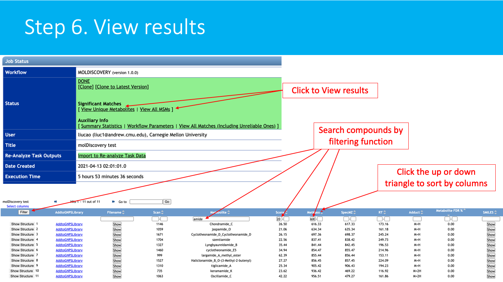

## molDiscovery - a probabilistic model for in silico database search of MS/MS

- [molDiscovery - a probabilistic model for in silico database search of MS/MS](#moldiscovery---a-probabilistic-model-for-in-silico-database-search-of-msms)
- [Introduction](#introduction)
- [Manuscripts and Citations](#manuscripts-and-citations)
- [Development](#development)
- [Accessing molDiscovery workflow on GNPS](#accessing-moldiscovery-workflow-on-gnps)
  - [STEP 1: Go to GNPS and login](#step-1-go-to-gnps-and-login)
  - [STEP 2: Access molDiscovery](#step-2-access-moldiscovery)
  - [STEP 3: Select input spectra](#step-3-select-input-spectra)
  - [STEP 4: Set up parameters](#step-4-set-up-parameters)
    - [BASIC OPTIONS:](#basic-options)
    - [ADVANCED OPTIONS:](#advanced-options)
  - [STEP 5: Submit job](#step-5-submit-job)
  - [STEP 6: View results](#step-6-view-results)
- [Feedback and Bug Reports](#feedback-and-bug-reports)
- [Contribute to the Documentation](#contribute-to-the-documentation)
- [Page Contributions](#page-contributions)

## Introduction ##
**molDiscovery** is a probabilistic model for in silico database search of small molecule MS/MS. It improves [**DEREPLICATOR+**](https://ccms-ucsd.github.io/GNPSDocumentation/dereplicator+/) by 

1. using an efficient fragmentation algorithm
2. using log likelihood ratio as metabolite spectrum matching score
3. an efficient implementation for indexing

As a result, **molDiscovery** improves both efficiency and accuracy of the database search.

**molDiscovery** model and software are developed in collaboration of [Saint Petersburg State University](http://cab.spbu.ru) (Russia)
and [Carnegie Mellon University](http://mohimanilab.cbd.cmu.edu) (PA, USA).

## Manuscripts and Citations

Liu Cao et al. "MolDiscovery: Learning Mass Spectrometry Fragmentation of Small Molecules." [bioRxiv](https://www.biorxiv.org/content/10.1101/2020.11.28.401943v1).

## Development

The [GitHub repository](https://github.com/mohimanilab/molDiscovery) provides latest source code and release. 

## Accessing molDiscovery workflow on GNPS

The **molDiscovery** are currently available on GNPS as a [workflow](https://gnps.ucsd.edu/ProteoSAFe/index.jsp?params=%7B%22workflow%22:%22MOLDISCOVERY%22%7D).

### STEP 1: Go to GNPS and login
Go to [http://gnps.ucsd.edu](https://gnps.ucsd.edu/ProteoSAFe/static/gnps-splash.jsp), and create/login to your account.

### STEP 2: Access molDiscovery
Derectly go to the [workflow page](https://gnps.ucsd.edu/ProteoSAFe/index.jsp?params=%7B%22workflow%22:%22MOLDISCOVERY%22%7D).

### STEP 3: Select input spectra
**Select/Import a mass spectrometry file**:
The input format accepted are mzML/mzXML/MGF. Note that have the option to import an existing GNPS dataset (by clicking on "Share Files") or upload your own data (by clicking on "Upload Files"). See the corresponding GNPS documentation for FTP upload.

After getting done with selecting files, click on Finish Selection.

### STEP 4: Set up parameters
**Set up the parameters for the molDiscovery job**:
Select a title for your job, and adjust parameters depending on your data and the mass spectrometer used.

#### BASIC OPTIONS:

  -- **Precursor Ion Mass Tolerance**:  This value specifies how much fragment ions can be shifted from their expected m/z values. Default value is ± 0.01 Da.

  -- **Fragment ion Mass Tolerance**: This value specifies how much fragment ions can be shifted from their expected m/z values. Default value is ± 0.01 Da.

#### ADVANCED OPTIONS:

  -- **Predifined database**: the default small molecule structure database is AllDB, which contains 720K compounds.

  -- **Custom DB file**: if a custom database is provided (via File selection or URL), the predefined DB choice is ignored.

  -- **Max charge**: Maximum charge allowed. The default is 2.

  -- **Fragmentation Model**: the default model is 2-1-3, which indicates there will be at most two bridges, one 2-cut, and three cuts in total.

  -- **Min significant score**: the minimum score to report a significant metabolite spectrum match. The default value is 10.

### STEP 5: Submit job
Add an email for notification. Then click on submit.

You will get an email with the link to the results when your job is finished. You can also check the status of your job in "Jobs" section.

### STEP 6: View results
**See the molDiscovery job status:**
The status of the job can be vizualized in your account job list, and through the link in provided in email you will received when the job is done.

The job can be *Cloned*, for further parameters modifications. Summary Statistics and Workflow Parameters can be consulted on the respective links.

Click on *View Unique Metabolites* (recommended), to have get the list of annotated molecules.

Click on the *View All MSM* (Metabolites-Spectrum Match) to have detailed view of the Metabolites-spectrum matches.

**Explore the molDiscovery annotations:**
Annotations are sorted by molDiscovery score (default), mass, compound name, etc. These fields can also be searched with the filter function.

## Feedback and Bug Reports

We will be thankful if you help us make **molDiscovery** better by sending your comments, bug reports, and suggestions to <npdtools.support@cab.spbu.ru> or posting them on our [GitHub repository tracker](https://github.com/mohimanilab/molDiscovery/issues).

## Contribute to the Documentation

- For informations/feature request, please open an "Issue" on the [*CCMS-UCSD/GNPSDocumentation*](https://github.com/CCMS-UCSD/GNPSDocumentation) GitHub repository.
- To contribute directly to the GNPS documentation, fork the [*CCMS-UCSD/GNPSDocumentation*](https://github.com/CCMS-UCSD/GNPSDocumentation) repository, and make a "Pull Request".

## Page Contributions

{{ git_page_authors }}
