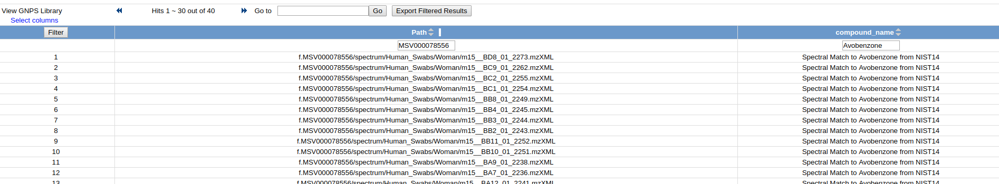

## Molecule Explorer

Building upon [Continuous Identification](continuousid.md), Molecule Explorer provides a portal for users to find exactly where each molecules occur in all public GNPS datasets. This powerful exploration tool enables users to understand the expected context where each molecule has been seen before to inform future analyses.

Explore [here](https://gnps.ucsd.edu/ProteoSAFe/result.jsp?task=698fc5a09db74c7492983b3673ff5bf6&view=molecule_explorer_v2_summary&show=true).

## All Molecules Summary

This summary list includes all molecules identified in public GNPS datasets. The summary also includes the total number of datasets and files that each molecule has been found, to provide a sense of ubiquity of each molecule. For example, common known contaminants, e.g. Sodium Formate Clusters, are seen in almost all public datasets.

## Datasets per Molecule

For each molecule, click on "Datasets" to view the specific datasets in which a molecule was found in. This view includes the accession and name of all datasets Continuous Identification found that molecule.

## Files per Molecule

In the final level of granularity, the molecule can be traced down to the set of files per dataset. By clicking "Dataset Files" a set of files which contain the molecule is listed along with the metadata associated with each of the individual files.

[Here](https://gnps.ucsd.edu/ProteoSAFe/result.jsp?view=molecule_explorer_v2_filedetails&task=698fc5a09db74c7492983b3673ff5bf6#%7B%22compound_name_input%22%3A%22Avobenzone%22%2C%22Original_Path_input%22%3A%22MSV000078556%22%7D) we can see that within the Skin Cartography Dataset, Avobenzone appears in only files from human swabs and not blanks:

## Page Contributors

{{ git_page_authors }}