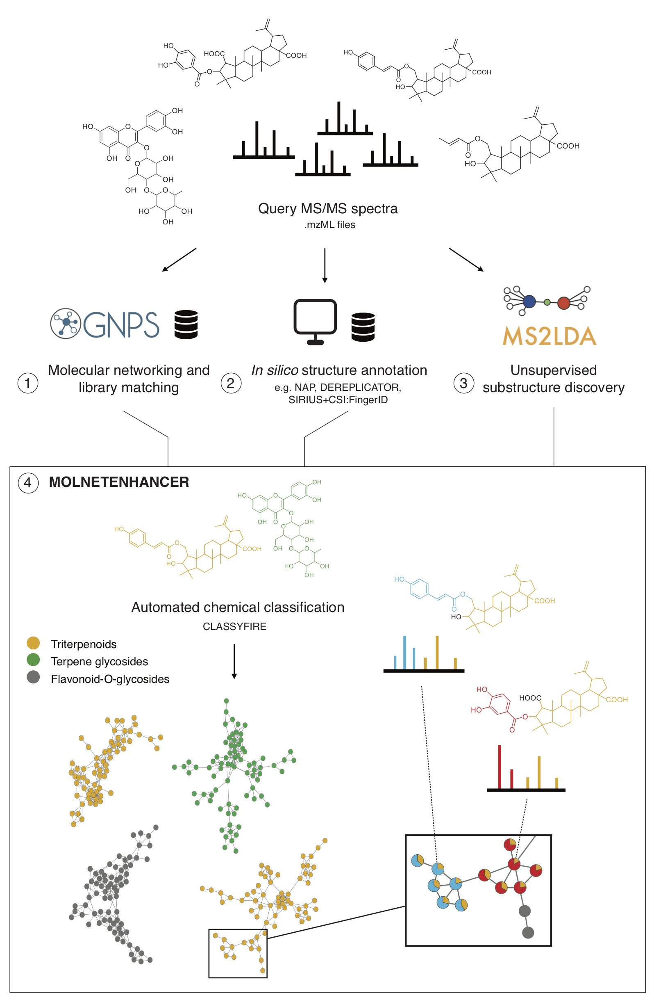
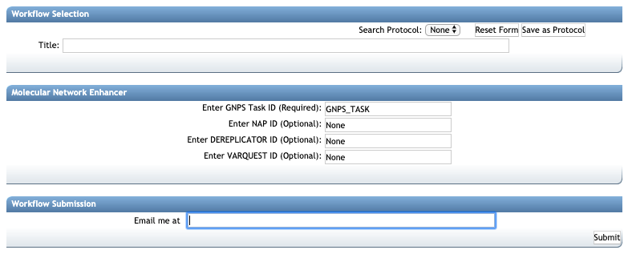
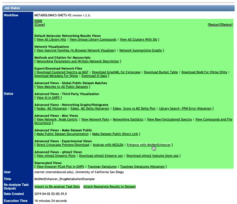
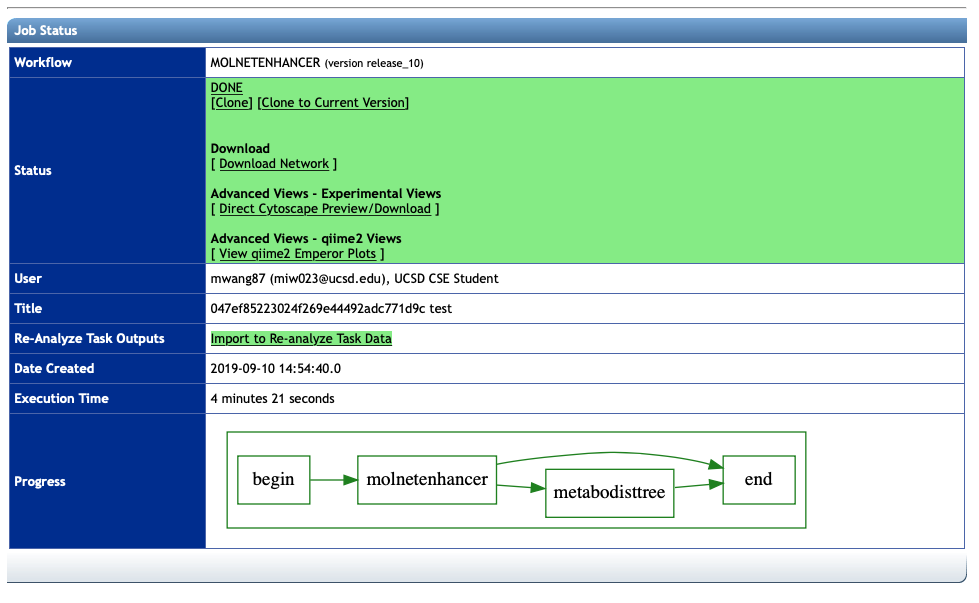
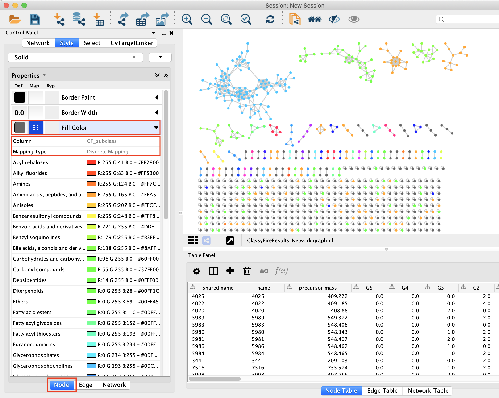
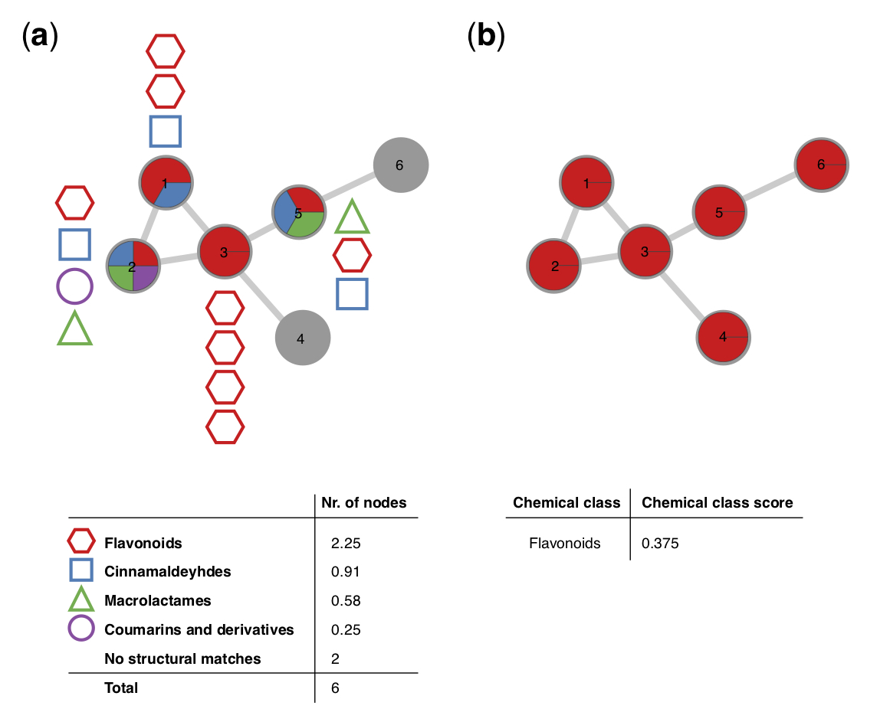
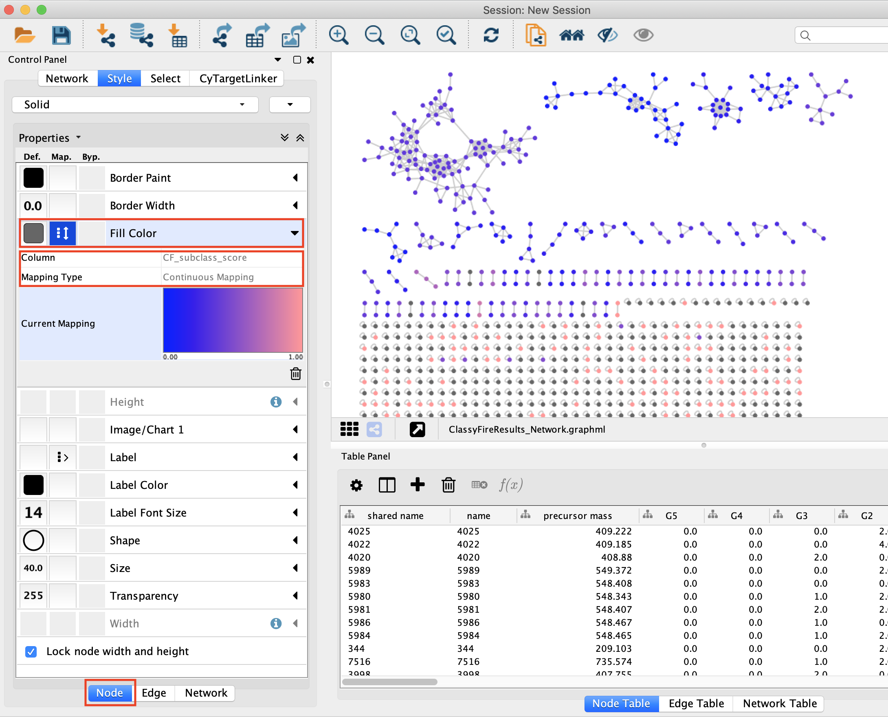

# MolNetEnhancer: Enhanced Molecular Networks by Integrating Metabolome Mining and Annotation Tools

MolNetEnhancer is a workflow that enables to combine the outputs from molecular networking, MS2LDA, <i>in silico</i> structure annotation tools (such as Network Annotation Propagation or DEREPLICATOR) and the automated chemical classification through ClassyFire to provide a more comprehensive chemical overview of metabolomics data whilst at the same time illuminating structural details for each fragmentation spectrum. For more information refer to the main MolNetEnhancer [publication](https://www.mdpi.com/2218-1989/9/7/144). 

The MolNetEnhancer worflow consists of two steps:

1. Integrate MS2LDA substructure information with mass spectral molecular networks  
2. Integrate chemical structural information from GNPS library matching, and <i>in silico</i> structure prediction with mass spectral molecular networks to retrieve most abundant chemical classes per molecular family

MolNetEnhancer is freely availble as [Python](https://github.com/madeleineernst/pyMolNetEnhancer) and [R](https://github.com/madeleineernst/RMolNetEnhancer) package and open to contributions from the community on Github. Additionally, it is now also possible to run MolNetEnhancer through the GNPS interface:

1. To run step 1 through the GNPS interface refer to the MS2LDA [documentation](https://ccms-ucsd.github.io/GNPSDocumentation/ms2lda/) or through [MS2LDA.org](http://ms2lda.org).

2. To run step 2 through the GNPS interface access this [link](https://gnps.ucsd.edu/ProteoSAFe/index.jsp?params=%7B%22workflow%22:%22MOLNETENHANCER%22%7D), which will lead to the below displayed job entry page:

In the following section, we explain what input files are needed, and what kind of output you'll get.

# Collecting the right input IDs

After providing the GNPSs analysis with a title, you'll need at least one job ID and up to 3 job IDs from GNPS <i>in silico</i> structure annotation to start the MolNetEnhancer chemical class annotation, including:

* Required: GNPS Task ID
* Optional: NAP ID
* Optional: DEREPLICATOR ID
* Optional: VARQUEST ID
* Optional: MS2LDA.org Job ID

## Quick start from processed Molecular Network

To facilitate MolNetEnhancer analysis of processed Molecular Networking jobs, in the newest (V2) version under "Advanced Views - Experimental Views" there is a button <u>Enhance with MolNetEnhancer</u> that will bring you directly to the MolNetEnhancer chemical class annotation analysis page with the GNPS Task ID prefilled. See also the animated GIF below.
Please note that you can adapt the title and you must add the relevant <i>in silico</i> structure annotation job IDs for your data set.

# MolNetEnhancer output files

Upon succesful completion, you will be able to see the output job page as displayed below:

There are different files for download available:

### Download Network

This downloads the network with chemical class information mapped in the .graphml format. To visualize results import the .graphml output file into [Cytoscape](https://cytoscape.org/). To color nodes based on the chemical subclass for example select 'Fill Color' in the 'Node' tab to the left and choose 'CF_subclass' as <i>Column</i> and 'Discrete Mapping' as <i>Mapping Type</i>:

Each molecular family is associated with a classification score at each level of the chemical taxonomy. The figure below retrieved from [Ernst and co-workers](https://www.mdpi.com/2218-1989/9/7/144), illustrates how this classification score is calculated. A hypothetical molecular family consisting of 6 nodes, for which chemical structural information could be retrieved for a total of 4 nodes is shown in (a). MolNetEnhancer calculates the total number of nodes per chemical class and subsequently assigns the most abundant chemical class to the respective molecular family. The molecular family illustrated in (a), was classified as ‘flavonoids’ at the chemical class level by MolNetEnhancer, with a score of 0.375, which translates to the majority of the putative structural annotations within this molecular family (2.25 nodes out of 6) belong to the flavonoid structural class (b):

To color nodes based on the chemical subclass score select 'Fill Color' in the 'Node' tab to the left and choose 'CF_subclass_score' as <i>Column</i> and 'Continuous Mapping' as <i>Mapping Type</i>:

All columns related to chemical class information are labeled with 'CF_', and chemical class information at other hierarchical levels of the chemical taxonomy can be mapped analogously (e.g. CF_superclass, CF_superclass_score, CF_class, etc.). 

### Direct Cytoscape Preview/Download

This downloads the network with chemical class information mapped in the .cys format. You can open this file directly with [Cytoscape](https://cytoscape.org/). Chemical class information at the superclass level is already mapped. You can change to different levels of the chemical taxonomy as described above.

### View qiime2 Emperor plots

This loads the principal coordinates plot within the Qiime2 platform using a beta version of a UniFrac-based, chemically informed distance metric. Chemically-informed distance trees are built from the MolNetEnhancer retrieved chemical class information (MetaboDistTree-ClassyTree), which is based on the ClassyFire chemical ontology. 
For more information on the algorithm refer to [this repository](https://github.com/madeleineernst/MetaboDistTrees). 

## Citations

Have you found MolNetEnhancer to be useful for your data analysis? Please cite the relevant literature from below.

### Main citation

[Ernst, M.; Kang, K.B.; Caraballo-Rodríguez, A. M.; Nothias, L.-F.; Wandy, J.; Chen, C.; Wang, M.; Rogers, S.; Medema, M.H.; Dorrestein, P.C. and van der Hooft, J.J.J. MolNetEnhancer: Enhanced Molecular Networks by Integrating Metabolome Mining and Annotation Tools. Metabolites 2019, 9 (7): 144.](https://www.mdpi.com/2218-1989/9/7/144)

### Other citations

MolNetEnhancer uses molecular networking through GNPS: 
[Wang, M.; Carver, J. J.; Phelan, V. V.; Sanchez, L. M.; Garg, N.; Peng, Y.; Nguyen, D. D.; Watrous, J.; Kapono, C. A.; Luzzatto-Knaan, T.; et al. Sharing and Community Curation of Mass Spectrometry Data with Global Natural Products Social Molecular Networking. Nat. Biotechnol. 2016, 34 (8), 828–837.](https://www.nature.com/articles/nbt.3597)

MolNetEnhancer uses untargeted substructure exploration through MS2LDA: 
[van der Hooft, J.J.J.; Wandy, J.; Barrett, M.P.; Burgess, K.E.V.; Rogers, S. Topic modeling for untargeted substructure exploration in metabolomics. PNAS 2016, 113 (48), 13738-13743.](https://www.pnas.org/content/113/48/13738)

MolNetEnhancer uses Network Annotation Propagation (NAP): 
[da Silva, R. R.; Wang, M.; Nothias, L.-F.; van der Hooft, J. J. J.; Caraballo-Rodríguez, A. M.; Fox, E.; Balunas, M. J.; Klassen, J. L.; Lopes, N. P.; Dorrestein, P. C. Propagating Annotations of Molecular Networks Using in Silico Fragmentation. PLoS Comput. Biol. 2018, 14 (4), e1006089.](http://journals.plos.org/ploscompbiol/article?id=10.1371/journal.pcbi.1006089)

MolNetEnhancer uses DEREPLICATOR: 
[Mohimani, H.; Gurevich, A.; Mikheenko, A.; Garg, N.; Nothias, L.-F.; Ninomiya, A.; Takada, K.; Dorrestein, P.C.; Pevzner, P.A. Dereplication of peptidic natural products through database search of mass spectra. Nat. Chem. Biol. 2017, 13, 30-37.](https://www.nature.com/articles/nchembio.2219)

MolNetEnhancer uses automated chemical classification through ClassyFire: 
[Feunang, Y. D.; Eisner, R.; Knox, C.; Chepelev, L.; Hastings, J.; Owen, G.; Fahy, E.; Steinbeck, C.; Subramanian, S.; Bolton, E.; Greiner, R.; Wishart, D.S. ClassyFire: automated chemical classification with a comprehensive, computable taxonomy. J. Cheminform. 2016, 8, 61.](https://jcheminf.biomedcentral.com/articles/10.1186/s13321-016-0174-y)

Principal coordinates plots are visualised through the Qiime2 platform using EMPeror:
[Bolyen, E.; Rideout, J. R.; Dillon, M. R.; et al. Reproducible, interactive, scalable and extensible microbiome data science using QIIME 2. Nat. Biotechnol. 2019, 37, 852-857.](https://www.nature.com/articles/s41587-019-0209-9) and
[Vázquez-Baeza,Y.; Pirrung, M.; Gonzalez, A.; Knight R. EMPeror: a tool for visualizing high-throughput microbial community data. Gigascience 2013, 2, 16.](https://academic.oup.com/gigascience/article/2/1/2047-217X-2-16/2656132)

Chemically-informed distances are calculated using the UniFrac distance metric:
[Lazupone, C.; Knight R. UniFrac: a New Phylogenetic Method for Comparing Microbial Communities. Applied and Environmental Microbiology 2005, 71, 8228-8235.](https://aem.asm.org/content/71/12/8228)

## Page Contributors

{{ git_page_authors }}