# MS2LDA Substructure Discovery

MS2LDA is a tool that decomposes molecular fragmentation data derived from large metabolomics experiments into annotated Mass2Motifs or discovers Mass2Motifs from experimental data. Mass2Motifs are fragmentation patterns of often co-occurring mass fragment peaks and/or neutral losses that often represent molecular substructures. Check out the [MS2LDA website](http://ms2lda.org/) here where you can find more information, browse through data sets, and sign up for an account to run the Mass2Motif discovery on your own data. At GNPS, we are working with the MS2LDA team to integrate both workflows which allows users to map Mass2Motif occurrences in their Molecular Families.

It is now also possible to run MS2LDA analyses through the GNPS interface [here](https://gnps.ucsd.edu/ProteoSAFe/index.jsp?params=%7B%22workflow%22:%22MS2LDA_MOTIFDB%22%7D) which will lead to the below displayed job entry page.

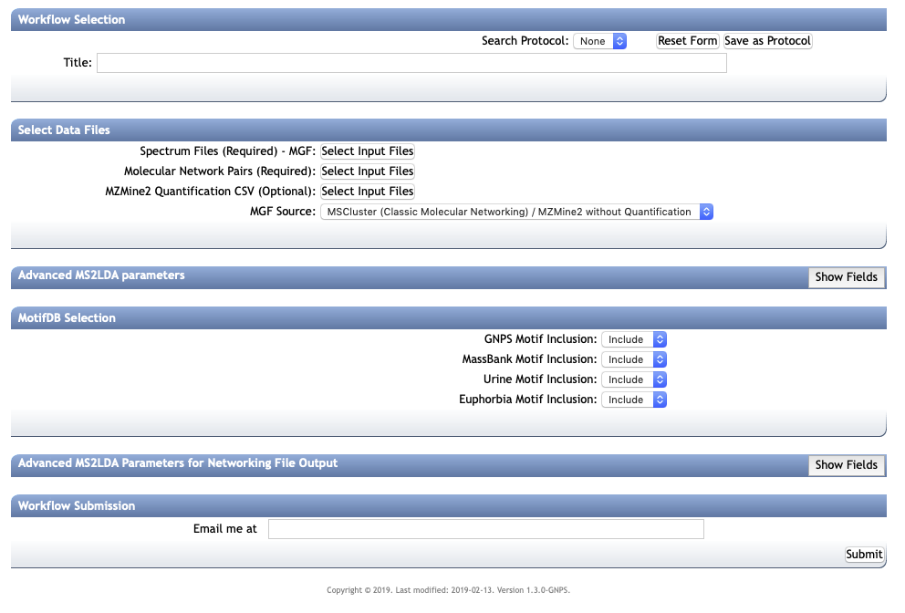

In this section, it is explained what input files are needed, how the parameters can be chosen, and what kind of output you get.
Finally, it is explained how the obtained MS2LDA model can be further explored on the [MS2LDA](www.ms2lda.org) website by uploading the generated dict file.

# Collecting the right input files

After providing the GNPS analysis with a title, the right input files are needed to start an MS2LDA analysis. They can be obtained with the classical molecular network (MS-Cluster based, [see documentation here](networking.md)) or from the Feature-Based Molecular Networking workflow (using for example MZmine2, [see documentation here](featurebasedmolecularnetworking.md). These files are:

* Required: Spectral data (MGF file) which can be downloaded from a processed Molecular Networking job
* Required: Edges file including selfloops which can be downloaded from a processed Molecular Networking job (i.e., typically found in the networkedges_selfloop folder within the downloaded GNPS job folder)
* Optional: MS1 peak abundance information (CSV file generated by MZmine2). The format must be similar to the MZmine2 format used with the [Feature based Molecular Networking](featurebasedmolecularnetworking.md). This will allow you to perform MS1 differential analysis within the MS2LDA web app to find discriminate Mass2Motifs between groups.

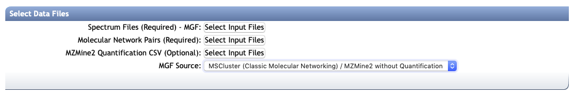

After selecting the input files, the right MGF Source needs to be selected: "MSCluster" for a classical Molecular Networking derived clustered MGF file, and "MZmine2" for a Feature based Molecular Networking derived MGF file.

## Quick start from processed Molecular Network

To facilitate MS2LDA analysis of processed Molecular Networking jobs, in the newest (V2) version and the Feature Based Molecular Networking job, under "Advanced Views - Experimental Views" there is a button <u>Analyze with MS2LDA</u> that will bring you directly to the MS2LDA analysis page prefilling the relevant input files (spectral MGF file and edge pair file including selfloops). See also the animated GIF below.
Please note that you can adapt the title and you must check the relevant MS2LDA parameter settings for your data set.

# Setting the MS2LDA parameters

There are three sections of parameters to fill out of which the first is the most important. Default values are provided for all settings, but each of them is dependent on the input data. We provide some guidelines here to ease your choice.

## LDA parameters

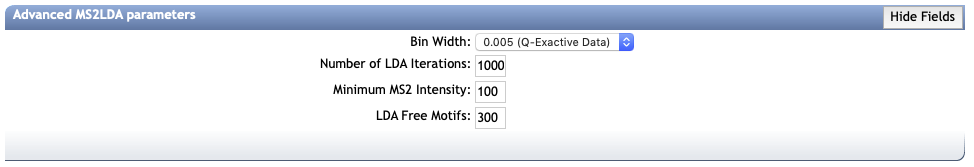

The "Advanced MS2LDA parameters" displays four parameter values to set. The first is the bin width used to bin the MS2 fragments and losses. Defaults for Q-Exactive (0.005 Da) and ToF (0.01 Da) Data are provided. For instruments like Ion Traps a larger bin width of 0.1 Da is recommended. The appropriate bin width to choose is dependent on the expected mass variation of mass fragments across mass spectra in your data.

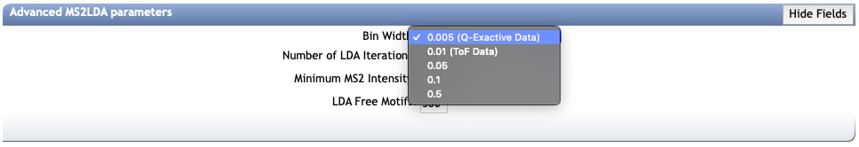

The number of LDA iterations is set to 1000 by default which should work in most cases.

The Minimum MS2 Intensity is meant to filter out the basic noise from the MS/MS spectra. It is recommended to open the inputted MGF file and check the noise levels. Typically they range from 25-200 (ToF Data) to 5000 (Q-Exactive Data). Inclusion of noise will unnecessarily lengten the analysis time and create non-informative Mass2Motifs.

The LDA Free Motifs correspond to the number of "free Mass2Motifs" that are added on top of the prefixed annotated Mass2Motifs from MotifDB. This number depends on your data: if you input a larger number of fragmented molecules (i.e., > 4,000) that includes lots of novel chemistry not present in MotifDB it is best to put the LDA Free Motifs on 300 - 500. If the data set is relatively small with a considerable amount of known chemistry, you best put this number to 50 - 150.

## Selecting MotifDB motif sets

By default all Motif Sets will be imported from [MotifDB](http://www.ms2lda.org/motifdb). However, it is wise to exclude annotated motif sets of sources that are very distant from the source of your input data. Note that the GNPS and MassBank are annotated Mass2Motifs discovered in reference molecules.

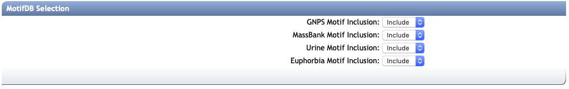

## Output Networking file thresholds

After running MS2LDA, output files are created that include a new networking (edge) file that can be used to create an enriched Molecular Network including Mass2Motif distributions through the Molecular Families. To do so, cut-off values (thresholds) are needed for LDA scores to consider a Mass2Motif to be linked to a molecule or not and how many you want to show in the network. Default values are provided that were found to work well so far.
In [this](https://pubs.acs.org/doi/abs/10.1021/acs.analchem.7b01391) publication the two scores are explained: probability and overlap score.

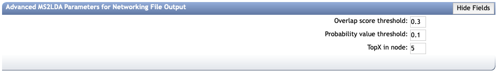

Note that you will have to provide your email address in the appropriate field in order to be notified upon completion of your GNPS-MS2LDA job.

# MS2LDA output files

Upon succesful completion, you will be able to see the output job page as displayed below:

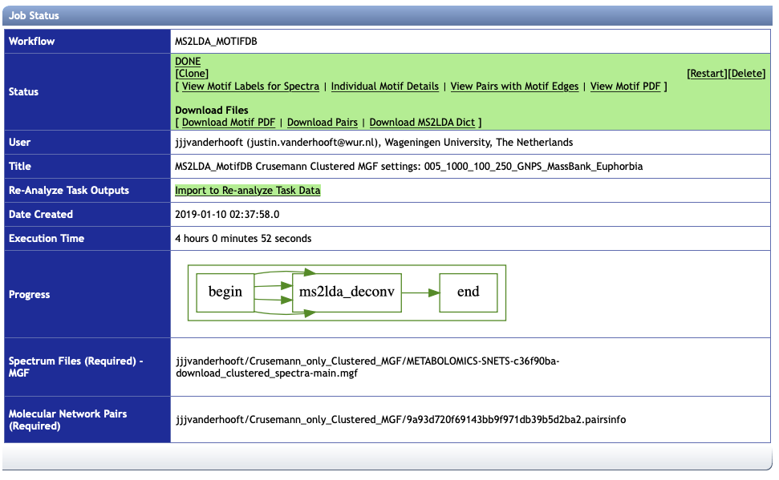

There are different views and files for download available:

### View Motif Labels for Spectra

This view displays all the fragmented molecules (scans) and each of the motifs linked to them [above the set thresholds as specified in the Output Networking file thresholds].
It can be downloaded as a tab separated file.

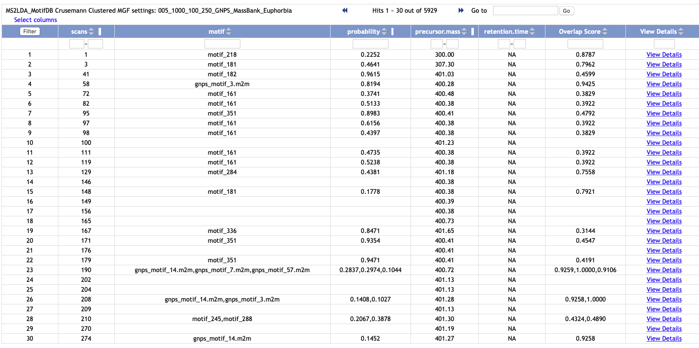

### Individual Motif Details

This view displays all molecule-motif links [some molecules have more than one motif linked and will appear multiple times in this table] and also shows the annotation if available from MotifDB.
It can be downloaded as a tab separated file.

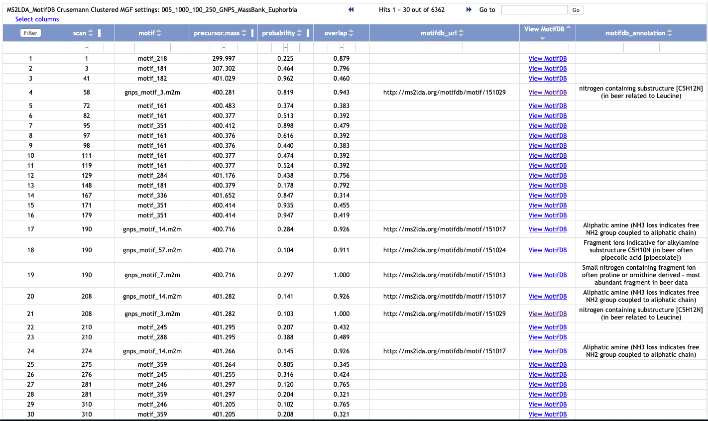

### View Pairs with Motif Edges

This view is the new edge file enriched with Motif interactions: note that in the "Interact" column apart from cosine now different Mass2Motifs are listed [above the set thresholds as specified in the Output Networking file thresholds].
It can be downloaded as a tab separated file - this can be used to create a new enriched Molecular Network in CytoScape.

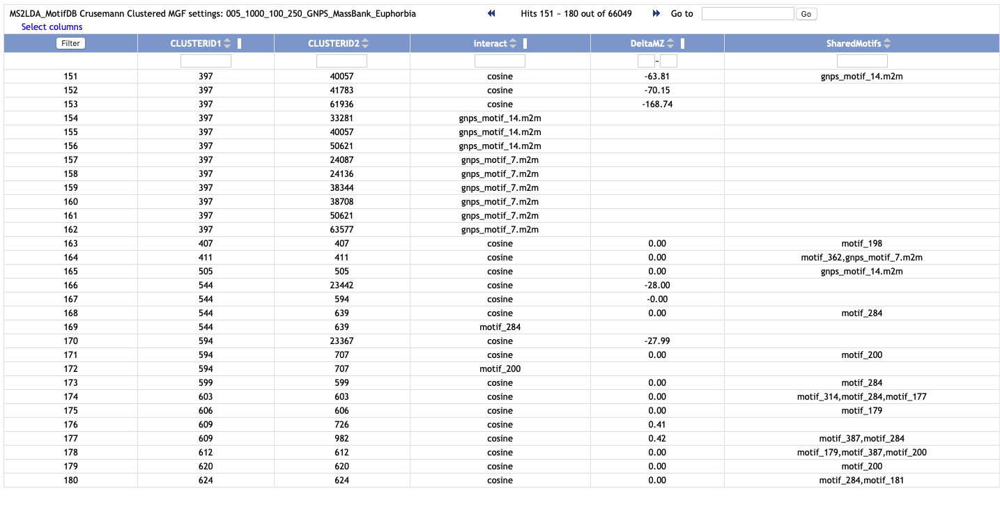

### View Motif PDF

This displays a PDF report of all the Mass2Motifs. Each Mass2Motif spans two pages with the first page a graphical overview of the relevant mass fragments (red, on top, pointing up) and neutral losses (green, bottom, pointing down) with the y-axis being the intensity which equals the features' probability to be found in the Mass2Motif, and the x-axis being the m/z (rounded up to nominal values in the labels) in Daltons.
The second page displays the top mass fragments and neutral losses with their probabilities.

### Download Motif PDF

This downloads the PDF report as explained in "View Motif PDF".

### Download Pairs

This downloads the new edge file as explained in "View Pairs with Motif Edges".

### Download MS2LDA Dict

This downloads the MS2LDA Dict file that houses all the relevant information on the MS2LDA experiment.

# Analysing the MS2LDA results within GNPS

The different available views enable a quick overview of the MS2LDA experiment. Especially when annotated Mass2Motifs are found, this could help in further downstream analysis.
However, when no annotation is provided, the Mass2Motif is one of the "free Motifs" that was discovered by LDA. With the MS2LDA Dict file through the MS2LDA web app there are ways to analyse these Mass2Motifs further and also annotate them.

In general, when analysing annotating or novel Mass2Motifs, it is important to keep [this](http://ms2lda.org/disclaimer/) in mind!

# Taking the GNPS results into the MS2LDA web app

After downloading the MS2LSA Dict file from the finished MS2LDA experiment, this can be uploaded into the [MS2LDA web app](http://www.ms2lda.org). There is a [User Guide](http://www.ms2lda.org/user_guide/) available that covers the main functionalities of the MS2LDA web app.

If it is your first time at the MS2LDA web app, make sure you get a login account before continuing. Once logged in, go to the experiments section:

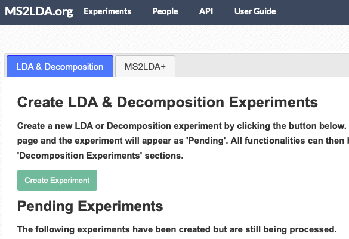

By default, you arrive on the Create tab which lets you create an MS2LDA experiment from mass spectrometry data.

Click on the Upload tab, to continue:

Now, you will have to provide a unique name for the MS2LDA experiment and you can also provide relevant details.
Most importantly, you will need to select the location of the downloaded MS2LDA Dict file under "LDA output file".
Also, you will need to select the bin width as used in the GNPS-MS2LDA workflow ("Bin Width") from the available options.

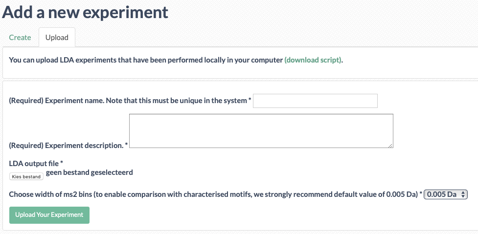

After you are ready, you can click "Upload Your Experiment" and the upload will start.

## Annotating new motifs

Once the MS2LDA dict file finished uploading, you can browse the MS2LDA experiment in the web app like a regular MS2LDa experiment. If you click on the experiment name, multiple tabs will appear:

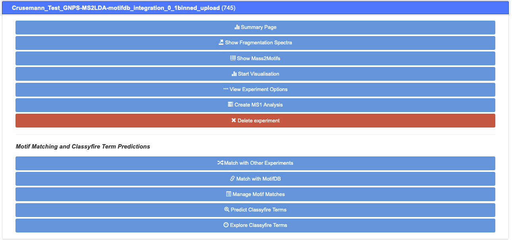

Here, you can click on the Summary Page tab which leads you to the summary of the experiment that includes all relevant Tables. For example, the Motif Table can be browsed, sorted, searched, and downloaded as CSV:

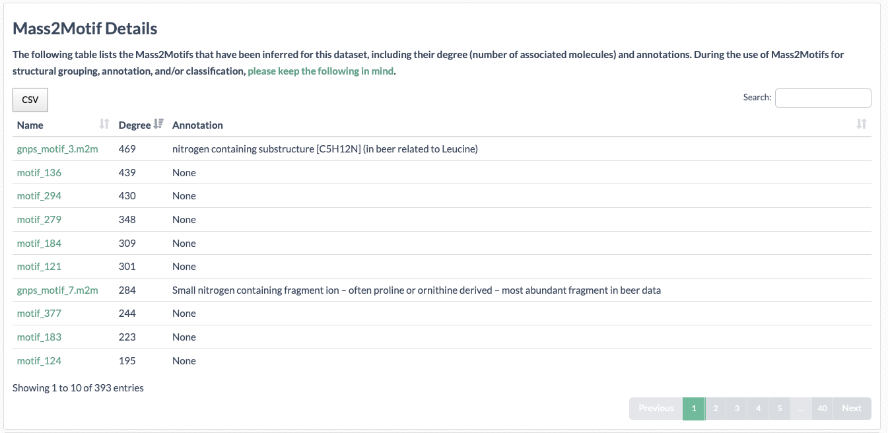

When clicking on the relevant "free Motif" name a Motif Page will appear where the relevant mass fragment and neutral losses are listed including their scores and a frequency plot. Also, all the spectra the Mass2Motif appears in can be browsed to analyse the nature of the fragmentation pattern.
Importantly, if you can annote the motif with any structural information, this can be provided on top of the page with the Annotation field for the full annotation and the Short Annotation field for a label to display in graphics - make sure to save the Motif Page afterwards! After reloading the Summary Page or the Show Mass2Motif tabs, the annotation(s) will be displayed and are searchable.

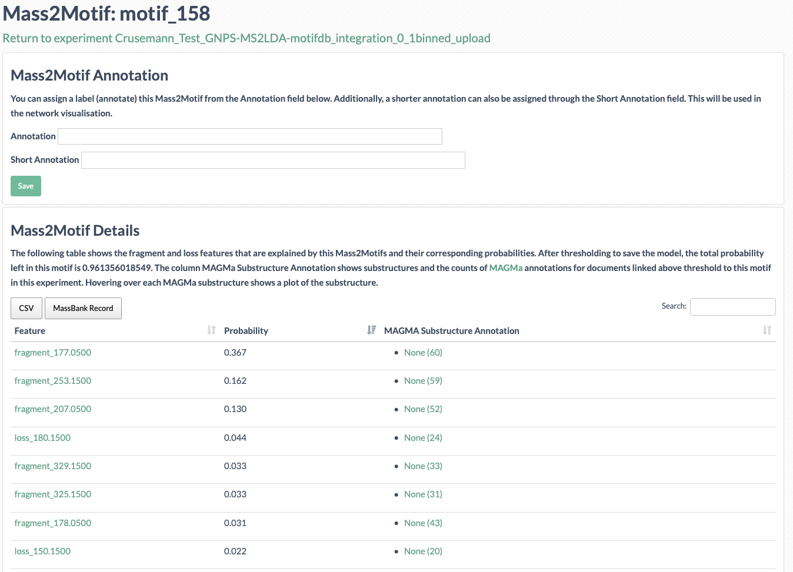

Finally, on top of the summary page there is a toggle where you can make the entire MS2LDA experiment public. See for example the public [MassBank Experiment](http://ms2lda.org/basicviz/summary/190/).

## MS1 Differential Analyses within the MS2LDA web app

If the Feature based Molecular Networking workflow was used, the MS1 peak information is available in the MS2LDA Dict file. This can be used to create MS1 analysis to find Mass2Motif that are discriminative between two sample groups.
More information can be found in [this](http://www.pnas.org/content/113/48/13738.short) publication and the [MS2LDA web app User Guide](http://www.ms2lda.org/user_guide/#ms1_analysis) explains how to set up such an analysis within your experiment.

## Uploading annotated motif sets into MotifDB
This is a future feature that will become available in the course of this year. It will allow you to make your new annotations searchable and usable by the community.

# Future Directions
At GNPS, we are working with the MS2LDA team to promote publication of curated sets of Mass2Motifs into [MotifDB](http://www.ms2lda.org/motifdb) that can help to annotate your MS/MS spectra.

## Citations

Have you found MS2LDA to be useful for your data analysis? Please cite the relevant literature from below.

### Introduction of MS2LDA Substructure Discovery algorithm

[van der Hooft, Justin J. J., Joe Wandy, Michael P. Barrett, Karl E.V. Burgess, and Simon Rogers. "Topic modeling for untargeted substructure exploration in metabolomics." Proceedings of the National Academy of Sciences 113, no. 48 (2016): 13738-13743.](http://www.pnas.org/content/113/48/13738.short)

### Publication of the MS2LDA.org web app to discover and analyse Mass2Motifs

[Wandy, Joe, Yunfeng Zhu, Justin J.J. van der Hooft, Ronan Daly, Michael P. Barrett, and Simon Rogers. "Ms2lda.org: web-based topic modelling for substructure discovery in mass spectrometry." Bioinformatics 34, no. 2 (2018): 317-318.](https://academic.oup.com/bioinformatics/article/34/2/317/4158166)

### Extended version of MS2LDA algorithm to handle multiple files at once

[van der Hooft, Justin J. J., Joe Wandy, Francesca Young, Sandosh Padmanabhan, Konstantinos Gerasidimis, Karl E.V. Burgess, Michael P. Barrett, and Simon Rogers. "Unsupervised Discovery and Comparison of Structural Families Across Multiple Samples in Untargeted Metabolomics." Analytical Chemistry 89, no. 14 (2017): 7569-7577.](https://pubs.acs.org/doi/abs/10.1021/acs.analchem.7b01391)

### Latest developments in MS2LDA.org: introduction of [MotifDB](http://ms2lda.org/motifdb/) with annotated Mass2Motif sets and [MAGMa](http://www.emetabolomics.org) integration for Mass2Motif annotation of reference compounds

[Rogers, Simon, Cher Wei Ong, Joe Wandy, Madeleine Ernst, Lars Ridder, and Justin J.J. van der Hooft. "Deciphering complex metabolite mixtures by unsupervised and supervised substructure discovery and semi-automated annotation from MS/MS spectra." Faraday Discussions themed collection  Challenges in analysis of complex natural mixtures (2019).](https://pubs.rsc.org/en/Content/ArticleLanding/2019/FD/C8FD00235E#!divAbstract)
