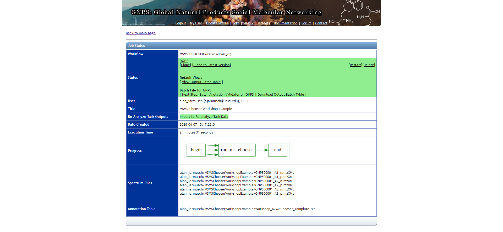

# Open-source Protocol for Community-created Public MS/MS Reference Library (MSMS-Chooser)

---

## Summary
[MSMS-Chooser](https://gnps.ucsd.edu/ProteoSAFe/index.jsp?params=%7B%22workflow%22:%22MS-CHOOSER%22%7D) is a GNPS workflow and open-source protocol to empower the community to collect MS/MS reference data and contribute to the public MS/MS reference library. This specific step enables the finding of reference MS/MS spectra automatically in LC/MS data of pure standards given the structure of the pure standards. Its not fancy, but practically, its pretty beneficial. 

**This is a community effort and welcome everyone to participate!**  

---

## Requirements for MSMS-Chooser Workflow and Subsequent Addition of Spectra to the GNPS Library
  - Complete MSMS-Chooser Template
  - Data containing MS/MS data convereted to open-file formats (.mzXML or .mzML)
  - Validation of MSMS-Chooser output (using drag-and-drop validator) + visual inspection of MS/MS spectra
  - Email contacting Dorrestein Lab with task ID (see contact information below)

---

## Step-by-Step Instructions

### Completion of MSMS-Chooser Template - [Link Here](https://docs.google.com/spreadsheets/d/1P8XnChlNZzeXUmVT6VlrWl7CL5aI4ZEdhBBYNG4wSvc/edit?usp=sharing)
1. Make a copy of the **MSMS-Chooser Workflow Basic Template** by selecting “File” and then “Make a copy”. We **strongly encourage** users to continue working in Google Sheets as the formatting will be maintained.
2. Fill out the MSMS-Chooser Template in the **"MSMS-Chooser Workflow Basic Template"** tab.  
3. Download a copy of the **MSMS-Chooser Basic Template** tab as a .tsv file by selecting "File", "Download", and then "Tab-separated value (.tsv, current sheet)."

---

## MSMS-Chooser (v1.0) Workflow at GNPS

1. Navigate to ProteoSAFe - [link here](https://gnps.ucsd.edu/ProteoSAFe/index.jsp?params=%7B%22workflow%22:%22MSMS-CHOOSER%22%7D).
2. Select all .mzXML/.mzML files from MassIVE (positive and negative mode should be selected into the same folder).
3. Select the **"MSMS-Chooser Submission"** file (.tsv) from MassIVE (or uploaded via the drag-and-drop method in the 2nd tab over in the selection UI).
4. The default mass error tolerance is 10 ppm. This value should be adjusted according to the instrumentation and experimental conditions used to collect the mass spectrometry data.
5. Launch the Job.

### Basic Information about MSMS-Chooser
This workflow selects MS/MS spectra, specifically product ion scans, based on precursor *m/z* (within 10 ppm error by default). Retention time is not taken into consideration given the provided MSMS-Chooser workflow method uses flow-injection. Several adducts are considered in the positive and negative mode for each chemical (tabulated below). If additional adducts are required, please contact us.

| Ionization Mode | Adducts Supported |
|:---:|:---:|
|Positive|[M+H]+, [M+Na]+, [M+K]+, [2M+H]+, [2M+Na]+, [2M+K]+, [M-H2O+H]+, [M-2H2O+H]+|
|Negative|[M-H]-, [2M-H]-, [2M-2H+Na]-|

---

## Interpretation and Validation of MSMS-Chooser (v1.0) Results

The results can be accessed by clicking the "View Output Batch Table" link and the "View Spectrum" button on the left-hand side of the table for each chemical. **review of all data is strongly encouraged**  
1. After review, if all look acceptable
    - click the “Next Step: Batch Anotation Validator on GNPS” and run the validation workflow.
    - Once complete, email Morgan (ccms-web@cs.ucsd.edu) and send her the completed job from above.
2. After review, if you would like to remove MS/MS for any reason
    - Download the “Download Output Batch Table” and delete the rows you would like to exclude.
    - You should then follow the “[Batch Upload of Annotated Spectra](https://ccms-ucsd.github.io/GNPSDocumentation/batchupload/)" documentation (you will need to reselect the files and upload the modified “output batch table” in the “Annotation Table” option).
    - Once complete, email Morgan (ccms-web@cs.ucsd.edu) and send her the completed job from above.

---

## FAQs

**"Can I use this method to run isolated, possibly impure, chemicals?"**
   - Yes! GNPS MS/MS spectral libraries allow any contribution even if the structure or identification is not fully confirmed. The GNPS community will help correct any inaccuracies over time with provenance of all edits and updates.

---

## Issues and Suggestions
  - Please submit any issues or suggestions via GitHub - [link here](https://github.com/CCMS-UCSD/GNPS_Workflows).
  - The use of the GNPS forum - [link here](https://groups.google.com/forum/#!forum/molecular_networking_bug_reports) is encouraged.

---

## Data Availability
All public MS/MS spectra are avaliable for download and browsing in GNPS.

---

## Citation
Vargas, F, Weldon, KC, Sikora, N, et al. Protocol for Community‐created Public MS/MS Reference Spectra Within the Global Natural Products Social Molecular Networking Infrastructure. Rapid Commun Mass Spectrom. 2020. https://doi.org/10.1002/rcm.8725

---

## Contacts
  - Morgan Panitchpakdi(mpanitch@ucsd.edu)  
  - Mingxun Wang (miw023@ucsd.edu)  
  - Alan Jarmusch (ajarmusch@ucsd.edu)  

---

## Page Contributions
Alan K. Jarmusch (UCSD)
Mingxun Wang (UCSD)
