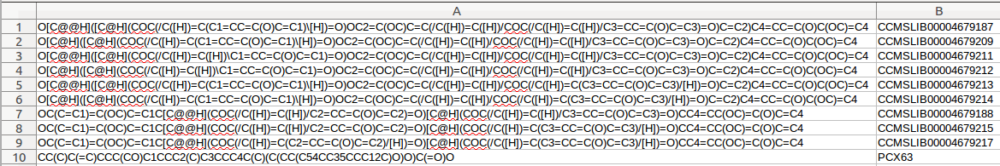
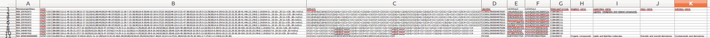
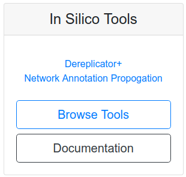
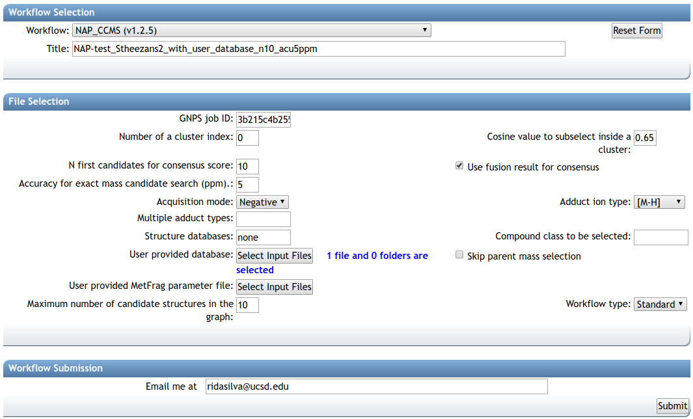
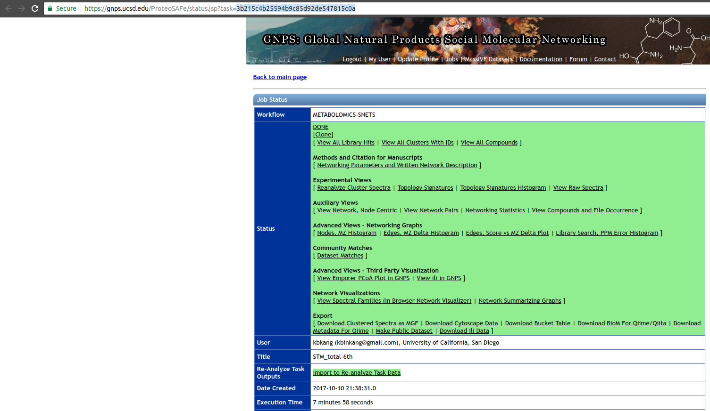

## Network Annotation Propagation Overview

Network Annotation Propagation (NAP) uses spectral networks to propagate information from spectral library matching, in order to improve in silico fragmentation candidate structure ranking. This workflow is currently in beta development stages so any feedback is welcome to improve analysis and usability. It is available [here](https://proteomics2.ucsd.edu/ProteoSAFe/?params={%22workflow%22:%22NAP_CCMS2%22}) under 'NAP_CCMS' Workflow drop down menu.

Check out the full [documentation](https://github.com/DorresteinLaboratory/NAP_ProteoSAFe/blob/master/supplementar_tool_manual_documentation.pdf).

## Data Input Preparation

The following inputs are used for NAP:

1. Molecular network task id, see [Molecular Networking](networking.md) (required)
2. Identifier(s) of databases and/or user provided databases (required)

### Structure database 

There are basically three options for database structure selection:

1. Input one or more databases, separated by ",". Available options are: GNPS, HMDB, SUPNAT, CHEBI, DRUGBANK and FooDB. Be aware that these databases are static and new changes on the source databases are not incorporated automatically.
2. Input an in house generated database. See [Molecular Networking](networking.md) documentation to learn how to use the drag and drop upload.
A standard format is required for the in house database. One can easily collect structures in the literature and format a tab separated files with SMILES strings and a character identifier of any kind, as the example database [Right-click, and Save link as](https://raw.githubusercontent.com/DorresteinLaboratory/GNPSDocumentation/master/docs/static/JNP_Kyobin.txt):  

Having a in house collection, before the use in NAP, the user has to first format the database, using the following [webserver](http://dorresteinappshub.ucsd.edu:5002/upload):

After submission for conversion the user should receive an email with the link to download a file in the following format [Right-click, and Save link as](https://raw.githubusercontent.com/DorresteinLaboratory/GNPSDocumentation/master/docs/static/JNP_Kyobin_formatted.txt):

3. The combination of the two databases above. NAP allows the combination of different databases, both, through multiple database identifiers, or by the combination of identifiers and text file. While this feature allows flexibility, it is important narrow the search space for the system under study.

## Running NAP 

### NAP Workflow Selection

From the main [GNPS page](https://gnps.ucsd.edu/ProteoSAFe/static/gnps-splash.jsp), you can access NAP clicking the banner

and then selecting NAP in the corresponding description. You can also directly open clicking ["here"](https://proteomics2.ucsd.edu/ProteoSAFe/?params=%7B%22workflow%22:%22NAP_CCMS2%22%7D).

This will bring you to the workflow input to start NAP. The image bellow shows an example of the most important parameters

The first parameter is the GNPS network task id, this id can be found in the results email sent by GNPS or in the url, as shown in the image below, the task id is 

A detailed description of the parameters is provided [below](#parameter-walkthrough).

### Parameter Walkthrough

| Parameter  | Description          | Default |
| ------------- |-------------| -----|
| GNPS job ID | GNPS molecular networking task id. | |
| Number of a cluster index | Any cluster index of a connected component of interest in a Molecular Network. The propagation is limited by the connected component. | |
| Cosine value to subselect inside a cluster | Used to disconnect nodes in very dense molecular networks and decrease the number of nodes to be analyzed. | 0.5 |
| N first candidates for consensus score | Number of candidate structures of the neighbor nodes used for Consensus re-ranking. | 10 |
| Use fusion result for consensus | Whether to use the result from Fusion re-ranking to perform Consensus re-ranking. | 1 |
| Accuracy for exact mass candidate search (ppm) | Accuracy used for structure database search. The predicted neutral mass (for a given adduct selected) is compared to the exact mass of the structures provided. | 15 |
| Acquisition mode | Mass spectrometry acquisition mode. | Positive |
| Adduct ion type | Expected adduct type for the precursor ion mass. | [M+H] |
| Multiple adduct types | Input one or more adducts, separated by ",". Available options are: listed on the Adduct drop down menu. | |
| Structure databases | Input one or more databases, separated by ",". Available options are: GNPS, HMDB, SUPNAT, CHEBI, DRUGBANK and FooDB. Use none to select only user defined. | |
| Compound class to be selected | ClassyFire class in the following format: "class:name". | |
| User provided database | In house candidate structure database to be used in the search. | |
| Skip parent mass selection | Should be used only in combination with class selection. | 0 |
| User provided MetFrag parameter file | Check [here](https://github.com/DorresteinLaboratory/NAP_ProteoSAFe/blob/master/nap_ccms2/Snap/sl_mock_parameter.txt) for a template. | |
| Maximum number of candidate structures in the graph: | Number od candidate structures to be exported in the Cytoscape graph. | 10 |
| Workflow type | [Standard](networking.md) or [MZmine](featurebasedmolecularnetworking.md). | |

## Citation

[da Silva, Ricardo R., Mingxun Wang, Louis-Félix Nothias, Justin JJ van der Hooft, Andrés Mauricio Caraballo-Rodríguez, Evan Fox, Marcy J. Balunas, Jonathan L. Klassen, Norberto Peporine Lopes, and Pieter C. Dorrestein. "Propagating annotations of molecular networks using in silico fragmentation." PLoS computational biology 14, no. 4 (2018): e1006089.](http://journals.plos.org/ploscompbiol/article?id=10.1371/journal.pcbi.1006089)

[Kyo Bin Kang, Eun Jin Park, Ricardo R. da Silva, Hyun Woo Kim, Pieter C. Dorrestein, Sang Hyun Sung. "Targeted Isolation of Neuroprotective Dicoumaroyl Neolignans and Lignans from Sageretia theezans Using in Silico Molecular Network Annotation Propagation-Based Dereplication" Journal of Natural Products, 2018, 81 (8), pp 1819–1828](https://pubs.acs.org/doi/abs/10.1021/acs.jnatprod.8b00292)
