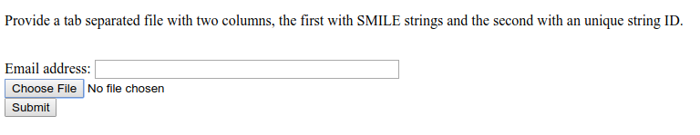

## Network Annotation Propagation Overview

Network Annotation Propagation (NAP) uses spectral networks to propagate information from spectral library matching, in order to improve in silico fragmentation candidate structure ranking. This workflow is currently in beta development stages so any feedback is welcome to improve analysis and usability. It is available [here](https://proteomics2.ucsd.edu/ProteoSAFe/?params={%22workflow%22:%22NAP_CCMS2%22}) under 'NAP_CCMS' Workflow drop down menu.

Check out the full [documentation](https://github.com/DorresteinLaboratory/NAP_ProteoSAFe/).

## NAP short hands on tutorial

The aim of this tutorial is to work as a guided tour through this documentation page and exploring the finding of [Kang et al., (2018)](#citation).

1. Go to [Structure database](#structure-database) section, download the example in house database (two columns file), add the structure [SN00230021](http://bioinf-applied.charite.de/supernatural_new/index.php?site=search5&np_id=SN00230021) to the file and generate the formatted database. Make sure you use an excel like software and save as tab separated text file;
2. Go to [Running NAP](#running-nap) section, open NAP input interface, make sure you are logged and run a job with example parameters present in the picture (including job id: '3b215c4b25594b9c85d92de547815c0a' and cluster index: 56), with the database you just created. Go here if need instructions to [upload the database](fileupload.md);
3. When your job is processed, you should receive a [link](https://proteomics2.ucsd.edu/ProteoSAFe/status.jsp?task=2d7b00ff710c42438146f2bc311f1785) similar to that. Go to section [Online Exploration](#online-exploration-of-nap-results) and browse the results; 
3. Follow the same [link](https://proteomics2.ucsd.edu/ProteoSAFe/status.jsp?task=2d7b00ff710c42438146f2bc311f1785) above. Go to section [NAP Visualization in Cytoscape](#nap-visualization-in-cytoscape) and browse the results; 

## Data Input Preparation

The following inputs are used for NAP:

1. Molecular network task id, see [Molecular Networking](networking.md) (required)
2. Identifier(s) of databases and/or user provided databases (required)

### Structure database 

There are basically three options for database structure selection:

1. Input one or more databases, separated by ",". Available options are: GNPS, HMDB, SUPNAT, CHEBI, DRUGBANK and FooDB. Be aware that these databases are static and new changes on the source databases are not incorporated automatically.
2. Input an in house generated database. See [Molecular Networking](networking.md) documentation to learn how to use the drag and drop upload.
A standard format is required for the in house database. One can easily collect structures in the literature and format a tab separated files with SMILES strings and a character identifier of any kind, as the example database [Right-click, and Save link as](https://raw.githubusercontent.com/DorresteinLaboratory/GNPSDocumentation/master/docs/static/JNP_Kyobin.txt):  

Having an in house collection, before the use in NAP, the user has to first format the database, using the following [webserver](http://dorresteinappshub.ucsd.edu:5002/upload):

After submission for conversion the user should receive an email with the link to download a file in the following format [Right-click, and Save link as](https://raw.githubusercontent.com/DorresteinLaboratory/GNPSDocumentation/master/docs/static/JNP_Kyobin_formatted.txt):

3. The combination of the two databases above. NAP allows the combination of different databases, either through multiple database identifiers, or by the combination of identifiers and text file. While this feature allows flexibility, it is important narrow the search space for the system under study.

## Running NAP 

### NAP Workflow Selection

From the main [GNPS page](https://gnps.ucsd.edu/ProteoSAFe/static/gnps-splash.jsp), you can access NAP clicking the banner

and then selecting NAP in the corresponding description. You can also directly open clicking ["here"](https://proteomics2.ucsd.edu/ProteoSAFe/?params=%7B%22workflow%22:%22NAP_CCMS2%22%7D).

This will take you to the workflow input to start NAP. The image below shows an example of the most important parameters

The first parameter is the GNPS network task id, this id can be found in the results email sent by GNPS or in the url, as shown in the image below, the task id is '3b215c4b25594b9c85d92de547815c0a'

and the molecular family (connected component) containing the 'cluster index' 56 can be inspected in the [molecular network](https://gnps.ucsd.edu/ProteoSAFe/result.jsp?view=network_displayer&componentindex=1&task=3b215c4b25594b9c85d92de547815c0a#%7B%7D). 

A detailed description of the parameters is provided [below](#parameter-walkthrough).

### Parameter Walkthrough

| Parameter  | Description          | Default |
| ------------- |-------------| -----|
| GNPS job ID | GNPS molecular networking task id. | |
| Number of a cluster index | Any cluster index of a connected component of interest in a Molecular Network. The propagation is limited by the connected component. | |
| Cosine value to subselect inside a cluster | Used to disconnect nodes in very dense molecular networks and decrease the number of nodes to be analyzed. | 0.5 |
| N first candidates for consensus score | Number of candidate structures of the neighbor nodes used for Consensus re-ranking. | 10 |
| Use fusion result for consensus | Whether to use the result from Fusion re-ranking to perform Consensus re-ranking. | 1 |
| Accuracy for exact mass candidate search (ppm) | Accuracy used for structure database search. The predicted neutral mass (for a given adduct selected) is compared to the exact mass of the structures provided. | 15 |
| Acquisition mode | Mass spectrometry acquisition mode. | Positive |
| Adduct ion type | Expected adduct type for the precursor ion mass. | [M+H] |
| Multiple adduct types | Input one or more adducts, separated by ",". Available options are: listed on the Adduct drop down menu. | |
| Structure databases | Input one or more databases, separated by ",". Available options are: [GNPS](https://gnps.ucsd.edu/ProteoSAFe/libraries.jsp), [HMDB](http://www.hmdb.ca/), [SUPNAT](http://bioinf-applied.charite.de/supernatural_new/index.php), [CHEBI](https://www.ebi.ac.uk/chebi/), [DRUGBANK](https://www.drugbank.ca/) and [FooDB](http://foodb.ca/). Use none to select only user defined. | |
| Compound class to be selected | ClassyFire class in the following format: "class:name". | |
| User provided database | In house candidate structure database to be used in the search. | |
| Skip parent mass selection | Should be used only in combination with class selection. | 0 |
| User provided MetFrag parameter file | Check [here](https://github.com/DorresteinLaboratory/NAP_ProteoSAFe/blob/master/nap_ccms2/Snap/sl_mock_parameter.txt) for a template. | |
| Maximum number of candidate structures in the graph: | Number od candidate structures to be exported in the Cytoscape graph. | 10 |
| Workflow type | [Standard](networking.md) or [MZmine](featurebasedmolecularnetworking.md). | |

## Online Exploration of NAP results 

After completing a NAP workflow, the results can be browsed in the web interface. The web interface provides a quick and easy way to perform initial analysis of your data, particularly if you are interested in a specific structure or class of structures and want to inspect in the results.

To have access to the web interface click on the 'EXPERIMENTAL - NAPviewer' at the results page: 

The result summaries can be divided in four sections.

### 1. Structure view 

NAP attempts to re-rank the candidate structures provided by [MetFrag](http://c-ruttkies.github.io/MetFrag/) using the information provided by the molecular network. This first view shows the **S**tructures ranked by MetFrag and the ones re-ranked by NAP to allow the user to quickly inspect if the propagation improved the ranking:

### 2. Graph view 

As the re-ranking is performing obtaining information from neighbor nodes, the **G**raph view displays the direct neighbor's first candidate structures of a given re-ranked node to allow the user to inspect if the re-ranking is consistent in the network:

The node border colors indicate the source of structure: green - reference spectral library structure; magenta MetFrag's first candidate; blue Fusion's first candidate and red Consensus' first candidate.

### 3. Fragment view 

Some important aspects of structural prediction are: how many fragments were predicted, which fragments and which substructures were assigned to the predictions. The **F**ragment view displays the direct fragments predicted for each structure in the candidate list of a given fragmentation spectrum (represented by a node in the network):

By hovering the mouse over the candidate fragment it is possible to see the substructure predicted for the fragment.

### 4. Full candidate list view 

As structural prediction is very challenging. The correct candidate may not be the first in the list, therefore it is important to be able to browse the candidate list. The __Link__ containing the full list of candidate structures found in NAP search is provided. The first column of the candidate's table contains a link out for the respective database where the structure was originated. The table also contains the ranking for MetFrag, Fusion and Consensus, the link for number of fragments predicted for each candidate structure, a link to fragment plot representation and a column with color coded structural similarity grouping that can be easily associated with candidate's [ClassyFire](http://classyfire.wishartlab.com/) class, when available:

## NAP Visualization in Cytoscape

In a similar way as [Molecular Networking](networking.md) uses [Cytoscape](cytoscape.md) to visualize the whole network, we can visualize structure prediction of entire connected component or networks using the output from NAP.

Cytoscape (we have used version >= 3.4) is available for download from [here](http://www.cytoscape.org). 

### Download NAP Cytoscape files

To download NAP's Cytoscape file, go back to the results page of your task:

and download the compacted file containing the 'structure_graph_alt.xgmml' file.

After the download, remember to uncompress the file for downstream use.

### Installing the ChemViz plugin

To visualize the structures on NAP output we need the [ChemViz](https://apps.cytoscape.org/apps/chemviz) plugin. The easiest way to install it is using Cytoscape's App Manager, as shown below:

## Load NAP Cytoscape file and apply layout

Load the 'structure_graph_alt.xgmml' file:

and apply a layout to spread the nodes:

## Change image display properties and paint library match structure 

The 'structure_graph_alt.xgmml' file contains some pre-set elements to aid structure display. Nodes possessing a structure are empty squares. Node borders are either green (spectral library match) or blue (in silico prediction). In silico predictions can be a combination of MetFrag, Fusion and Consensus. Browsing the 'Table Panel' is possible to inspect which scoring method has structures available in the columns MetFrag/Fusion/ConsensusSMILES. To use one of these columns to display the structures we have first to change the properties of ChemViz, by doing:

After setting the desired source column to display the structure one can just 'paint' the structure on the node:

### Change display properties and paint on multiple nodes 

As we described in the publications [below](#citation) we have a decreasing order of confidence on structural prediction spectral library match > Fusion scoring > Consensus scoring > MetFrag scoring. To change for Fusion scoring structures you can do:

and paint the structures:

### Display the list of candidates

As discussed in the [Online Exploration](#online-exploration-of-nap-results) section, the most correct structure may not be the first candidate. Therefore we can display the structures outputted from our [initial parameters](#parameter-walkthrough):

## Citation

[da Silva, Ricardo R., Mingxun Wang, Louis-Félix Nothias, Justin JJ van der Hooft, Andrés Mauricio Caraballo-Rodríguez, Evan Fox, Marcy J. Balunas, Jonathan L. Klassen, Norberto Peporine Lopes, and Pieter C. Dorrestein. "Propagating annotations of molecular networks using in silico fragmentation." PLoS computational biology 14, no. 4 (2018): e1006089.](http://journals.plos.org/ploscompbiol/article?id=10.1371/journal.pcbi.1006089)

[Kyo Bin Kang, Eun Jin Park, Ricardo R. da Silva, Hyun Woo Kim, Pieter C. Dorrestein, Sang Hyun Sung. "Targeted Isolation of Neuroprotective Dicoumaroyl Neolignans and Lignans from Sageretia theezans Using in Silico Molecular Network Annotation Propagation-Based Dereplication" Journal of Natural Products, 2018, 81 (8), pp 1819–1828](https://pubs.acs.org/doi/abs/10.1021/acs.jnatprod.8b00292)
