## Molecular Networking Overview

Molecular networks are visual displays of the chemical space present in tandem mass spectrometry (MS/MS) experiments. This visualization approach can detect sets of spectra from related molecules (molecular networks), even when the spectra themselves are not matched to any known compounds.

The visualization of molecular networks in GNPS represents each spectrum as a node, and spectrum-to-spectrum alignments as edges (connections) between nodes. Nodes can be supplemented with metadata, including dereplication matches or information that is provided by the user, e.g. as abundance, origin of product, biochemical activity, or hydrophobicity, which can be reflected in a node’s size or color. This map of all related molecules is visualized as a global molecular network.

For more information about Molecular Networking check out the [GNPS publication](https://www.nature.com/articles/nbt.3597) from 2016.

## Data Input Preparation

The follow data is can be put into molecular networking.

1. Mass Spectrometry data files (required)
2. Metadata/Group Mapping (optional)
3. \`ili 3D mapping files (optional)

### Mass Spectrometry data files

Molecular networking supports mzXML, mzML, and mgf file formats. To convert your file to the appropriate formats, check out our [documentation](fileconversion.md).

### Metadata

The metadata file describes the samples properties and allows more flexibility for data analysis and visualization. It is an alternative way to assign groups when selecting data input files within the workflow of GNPS.

The current version of molecular networking allows to use the metadata table as an input. Although it is possible to use the legacy group mapping and attribute mapping file, we strongly advise to prepare metadata table instead.

#### Format

The metadata table is a text file (Tab separated) that users must create these file themselves using a text editor (e.g. Microsoft Excel, Notepad++ for Windows, gedit for Linux, TextWrangler for Mac OS). Using Metadata table can greatly ease the visualization and analysis of data within Cytoscape. We strongly encourage you to prepare those in advance and to share it publicly with your MassIVE data.

You can download an example and edit it appropriately. Finally users will need to upload just as you would upload data input files and select it in the metadata table file upload selection. For a metadata table file template, you can use the following .txt file - [Right-click, and Save link as](https://raw.githubusercontent.com/DorresteinLaboratory/GNPS-Trinity/master/GNPS-Trinity_template_files/metadata_GNPS_AMG_demo.txt).

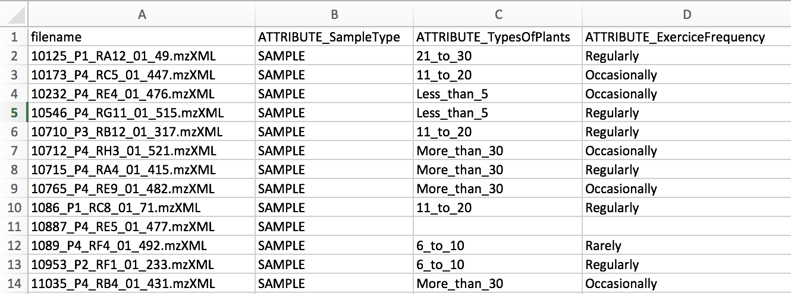

The only required columns in the metadata is "filename". NOTE: capitalization matters.

Metadata columns that will be considered by molecular networking must be prefixed by "ATTRIBUTE_".

Please ensure that the file is saved as a tab separated text file. Excel (xlsx), rich text (rtf) are not acceptable.

Pardon our dust as we are migrating this documentation, if we missed anything, please check out our [Legacy Documentation](https://bix-lab.ucsd.edu/display/Public/Metadata+table+in+GNPS).

### \`ili 3D Mapping Files

The metadata can also be used to specify spatial coordinates for direct visualization of the data in ['ili toolbox](https://ili.embl.de/). Note that an .STL binary file must selected as an input in the workflow.

The following headers are required:

1. "COORDINATE_X" - X coordinate on the 2D/3D model
2. "COORDINATE_Y" - Y coordinate on the 2D/3D model
3. "COORDINATE_Z" - Z coordinate on the 2D/3D model
4. "COORDINATE_radius" - radius for the spot in 'ili toolbox.

Additionally, a 3D STL file will need to be provided to visualize all the molecule intensities onto. It creates really cool plots like this:

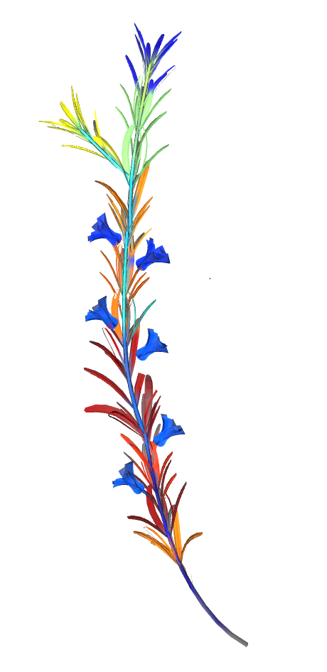

### Legacy Group and Attribute Mapping Format

This format has been replaced by the above Metadata format. While it is still supported it is not recommended. Please see the details [here](https://bix-lab.ucsd.edu/display/Public/Metadata+table+in+GNPS).

## Running Molecular Networking

### Molecular Networking Workflow Selection

From the main [GNPS page](https://gnps.ucsd.edu/ProteoSAFe/static/gnps-splash.jsp), click the ["Data Analysis"](https://gnps.ucsd.edu/ProteoSAFe/index.jsp?params=%7B%22workflow%22:%22METABOLOMICS-SNETS-V2%22,%22library_on_server%22:%22d.speclibs;%22%7D) link.

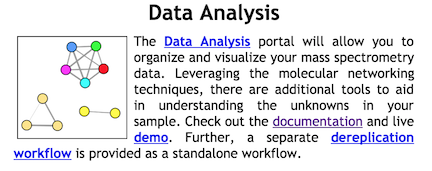

This will bring you to the workflow input to start networking.

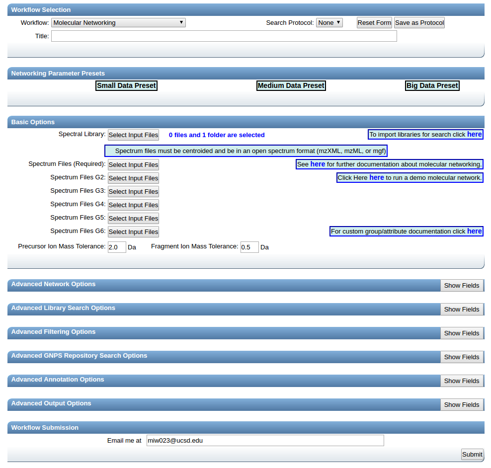

Provide a detailed title for your molecular network. This title will be helpful when you retrieve your data after the workflow is completed.

### Selecting Files to Analyze

Select files for analysis by first clicking "Select Input Files".

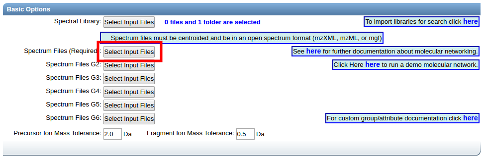

This bring a popup window. We can select our own files to analyze.

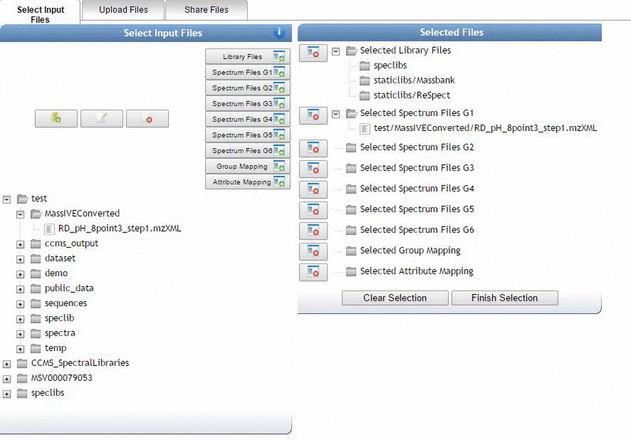

Alternatively, we can import an existing public dataset if we know the dataset accession ([Browse Datasets](datasets.md)). From the Select Input Files popup, you will be a shares files tab. There you will find a box called Import Data Share. In this box you may enter an accession of a MassIVE dataset. Upon clicking import the dataset will appear in your workspace to select input files to analyze from.

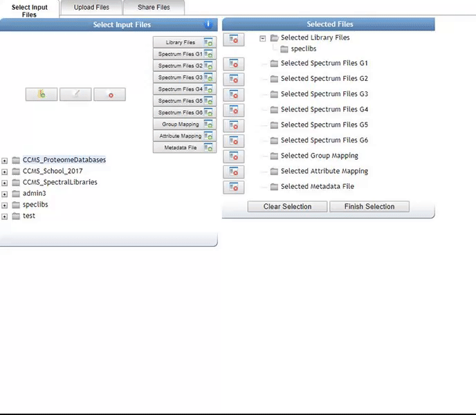

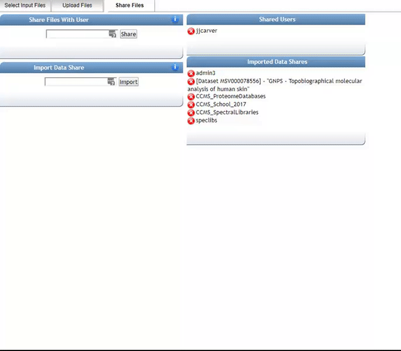

### Organizing Selected Files into Groups

By default, files can be categorized into separate groups (G1, G2, etc.). For example, case and control or two different microbes can be separate groups. Using the basic options, only six groups can be created. Individual files or entire folders can be selected.

Click Finish Selection which will close the pop-up window.

### Parameter Walkthrough

#### Basic Options

| Parameter  | Description          | Default |
| ------------- |-------------| -----|
| Precursor ion mass tolerance (PIMT) | Parameter used for MS-Cluster and spectral library search. Specify the precursor ions mass tolerance, in Daltons. This value influences the aforementioned clustering of nearly-identical MS/MS spectra via MS-Cluster. Note that the value of this parameters should be consistent with the capabilities of the mass spectrometer and the specific instrument method used to generated the MS/MS data. Recommended Values value is ± 0.02 Da for high-resolution instruments (q-TOF, q-Orbitrap) and ± 2.0 Da for low-resolution instruments (ion traps, QqQ).| 2.0 |
| Fragment Ion Mass Tolerance (FIMT)	      | Parameters used for MS-Cluster, molecular networking, and MS/MS spectral library searches. For every group of MS/MS spectra being considered for clustering (consensus spectrum creation), this value specifies how much fragment ions can be shifted from their expected m/z values. Recommended Values value is ± 0.02 Da for high-resolution instruments (q-TOF, q-Orbitrap) and ± 0.5 Da for low-resolution instruments (ion traps, QqQ). | 0.5 |

#### Advanced Network Options

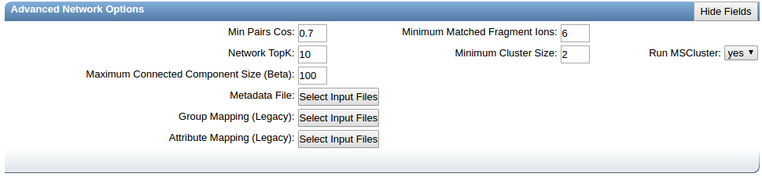

| Parameter        | Description          | Default | Notes |
| ------------- |-------------| -----| -----|
| Min Pairs Cos | Minimum cosine score that must occur between a pair of consensus MS/MS spectra in order for an edge to be formed in the molecular network.  | 0.7 | Lower value will increase the size of the clusters by inducing the clustering of less related MS/MS spectra, higher value will limit do the opposite. |
| Minimum Matched Fragment Ion (Min Matched Peaks) | Parameters used for molecular networking. Is the minimum number of common fragment ions that are shared by two separate consensus MS/MS spectra in order to be connected by an edge in the molecular network | 6 | A low value will permit linkages between spectra of molecules with few similar fragment ions, but it will result in many more less-related spectra being connected to the network. An higher value will do the opposite. Default value is 6, but note that this parameters should be adjusted depending on the experimental conditions for mass spectra acquisition (such as mode of ionisation, fragmentation conditions, and the mobile phase,  ...), and the collision-induced fragmentation behavior of the molecules of interest within the samples. High molecular weight (MW) compounds, and compounds with more hetero-atoms will generally tend to produce more fragment ions. However, this rule cannot be systematized. For example, some lipids with high MW generate only few fragment ions. |
| Node TopK	| Maximum number of neighbor nodes for one single node  | 10 | The edge between two nodes are kept only if both nodes are within each other's ‘TopK’ most similar nodes.  For example, if this value is set at 20, then a single node may be connected to up to 20 other nodes.  Keeping this value low makes very large networks (many nodes) much easier to visualize. |
|Minimum Cluster Size  | Minimum number of MS/MS spectra in a consensus MS/MS spectra to be considered for molecular networking | 2 | Requires MS-Cluster to be on. This parameter should be tuned based on the dataset size. See presets below |
| Run MSCluster | Cluster MS/MS spectra before networking | Yes | MSCluster will analyze every MS/MS spectra resulting from ions that fall within the defined precursor ion mass tolerance, and will merge the nearly-identical MS/MS spectra (above the cosine score) into a single consensus MS/MS spectrum. Each consensus MS/MS spectrum usually consist of multiple MS/MS spectra from across multiple LC-MS runs (or data files) |
| Maximum Connected Component Size | Maximum size of nodes allowed in a single connected network  | 100 | Maximum size of nodes allowed in a single connected network. Nodes within a single connected molecular network will be separated by increasing cosine threshold for that specific connected molecular network. Default value is 100. Use 0 to allow an unlimited number of nodes in a single network. Note that with large datasets, or when a great number of related molecules are in the dataset, this value should be higher (or turn to 0) to retain as much information as possible. Downstream, these larger networks can be visualized using Cytoscape layout algorithms that can increase the intra-network clustering, allowing to visualize spectral groups in the network despite the number of nodes in the network. |
| Metadata File | Text input to describe experimental setup | | Replaces both Group mapping and Attribute Mapping |
| Group Mapping | Input text file organizing input files into groups | | Input text file organizing input files into groups. used as a more flexible alternative to assigning groups during data input selection.  |
| Attribute Mapping | Attribute mapping eases visualization of different groups within cytoscape  | | Input text file organizing groups into attributes |

#### Advanced Library Search Options

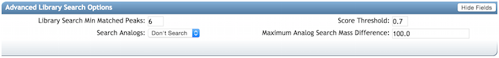

| Parameter        | Description          | Default |
| ------------- |-------------| -----|
|Library Search Min Matched Peaks | Minimum number of common fragment ions that MS/MS spectra should contain in order to be considered for spectral library annotation. Default value is 6, but note that this parameters should be tuned depending of the molecule of interest, and the experimental conditions (such as the ionisation mode, and the fragmentation conditions, ...). For example, collision-induced fragmentation of some lipids produce only few fragment ions. A lower value will allow clustering of MS/MS spectra containing less  fragment ions, however it will also induce clustering of  MS/MS spectra from different molecular-type to be connected in one network. An higher value will do the opposite|6|
|Score Threshold |Minimum cosine score that MS/MS spectra should get in spectral matching with MS/MS spectral libraries in order to be considered an annotation.|0.7|
|Search Analogs|Will search data for analogs to library spectra|Don't Search|
|Maximum Analog Search Mass Difference|Maximum mass shift between library and putative analog found| 100 (Da)|

#### Advanced Filtering Options

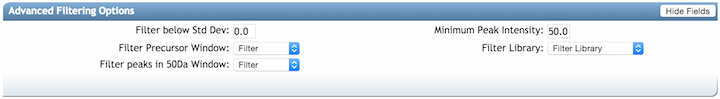

| Parameter        | Description          | Default | Notes|
| ------------- |-------------| -----| -----|
| Filter stdDev Intensity | Deprecated | 0 | Not recommended to change |
| Minimum Fragment Ion Intensity | All fragment ions in the MS/MS spectrum below this raw intensity will be deleted.  By default, no filter. | 0 | Reduce to 0 if your data's raw intensities are very low. |
| Filter Precursor Ion Window | All peaks in a +/- 17 Da around precursor ion mass are deleted. By default, yes filter. This removes the residual precursor ion, which is frequently observed in MS/MS spectra acquired on qTOFs. | Filter | |
| Filter library | Apply peak filters to library | Filter | |
|Filter peaks in 50Da Window | Filter out peaks that are not top 6 most intense peaks in a +/- 50Da window | Filter | Turn off if your data is very small molecules as it might filter out a lot peaks in the lower mass ranges that might be signal. |

### Parameter Presets

We have several parameter presets that seem to work well depending on the dataset size.

1. Small datasets - up to 5 LC/MS files
2. Medium Datasets - 5 to 400 LC/MS files
3. Large Datasets - 400+ LC/MS files
4. Big Data(sets) - Lets talk!

## Status Page

Upon submission of the workflow, you will be brought to the status page. This will show you the progress of your molecular networking job.

TODO: status page image

Molecular networks usually take

* 10 min for small datasets
* 1 hour for medium datasets
* Several hours for large datasets
* FOREVER for big datasets

If you find your molecular network is taking longer than this, please [contact us](contact.md).

## Online Exploration of Molecular Networks

After completing a Molecular Networking workflow utilizing GNPS, analysis can be done within the web interface. The GNPS web interface provides a quick and easy way to perform initial analysis of your data particularly if you want to view the MS2 spectra of the nodes/clusters/networks generated by the Molecular Networking workflow.

### Networking Results Views Description

**Default Views to Explore Molecular Networks**

| View        | Description          |
| ------------- |-------------|
| [View All Library Hits](networkingviews.md#view-all-library-hits) | All spectral library matches between consensus MS/MS spectra and the selected libraries |
| View Unique Library Compounds | All unique library spectrum matches |
| [View All Clusters With IDs](networkingviews.md#view-all-clusters-with-ids) | All consensus MS/MS spectra created by MSCluster that were considered for library search and molecular networking. This does not include consensus MS/MS spectra that fell below the minimum cluster size threshold |

**Network Visualizations**

| View        | Description          |
| ------------- |-------------|
| [View Spectral Families (In Browser Network Visualizer)](networkingviews.md#view-spectral-families) | List of all Spectral Families (i.e. connected components in the network) as well as view the network visualized in the browser |
| Network Summarizing Graphs | Brief statistics about the network such as number of spectra, number of nodes, number of spectral families, identification rates, etc. (legacy output) |

**Methods and Citation for Manuscripts**

| View        | Description          |
| ------------- |-------------|
| Networking Parameters and Written Network Description | Automatic description of molecular networking generation. This can be used in the methods section of manuscripts |

**Export/Download Network Files**

| View        | Description          |
| ------------- |-------------|
| Download Clustered Spectra as MGF | Download consensus MS/MS spectra as an MGF file |
| Download GraphML for Cytoscape | Download network files (graphML) for import into Cytoscape |
| Download Bucket Table | Download spectral abundance for all consensus spectra across all files |
| Download BioM for Qiime/Qiita | Download BioM for spectral counts for analysis in Qiime/Qiita multivariate statistics tools |
| Download Metadata for Qiime | Download Metadata file for analysis in Qiime |
| Download ili Data | Download the abundance information formatted for ili |

**Advanced Views - Global Public Dataset Matches**

| View        | Description          |
| ------------- |-------------|
| View Matches to All Public Datasets | View matches of consensus MS/MS spectra in the network to all public datasets |

**Advanced Views - Third Party Visualization**

| View        | Description          |
| ------------- |-------------|
| [View Emperor PCoA Plot in GNPS](networkingviews.md#view-principle-coordinate-analysis-pcoa-plots) | In browser visualization of all analyzed samples with PCoA |
| View ili in GNPS | Visualization of 3D ili mapping in GNPS |

**Advanced Views - Experimental Views**

| View        | Description          |
| ------------- |-------------|
| Direct Cytoscape Preview/Download | Preview entire molecular network and download direct cys file to open in Cytoscape |

### Publishing Data

To increase transparency in data analysis, please include the URL of your specific GNPS analysis job.

Additionally, we recommend that you deposit the data you used for analysis into the MassIVE dataset repository in order to make your raw data public. To do this please click the "Publish Data in MassIVE" button:

TODO: image and implement

## Citation

If you are using GNPS for analysis, please cite the manuscript

[Mingxun Wang, Jeremy J Carver, Vanessa V Phelan, Laura M Sanchez, Neha Garg, Yao Peng, et al. "Sharing and community curation of mass spectrometry data with Global Natural Products Social Molecular Networking" Nature Biotechnology 34.8 (2016): 828-837. PMID: 27504778](https://www.nature.com/articles/nbt.3597)

If you use MS-Cluster in your molecular networks, cite the following as well:

[Frank, Ari M., et al. "Clustering millions of tandem mass spectra." Journal of proteome research 7.01 (2007): 113-122.](https://pubs.acs.org/doi/abs/10.1021/pr070361e)
