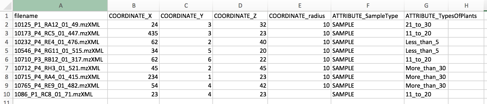

## Molecular Networking

Molecular networks are visual displays of the chemical space present in tandem mass spectrometry (MS/MS) experiments. This visualization approach can detect sets of spectra from related molecules (molecular networks), even when the spectra themselves are not matched to any known compounds.

The visualization of molecular networks in GNPS represents each spectrum as a node, and spectrum-to-spectrum alignments as edges (connections) between nodes. Nodes can be supplemented with metadata, including dereplication matches or information that is provided by the user, e.g. as abundance, origin of product, biochemical activity, or hydrophobicity, which can be reflected in a node’s size or color. This map of all related molecules is visualized as a global molecular network.

For more information about Molecular Networking check out the [GNPS publication](https://www.nature.com/articles/nbt.3597) from 2016.

### Workflow Selection

From the main [GNPS page](https://gnps.ucsd.edu/ProteoSAFe/static/gnps-splash.jsp), click the "Data Analysis" link.

This will bring you to the workflow input to start networking. 

See [Legacy Documentation](https://bix-lab.ucsd.edu/display/Public/Molecular+Networking+Documentation)

## Metadata

The metadata file describes the samples properties and allows more flexibility for data analysis and visualization. It is an alternative way to assign groups when selecting data input files within the workflow of GNPS.

The current version of molecular networking allows to use the metadata table as an input. Although it is possible to use the legacy group mapping and attribute mapping file, we strongly advise to prepare metadata table instead.

### Format

The metadata table is a text file (Tab separated) that users must create these file themselves using a text editor (e.g. Microsoft Excel, Notepad++ for Windows, gedit for Linux, TextWrangler for Mac OS). Using Metadata table can greatly ease the visualization and analysis of data within Cytoscape. We strongly encourage you to prepare those in advance and to share it publicly with your MassIVE data.

You can download an example and edit it appropriately. Finally users will need to upload just as you would upload data input files and select it in the metadata table file upload selection. For a metadata table file template, you can use the following .txt file - [Right-click, and Save link as](https://raw.githubusercontent.com/DorresteinLaboratory/GNPS-Trinity/master/GNPS-Trinity_template_files/metadata_GNPS_AMG_demo.txt).

The only required columns in the metadata is "filename". NOTE: capitalization matters.

Metadata columns that will be considered by molecular networking must be prefixed by "ATTRIBUTE_".

Please ensure that the file is saved as a tab separated text file. Excel (xlsx), rich text (rtf) are not acceptable.

Pardon our dust as we are migrating this documentation, if we missed anything, please check out our [Legacy Documentation](https://bix-lab.ucsd.edu/display/Public/Metadata+table+in+GNPS).

### Additions for \`ili

The metadata can also be used to specify spatial coordinates for direct visualization of the data in ['ili toolbox](https://ili.embl.de/). Note that an .STL binary file must selected as an input in the workflow.

The following headers are required:

1. "COORDINATE_X" - X coordinate on the 2D/3D model
2. "COORDINATE_Y" - Y coordinate on the 2D/3D model
3. "COORDINATE_Z" - Z coordinate on the 2D/3D model
4. "COORDINATE_radius" - radius for the spot in 'ili toolbox.

## Legacy Group and Attribute Mapping Format

This format has been replaced by the above Metadata format. While it is still supported it is not recommended. Please see the details [here](https://bix-lab.ucsd.edu/display/Public/Metadata+table+in+GNPS).

## Parameter Walkthrough

* Parent Mass Tolerance
* Fragment Tolerance
* etc.

TODO: Add this

### Parameter Presets

## Online Exploration of Molecular Networks

These are the primary views to explore the molecular networks:

1. View All Clusters - All consensus MS/MS spectra created by MSCluster that were considered for library search and molecular networking. This does not include consensus MS/MS spectra that fell below the minimum cluster size threshold.
2. View Library Hits - All spectral library matches between consensus MS/MS spectra and the given libraries
3. View Spectral Families - List of all molecular network components. Each of these components can be visualized in-browser.
4. Networking Parameters and Written Description - Includes a written English description of parameters and tools used in the creation of the molecular network that can be included in a manuscript's methods section.

Advanced Views

TODO: Fill it in

1.

## Citation

If you are using GNPS for analysis, please cite the manuscript

[Mingxun Wang, Jeremy J Carver, Vanessa V Phelan, Laura M Sanchez, Neha Garg, Yao Peng, et al. "Sharing and community curation of mass spectrometry data with Global Natural Products Social Molecular Networking" Nature Biotechnology 34.8 (2016): 828-837. PMID: 27504778](https://www.nature.com/articles/nbt.3597)

If you use MS-Cluster in your molecular networks, cite the following as well:

[Frank, Ari M., et al. "Clustering millions of tandem mass spectra." Journal of proteome research 7.01 (2007): 113-122.](https://pubs.acs.org/doi/abs/10.1021/pr070361e)
