## View All Library Hits

This view shows all the library matches between the consensus MS/MS spectra and the GNPS MS/MS Spectral Libraries.

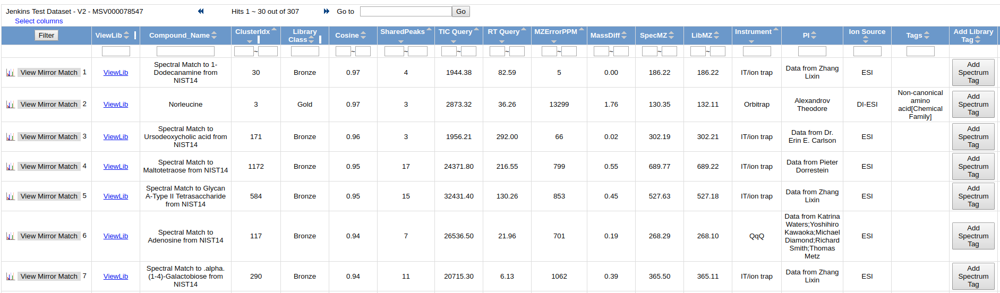

To view the quality of the MS/MS match, click "View Mirror Match" to display a mirror plot

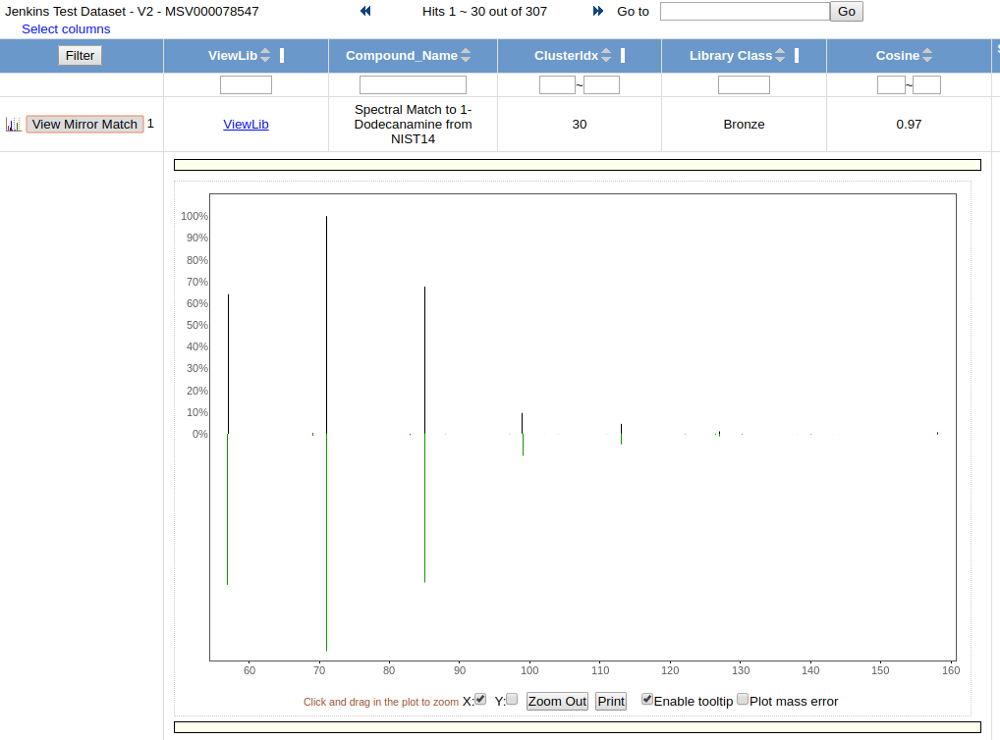

## View All Clusters With IDs

View All Clusters allow a user to view the all consensus spectra in the molecular networking analysis.

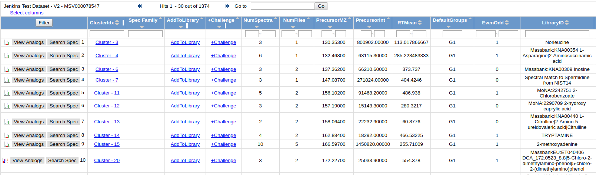

To view all the input MS/MS spectra that went into the consensus spectrum, click the link in the "ClusterIdx" link

This brings up all the input MS/MS spectra. To visualize each spectrum, we can click the "View Spectrum" button.

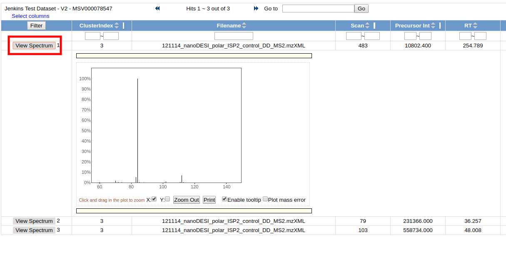

## View Spectral Families

View Spectra Families allows users to look at the molecular networks at a higher level. Users can see all the connected components. These connected components are all the nodes that are connected to each other. From here users can tell how big each component is, how many raw spectra are captured by the particular component, and also the libraries identifications of all the spectra in each component.

To visualize each network, click on the "Visualize Network" link

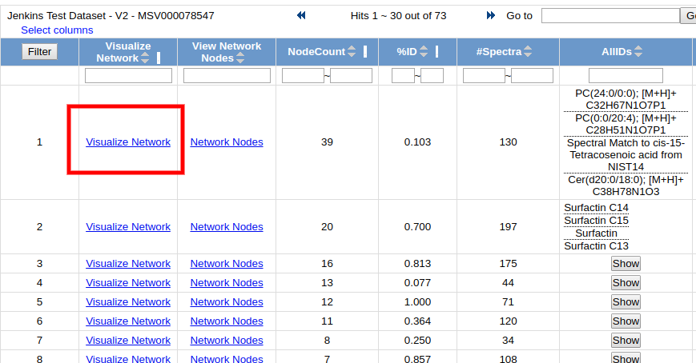

This brings up an in-browser visualization for a given connected component

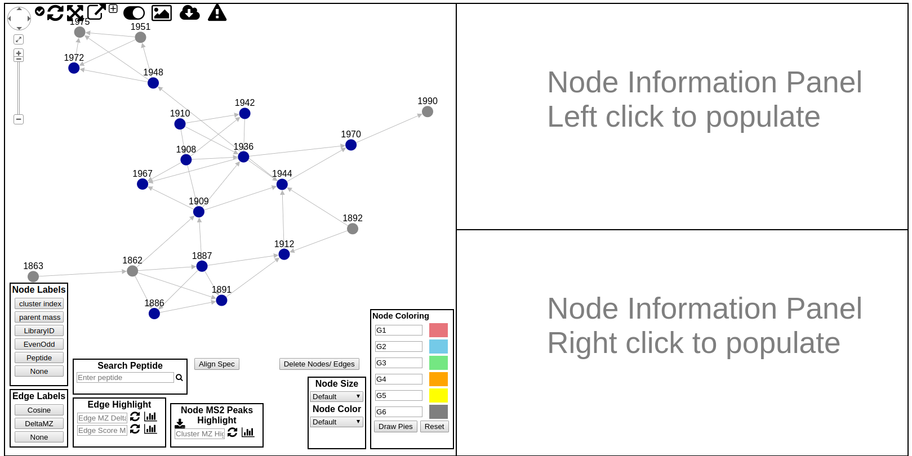

Here users can explore the connected component in the molecular network. Each circle in the left network panel represents a consensus spectrum and edge represents related fragmentation patterns. The default color of the nodes is gray, with blue nodes representing consensus MS/MS spectra that were identified by library search.

The default labeling is the cluster/node index which is rather uninformative, but there are alternative labelings possible by selecting the appropriate node label from the Node Label legend box.

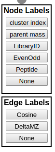

### Network Labeling

**Node Labels**

| Label        | Description          |
| ------------- |-------------|
| cluster index | cluster index used globally for each cluster across all networking views |
| parent mass |  precursor mass of the consensus spectrum |
| LibraryID |  library identification name for the node if a library search were performed |
| EvenOdd | 1/0 for even or odd depending on the parent mass. Used for nitrogen rule |
| Peptide | peptide labeling |
| None | No Labeling |

**Edge Labels**

| Label        | Description          |
| ------------- |-------------|
| Cosine | Cosine score measuring fragmentation similarity between two nodes |
| DeltaMZ | The Delta MZ of the spectra |
| None | No Labeling |

### Node Pie Coloring

An additional way to customize the view of the networks is to color the nodes. By default the nodes are gray, but users can color the nodes based upon spectra counts of the groups they came from. By default the coloring labels will be based upon the default groups G1, G2, G3, G4, G5, and G6. The coloring of each node will be a pie, and the proportion colored of that pie is the proportion of the spectral counts coming from each respective group. Additionally, the Node Coloring legend describes the color for each group. Users can also use their own group names if they defined their own arbitrary groups when creating the network.

To draw the pies, click "Draw Pies"

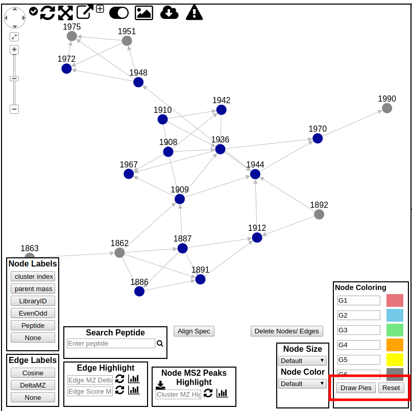

### Edge Highlights

Edges by default include arrows pointing from low mass spectra to high mass spectra. Further, edges can also be colored. Users are able to enter a delta mz of their choice to highlight in the network. The highlighted edges will appear in red.

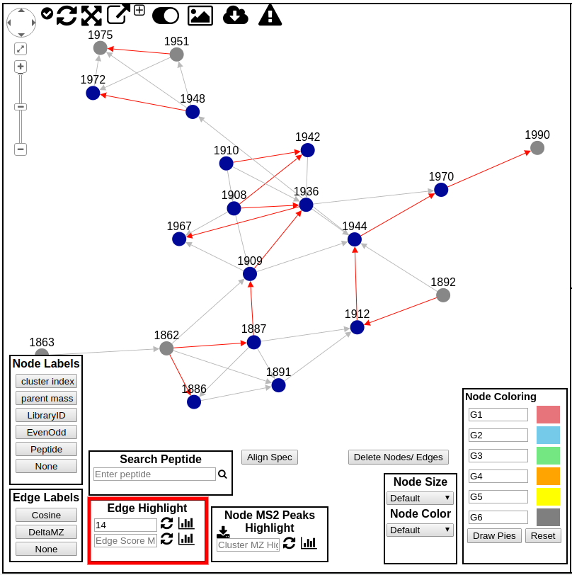

### Detailed Interrogation of Network Spectra

While its great to visualize the network properly, to truly make sense of the network users must be able to interrogate the network metadata and examine the actual spectra. To this end, users are able to find out information about a particular node by simply hovering their mouse over node. This will bring up a hover box describing the node information. At present the display shows like this:

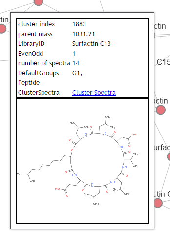

This shows basic information about the node, as well as the structure if the node is identified by library search and the structure was provided in the library spectrum.

To further investigate the network, users can left click on a node to plot the spectrum in the top right panel (right click to plot in bottom right panel), along with the spectrum information and structure if one is available.

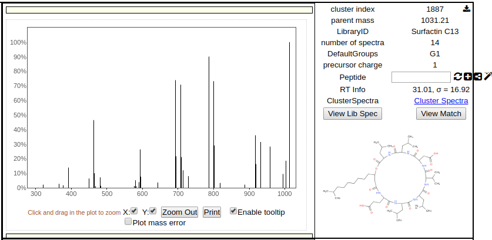

The spectrum image is interactive so users can zoom in and look at precisely at the spectrum to make sense of the data. Additionally users can compare two spectra in the network by simple right clicking on a different node to render its information in the bottom right panel.

Users can also click on an edge and both nodes that are connected to the edge are automatically displayed in the top and bottom right panels.

### Examining Spectrum Spectrum Alignment

Users can quickly ascertain how two spectra align to each other at the peak level. By clicking the "Align Spec" button to obtain the score between the spectrum in the top and the spectrum in the bottom render panels.

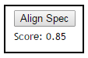

Additionally, the plots of the spectra will update to reflect the alignments shown here:

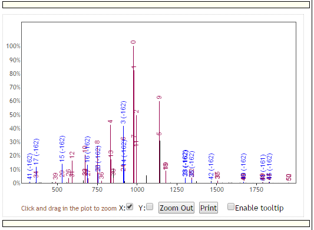

with red peaks representing peaks that match at the exact same masses between the top and bottom spectra, and blue peaks representing peaks matching at shifted masses. Additionally, each peak is labeled with a unique identification number that shows the correspondence of peak matches between the top and bottom spectra.

### Network Spectra Library Matches

To view how exactly a spectrum in the network has matched to a library spectrum, users can click the "Show Library Match" in the side panel on the far right. This will bring up this middle panel shown below comparing the spectrum in the network with the library spectrum in green.

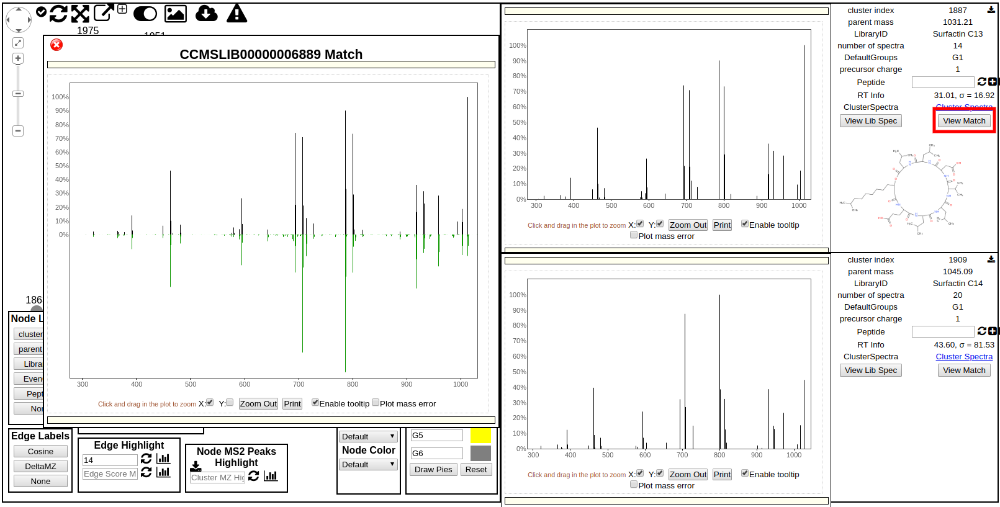

## View Principle Coordinate Analysis (PCoA) Plots

To view PCoA plots, please enable that output on the input page (default is on) in the "Advanced Output Options" section and enabling "Create Cluster Buckets and BioM/PCoA Plots output". This will create the appropriate data structures for PCoA analysis. To include additional metadata to color the nodes according to the sample types, include and add additional columns for metadata describing the experiment (see [documentation](???)).

To view the PCoA plots when the parameters are appropriately set, click the "View Emporer PCoA Plot in GNPS" under the section "Advanced Views - Third Party Visualization" on the results page of your GNPS job.
