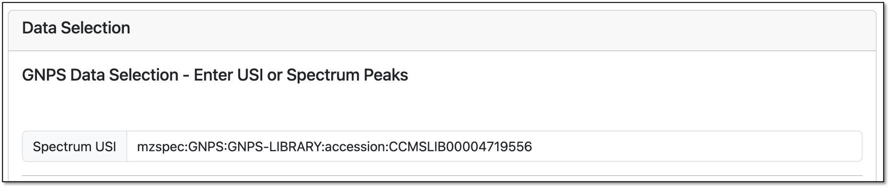
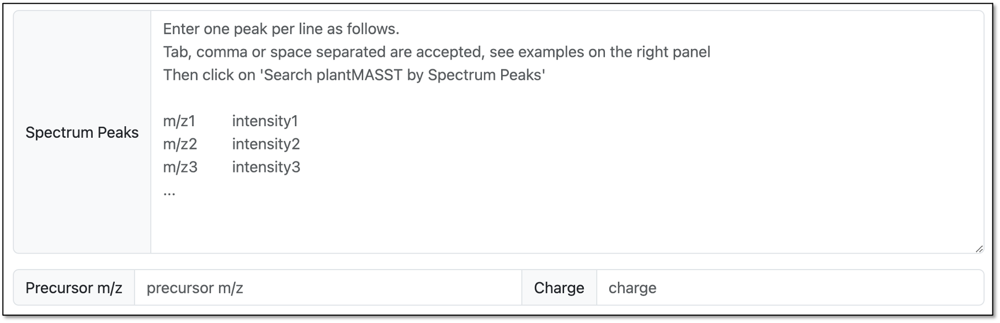
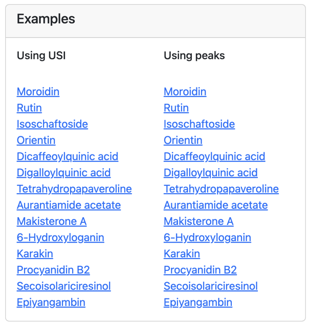
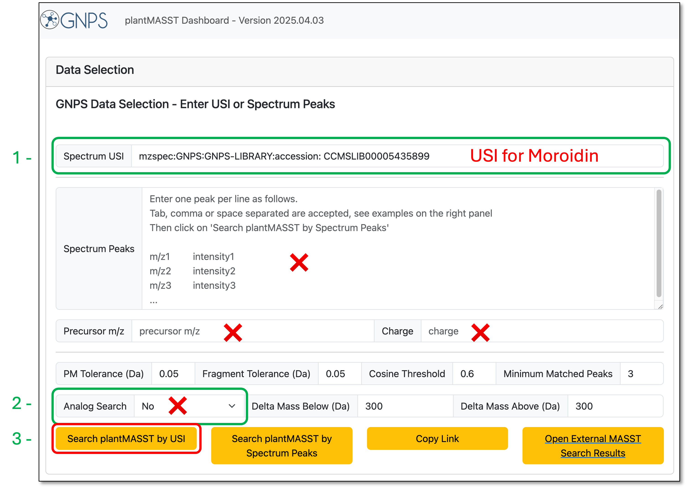
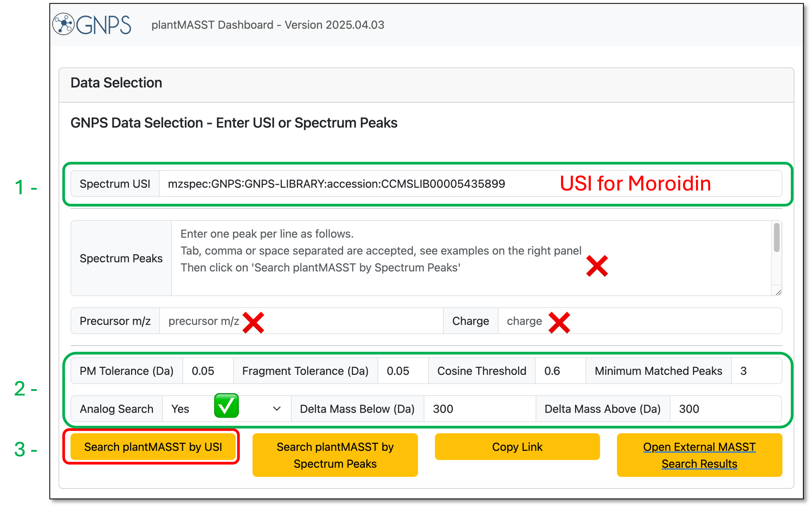
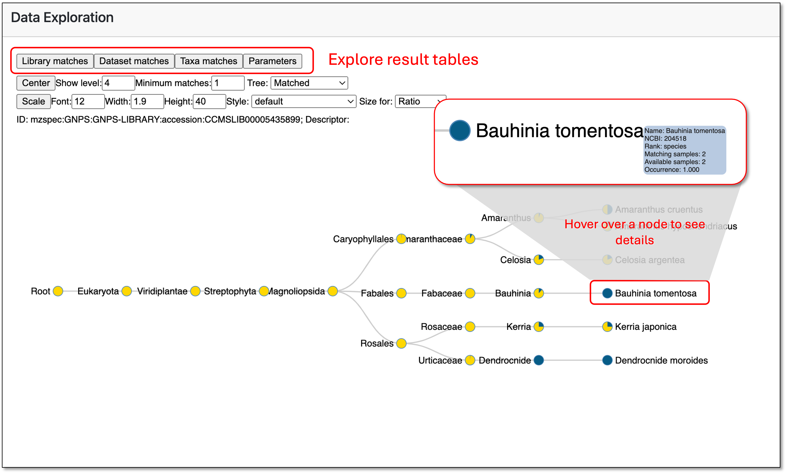
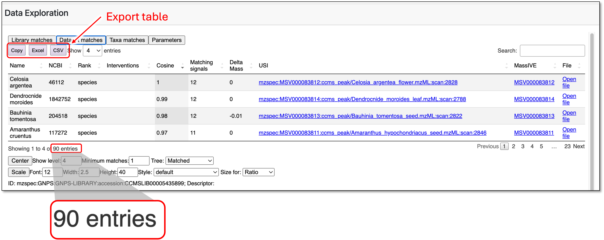
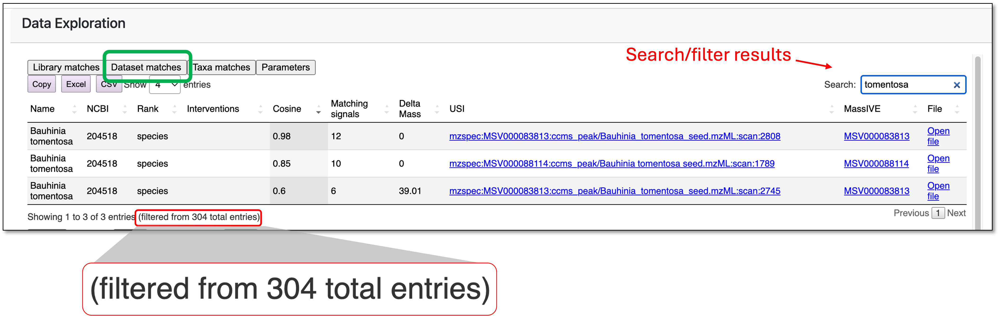

# plantMASST

[plantMASST](https://masst.gnps2.org/plantmasst) is a domain-specific MASST in which users can search MS/MS spectra against a public MS/MS database comprising taxonomically defined plant extracts.

## Input

The user can provide two different types of input for the search: by **USI (Universal Spectrum Identifier)** or by a list of **Spectrum Peaks**.

### USI input

To perform a search using a spectrum identifier (USI), just copy and paste it into the “**Spectrum USI**” input area. If the user wants to perform a search using their own data, they can deposit datasets in [MassIVE](https://massive.ucsd.edu/), [MetaboLights](https://www.ebi.ac.uk/metabolights/), or [Metabolomics Workbench](https://www.metabolomicsworkbench.org/), and using the GNPS Dashboard tool, get the USI assigned to each specific scan. The user can access the documentation to see more details about the usage of the dashboard ([GNPS Dashboard Documentation](https://ccms-ucsd.github.io/GNPSDocumentation/lcms-dashboard/)). 

In addition, an USI can be retrieved from a GNPS job (such as feature-based molecular networking or classical molecular networking workflow) or from any spectrum that is part of the GNPS libraries. Examples of types of valid USIs can be found in the [Metabolomics Spectrum Resolver webpage](https://metabolomics-usi.gnps2.org/).

_**Figure 1.** Input area for USI search on plantMASST_

### Spectrum Peaks input

Another useful way to perform a search is to use the “**Spectrum Peaks**” input field to pass the spectrum details as a list of m/z and intensity pair values. This option is particularly helpful when the spectrum is not deposited in any of the repositories cited above, so no USI is associated with it.

In such cases, the user must also provide a value in the **“Precursor m/z”** field to specify the mass-to-charge ratio of the precursor ion. The **“Charge”** field can be included as well, but it defaults to 1 if left blank.

_**Figure 2.** Input area for searching by spectrum peaks. The user needs to provide the formatted peak list and Precursor m/z. The charge input is optional, and defaults to 1 if not provided._

## Search examples

The example card on the right dashboard provides links to pre-configured search inputs. These examples demonstrate how to use the interface with both USI and spectrum peaks.

Clicking the links will populate the required field on the interface, requiring the user to only click “**Search plantMASST by USI**” or “**Search plantMASST by Spectrum Peaks**”, depending on the initial choice, as seen in the figure below. We encourage the user to explore the different searches and how the different parameters affect the search results to better understand how to use the interface.

_**Figure 3.** The example card provides a few pre-configured entries that can be used to explore how to populate the search parameters._

## Searching

### plantMASST Search

The example below illustrates a search using an USI for the compound moroidin as input (Box 1). The fields marked with an “**X**” were not altered, and by default, the search will look only for exact matches within the specified parameters (Analog Search \= No, Box 2).

The remaining fields (Fragment Tolerance, Cosine Threshold, Minimum Matched Peaks, Delta Mass Below.Above) can be adjusted as necessary.

Finally, the user can click “**Search plantMASST by USI**” (Box 3) to perform the search.

_**Figure 4.** Search parameters populated for USI search for the compound moroidin. By default, the Analog Search is off, and the search will look for matches within the tolerance input for PM Tolerance and fragment tolerance. Box 1 \- USI input for moroidin. Box 2 \- Parameters set with Analog Search off (default). Box 3 \- Search button to perform the search using the provided USI._

Another very useful feature available is the “**Copy Link**” button, which allows the user to share their search parameters easily. This facilitates reproducibility and collaboration by enabling others to rerun the exact same query.

!!! note "URL example"
    The URL below is an example of the parameters used in the search shown in the figure above. The user can click on it to populate the search fields with the same parameters. 

    **[Click here to populate the plantMASST search with the parameters shown above](http://127.0.0.1:5052/plantmasst#%7B%22usi1%22%3A%20%22mzspec%3AGNPS%3AGNPS-LIBRARY%3Aaccession%3A%20CCMSLIB00005435899%22%2C%20%22peaks%22%3A%20%22%22%2C%20%22precursor_mz%22%3A%20%22%22%2C%20%22charge%22%3A%20%22%22%2C%20%22pm_tolerance%22%3A%200.05%2C%20%22fragment_tolerance%22%3A%200.05%2C%20%22cosine_threshold%22%3A%200.6%2C%20%22min_matched_peaks%22%3A%203%2C%20%22analog_select%22%3A%20%22No%22%2C%20%22delta_mass_below%22%3A%20300%2C%20%22delta_mass_above%22%3A%20300%7D%0A)**

!!! tip "Reproducibility tip"
    Sharing a link like this ensures anyone can load the exact same parameters in the interface without manually re-entering them.

### plantMASST Analog Search

To search for possible compound analogs, the user must select Yes on the “**Analog Search**” field. In that case, a delta mass range should also be given using the “**Delta Mass Below (Da)**”/”**Delta Mass Above (Da)**” inputs. Both USI and Spectrum Peaks search inputs can be used for an analog search.

In the figure below, we illustrate the search using the USI for moroidin (Fig 5, Box 1). The search parameters were defined as shown in Box 2\. Finally, to perform the search, we click on ‘Search plantMASST by USI’  (Box 3).

_**Figure 5.** Search parameters set for Analog Search using an USI for the compound moroidin. Box 1 \- USI input for moroidin. Box 2 \- Parameters set with Analog Search on. Box 3 \- Search button to perform the search using the provided USI._

!!! tip "Reproducibility tip"
    To populate the search fields as shown above, click the link: [plantMASS analog search parameters example](https://masst.gnps2.org/plantmasst#%7B%22usi1%22%3A%20%22mzspec%3AGNPS%3AGNPS-LIBRARY%3Aaccession%3ACCMSLIB00005435899%22%2C%20%22peaks%22%3A%20%5B%22%22%5D%2C%20%22precursor_mz%22%3A%20%5B%22%22%5D%2C%20%22charge%22%3A%20%22%22%2C%20%22pm_tolerance%22%3A%200.05%2C%20%22fragment_tolerance%22%3A%200.05%2C%20%22cosine_threshold%22%3A%200.6%2C%20%22min_matched_peaks%22%3A%203%2C%20%22analog_select%22%3A%20%22Yes%22%2C%20%22delta_mass_below%22%3A%20300%2C%20%22delta_mass_above%22%3A%20300%7D)

## Output

### Default search results

The search results can be visualized in two main formats: A taxonomic tree and through data tables. Those outputs are highlighted in the figure below. The tree offers interactive features, and the user can explore the details by moving the cursor over any node, for example. The visualization is also highly customizable using the controls available above the tree.

_**Figure 6.** Interactive result tree visualization. The user can use the available controls to customize the visualization as well as see details by moving the mouse over the nodes. The result tables can be visualized and exported by clicking the buttons on the top left corner._

The results tables offer a concise way of obtaining more details about the matches. On the Dataset Matches tab, information such as NCBI taxonomy ID number, organism name, and external links to the matching spectrum, public dataset source, and a link to visualize the original file data using the GNPS Dashboard are available. For this search, 90 matches with public datasets were retrieved for moroidin.

_**Figure 7.** Dataset matches table visualization. Here details such as the NCBI  taxonomy ID, cosine similarity, matching spectra USI and other information are summarized. The table can also be exported in 3 different formats to be further explored._

### Analog search Results

Below, we can see the results retrieved when the analog search is performed with the parameters described in the “**planMASST Analog Search**” section. The interface is the same as described for the standard search, including customizing the tree visualization and exporting table results, as seen in the figure.

_**Figure 8.** Dataset matches table, filtered to matches containing the word “tomentosa”. NCBI  taxonomy ID, cosine similarity, matching spectra USI, and other information are available. The table can also be exported in 3 different formats to be further explored._

However, here we can see the total amount of matches has increased compared to the previous search. Since we are also looking for analogs, more matches are expected, and we can see that compounds that are not exact matches to moroidin are also retrieved. 

The Delta Mass column in the table above shows one compound that has a Delta mass of \+39.01 Da compared to moroidin. This means that the spectrum is similar enough to moroidin (according to the set parameters), but the precursor has a greater mass, suggesting that the compounds’ core structure might be similar but with an additional portion corresponding to the observed delta mass.\`

### Downloading results

As described in the previous session, the result tables can be exported in different formats for further use or processing. Besides that, the entire interactive tree with embedded tables can be downloaded as a HTML file, clicking on “Download Results” at the bottom of the page.

### Page Contributors

{{ git_page_authors }}
