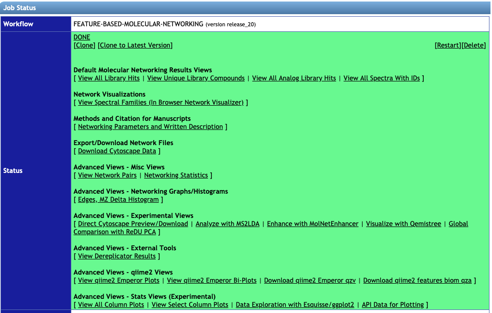
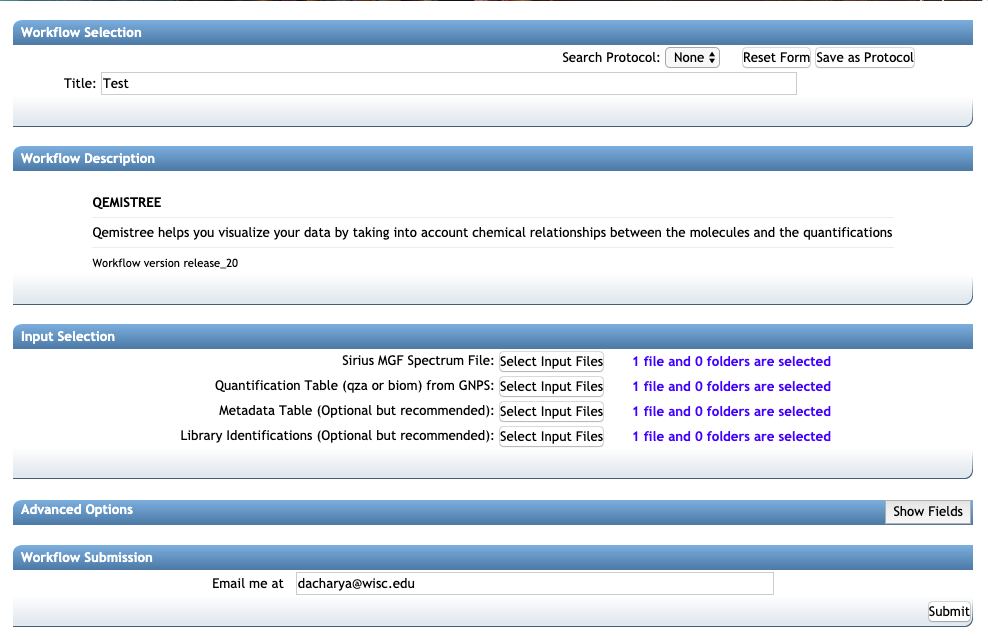
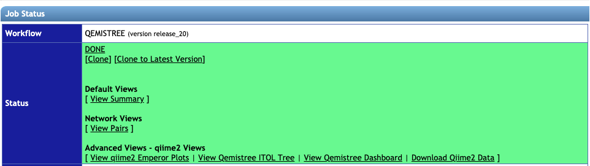
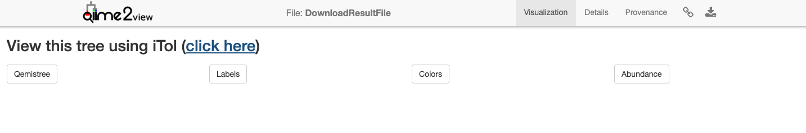
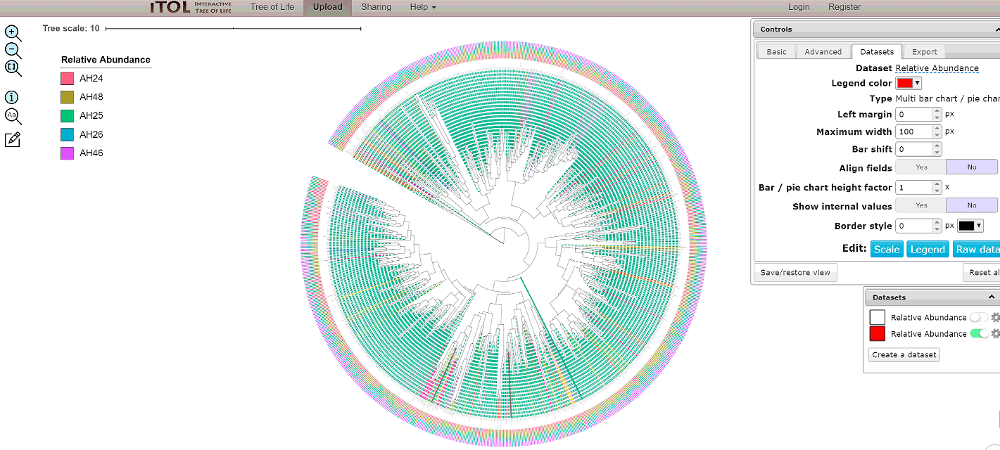
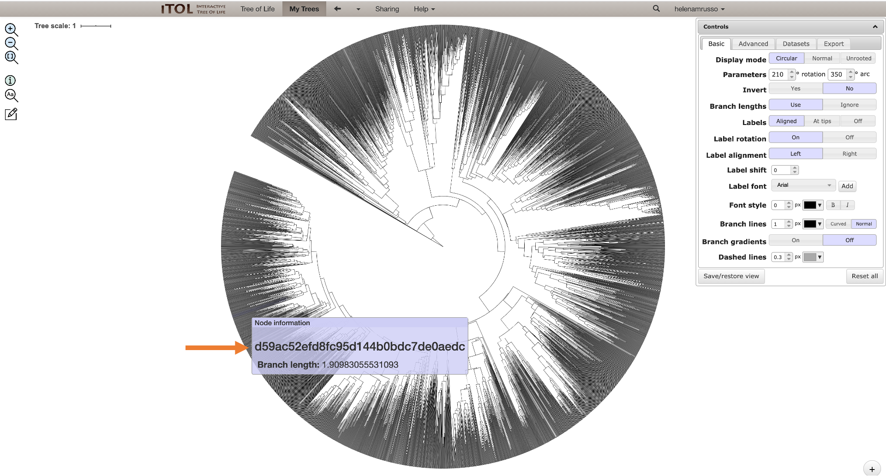
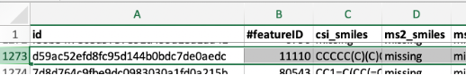

**QEMISTREE** - a tool to represnt metabolomics data as trees to explore chemical diversity
 
*Introduction*: Qemistree is a computation tool to build a tree of mass-spectrometry (LC-MS/MS) features to perform which enables the use of phylogeny-based tools to study chemical composition of samples. The article is available in [Nat. Chem. Biol. (2020)](https://www.nature.com/articles/s41589-020-00677-3).
This documentation aims to provide a user-guide on how to run a Qemistree workflow on GNPS. 

****

**STEP 1: Collecting the right input files**

Users can perform QEMISTREE analysis in GNPS after processing LC-MS/MS data through [Feature-Based Molecular Networking or FBMN](https://ccms-ucsd.github.io/GNPSDocumentation/featurebasedmolecularnetworking/) using [MZmine2](https://bmcbioinformatics.biomedcentral.com/articles/10.1186/1471-2105-11-395). The input files for Qemistree are:

**1. Required**: A SIRIUS MGF file generated from the MZmine workflow. See the [FBMN with MZmine2](featurebasedmolecularnetworking-with-mzmine2.md).

**2. Required**: A quant table called `qiime2_table.qza` with all the identified features (an output of [FBMN](https://ccms-ucsd.github.io/GNPSDocumentation/featurebasedmolecularnetworking/), and found  within the folder `qiime2_output`)

**3. Optional**: A metadata file called `qiime2_metadata.tsv` (an output of [FBMN](https://ccms-ucsd.github.io/GNPSDocumentation/featurebasedmolecularnetworking/), and also found in folder `qiime2_output`)

**4. Optional**: A library identification file (TSV) (an output of [FBMN](https://ccms-ucsd.github.io/GNPSDocumentation/featurebasedmolecularnetworking/), and found in the folder `clusterinfo_summary`)

Follow the steps below to generate these files:

a. Follow the documentation for [Feature-Based Molecular Networking using MZmine2](https://ccms-ucsd.github.io/GNPSDocumentation/featurebasedmolecularnetworking-with-mzmine2/) to generate an aligned feature list for your LC-MS/MS data and export the necessary MGF and CSV files for FBMN GNPS workflow.

b. While still in MZmine2, select your aligned feature list, then click on the tab for feature list methods and select Export/Import, followed by Export for SIRIUS.

c. Choose the Mass list that you used to generate your feature list, and specify a path and filename for your SIRIUS file. Click OK.

d. Go to GNPS server and run a [FBMN](https://gnps.ucsd.edu/ProteoSAFe/index.jsp?params=%7B%22workflow%22:%22FEATURE-BASED-MOLECULAR-NETWORKING%22,%22library_on_server%22:%22d.speclibs;%22%7D) job using the GNPS quant CSV, GNPS MGF (both generated in step a, above) and [ReDU](https://mwang87.github.io/ReDU-MS2-Documentation/HowtoContribute/) metadata file.

e. The Qemistree task utilizes the output files from FBMN. These can be downloaded by clicking on `Download qiime2 Emperor qzv` (`qiime2_table.qza` and `qiime2_metadata.tsv` from folder `qiime2_output` and  `clusterinfo_summary` for the tsv file within). You can start a Qemistree task by clicking on `Visualize with Qemistree` link on your FBMN status page 

**Note** `Visualize with Qemistree` option is available for FBMN release version >= 20. If your FBMN job was run using an older version, please re-run the job by clicking on `Clone to Latest Version` to follow the rest of the tutorial.

****       	
 
**STEP 2: Running a Qemistree job**

**1.** Go to the status page of your FBMN job:

 

Click on `Visualize with Qemistree` under the `Advanced Views - Experimental Views` to analyze your data using Qemistree. This method auto-populates the input fields `Quantification Table`, `Metadata Table` and `Library Identifications` from your corresponding FBMN job. Additionally, you need to upload your SIRIUS MGF file exported from Mzmine2 as describes in Step 1.

**2.** Make sure the correct files are included as described in the beginning:

1. Sirius MGF Spectrum file
2. `qiime2_table` for Quantification Table
3. `qiime2_metadata` for Metadata Table
4. `clusterinfo_summary` file for Library Identifications

**3.** Under the header: *Advanced options* select the following:
1. Instrument Type: `orbitrap` or `qtof`
2. Ionization Mode: `positive`, `negative` or `auto`

If you are signed in to the server the email address will auto-populate. If not, add your email address and click on submit. The runtime depends on the number of features in your dataset -- a typical dataset (few thousand features) can take a few hours. You will get an email once the job finishes and then you are ready to explore your molecular trees!

****

**STEP 3: Analysing the results from a Qemistree job from the status page**

Once the job is finished successfully, you will see the status page as below.

**1. View Summary** gives a list of the molecules, their structures and the chemical taxonomy assigned by [ClassyFire](https://jcheminf.biomedcentral.com/articles/10.1186/s13321-016-0174-y) taxonomic levels. It tabulates the annotations for all MS/MS spectra for which we could predict molecular fingerprint using Sirius and CSI:FingerID [Dührkop et. al](https://www.pnas.org/content/112/41/12580).

**2. View Qemistree iTOL Tree** to visualize the chemical tree based on similarity of molecular fingerprints predicted by Sirius and CSI:FingerID. Follow the `click here` button for Qemistree visualization in [iTOL](https://academic.oup.com/nar/article/47/W1/W256/5424068). Qemistree classifies the features/molecules based on [ClassyFire](https://jcheminf.biomedcentral.com/articles/10.1186/s13321-016-0174-y) chemical taxonomy into chemical kingdom, superclass, class, subclass, and direct_parent which can be visualized as tip labels in the tree. 

**Note.** The tree visualized above is the default visualization which includes all the molecules that had structural annotations from either spectral library matches or CSI:FingerID structural predictions. This tree is decorated with clade color and tip labels based on ClassyFire `class` assignment. This visualization can be interactively modified using `View Qemistree Dashboard` link (described in Step 4 below).

Shown below is an example default tree.

We recommend you to download the tree and tree decoration files by clicking on the boxes: **Qemistree, Labels, Colors, and Abundance**. These provide the tree file of the features that have smiles (`qemistree.tree`), the label for each tip of the tree (`labels.txt`), the color of each clade (`colors.txt`), and the relative abundance of the feature in the metadata category chosen for the job (`barplots.txt`). This is because the auto-generated tree is only available for 30 days & therefore it is recommended that you download the associated files and upload it on iTOL using your login credential for permanent storage.

**3.** Under **Advanced Views**, click on `View qiime2 Emperor Plots` to visualize the Principal Coordinate Analysis result using weighted [UniFrac distances](https://www.ncbi.nlm.nih.gov/pubmed/16332807) based on the chemical relationships based on predicted molecular fingerprints.  

**4.** Visualizing chemical trees using the **View Qemistree dashboard**. You can further explore and modify the Qemistree visualization interactively using the [Qemistree dashboard](https://qemistree.ucsd.edu/). This dashboard is available as a link on your Qemistree job status page for direct access.

The example Qemistree task on the dashboard provides is based on a subset of a global foodomics dataset. 

For your own data visualization, enter the following information on the dashboard:

1. Qemistree task ID: This is the unique ID of Qemistree job on GNPS. It can be found in your Jobs page in the `Description` column. Alternatively, click on `View Qemistree Dashboard` on the job status page, and this field will be auto-populated.
2. Column to filter qemistree features: Enter the feature metadata column to prune the tree. This can be a chemical taxonomy level or structural annotation type (all structures, MS2 structures, CSI:FingerID structures).
3. Column to label tree tips: Enter chemical taxonomic level that should be used to label each feature on the tree (tree tips).
4. You can include additional options for labelling features by MS2 library match or parent m/z values, when a feature cannot be assigned a chemical taxonomy by ClassyFire.
5. Choose metadata column by which to visualize the abundance of the features, and whether to normalize the abundance.
6. Click on Submit. You can quickly generate many Qemistree-iTOL visualizations by changing the values entered in step 2-5 to explore your data.
7. Click on `Datasets` tab in iTOL to visualize the relative abundance of each feature in the sample metadata category you chose in Step 5.

You can interactively modify the aethetics of this visualization (such as colors, fonts, sizes etc) interactively by using the control panel in iTOL. 

**5.** You can download the .qzv file generated in the dashboard and drag and drop to https://view.qiime2.org/. Clicking on “View this tree using iTol” will build the tree with all the information contained in the **Qemistree, Labels, Colors, and Abundance** files. In this way, it will not be possible to trace the branches back to the fingerprints (and, consequently, to the Feature IDs) since the information you can get putting the cursor on the nodes is its branch length and the classification information. 

If you want to trace the branches back to the feature IDs, you can download the Qemistree.tree file, and upload it in iTol directly in your account. In this way, you will get a tree without any other information added, just the fingerprint information for each node.

On the job status window, you can click on “view summary” and download this entire table to check which feature ID corresponds to the fingerprint you are interested in (seen on the tree).

You can also just drag and drop to iTol the **Labels, Colors, and Abundance** files to have all this information in the tree again.

****

**STEP 4. Advanced analysis using QIIME2** 
For advanced users, we encourage you to download all the files generated from this analysis by clicking on `Download Qiime2 data` on the status page of the job and explore your data using tools available in [QIIME2](https://qiime2.org/). Qemistree workflow formats all resulting files such that they are compatible with statistical and visualization tools in QIIME2 and we encourage users to leverage QIIME2 tools for data exploration.  

Among the folders downloaded, the `output folder` contains `qemistree.qza` and `qemistree-pruned-smiles.qza` which are two tree files. The `qemistree.qza` file contains all the features for which molecular fingerprints could be predicted using Sirius+CSI:FingerID; `qemistree-pruned-smiles.qza` which contains the features that were annotated with molecular structures using spectral matching or CSI:FingerID. Moreover, `output_folder` also contains: 1. `merged-feature-table.qza` which has the abundances of features per sample and 2. `classified-feature-data.qza` which has feature metadata (parent mass, retention time, spectral library match, molecular structures and Classyfire chemical taxonomy for each feature). 

You can use these files to perform additional analyses in the QIIME2 which can be installed on your computer using the documentation [here](https://docs.qiime2.org/2019.10/install/). Some suggested QIIME2 analytical tools are linked below:
1. [Generate heatmap of features per sample](https://docs.qiime2.org/2020.2/plugins/available/feature-table/heatmap/)
2. [Alpha-diversity using Faith's PD](https://docs.qiime2.org/2020.2/plugins/available/diversity/alpha-phylogenetic/) for within sample chemical diversity 
3. [Beta-diversity using UniFrac](https://docs.qiime2.org/2020.2/plugins/available/diversity/beta-phylogenetic/) for between sample chemical comparison
4. [Songbird analysis](https://github.com/biocore/songbird) for identifying differentially abundant molecules between sample groupings
5. [mmvec analyses](https://github.com/biocore/mmvec) for microbe-metabolite interactions

Additionally, we encourage you to explore the plethora of tools available [here](https://docs.qiime2.org/2020.2/plugins/) to guide further analyses of your metabolomics data.

For detailed information on all the steps performed during Qemistree processing, please check out our source code and documentation [here](https://github.com/biocore/q2-qemistree)

**CITATIONS**:

[Tripathi, A., Vázquez-Baeza, Y., Gauglitz, J.M. et al. Chemically informed analyses of metabolomics mass spectrometry data with Qemistree. Nat Chem Biol (2020)](https://www.nature.com/articles/s41589-020-00677-3)

[Dührkop, K., Shen, H., Meusel, M., Rousu, J. & Böcker, S. Searching molecular structure databases with tandem mass spectra using CSI:FingerID. Proc. Natl. Acad. Sci. U. S. A. 112, 12580–5 (2015)](https://www.pnas.org/content/112/41/12580)

[Djoumbou Feunang, Y. et al. ClassyFire: automated chemical classification with a comprehensive, computable taxonomy. J. Cheminform. 8, 61 (2016)](https://jcheminf.biomedcentral.com/articles/10.1186/s13321-016-0174-y)

[Letunic, I. & Bork, P. Interactive Tree Of Life (iTOL) v4: recent updates and new developments. Nucleic Acids Research vol. 47 W256–W259 (2019)](https://academic.oup.com/nar/article/47/W1/W256/5424068)

## Page Contributors

{{ git_page_authors }}
