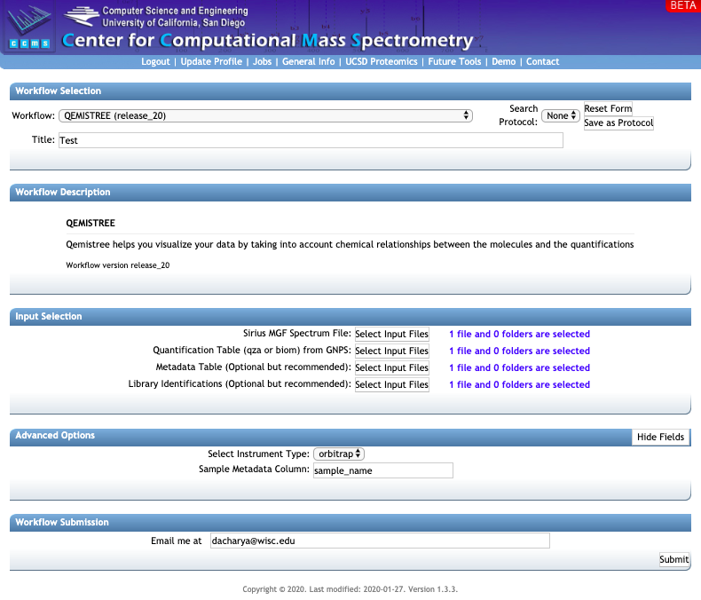
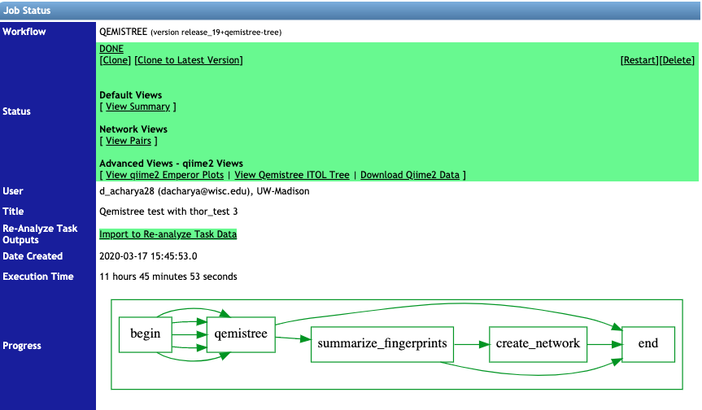

**QEMISTREE** – in silico tool to build a tree of molecules and annotate by chemical taxonomy
 
*Introduction*: Qemistree is a computation tool to build a tree of mass-spectrometry (LC-MS/MS) features to perform a chemically-informed comparison of untargeted metabolomic profiles. 

****

 
**STEP 1: Collecting the right input files**

Running a QEMISTREE job in GNPS requires 4 input files which can be generated using a combination of LC-MS/MS processing software [MZmine](https://ccms-ucsd.github.io/GNPSDocumentation/featurebasedmolecularnetworking-with-mzmine2/) and [Feature-Based Molecular Networking](https://ccms-ucsd.github.io/GNPSDocumentation/featurebasedmolecularnetworking/). The files are:

**1. Required**: A SIRIUS file generated from the MZmine workflow

**2. Required**: A quant table called `qiime2_table` with all the features which can be downloaded from a processed FBMN job (found in folder qiime2_output)

**3. Optional**: A metadata file called `qiime2_metadata` which can also be downloaded from a processed FBMN job (also found in folder qiime2_output)

**4. Optional**: A library identification file (tsv) which can also be downloaded from a processed FBMN job (found in folder `clusterinfo_summary`)

Follow the steps below to generate the files:

a. Follow the documentation for [Feature-Based Molecular Networking using MZmine2](https://ccms-ucsd.github.io/GNPSDocumentation/featurebasedmolecularnetworking-with-mzmine2/) to generate an aligned feature list for your LC-MS/MS data and export the necessary mgf and csv files for FBMN in GNPS.

b. While still in MZmine2, select your aligned feature list, then click on the tab for Feature list methods and select Export/Import, followed by Export for SIRIUS.

c. Choose the Mass list that you used to generate your feature list, and specify a path and Filename for your SIRIUS file. Click OK.

d. Go to GNPS server and run an [FBMN](https://gnps.ucsd.edu/ProteoSAFe/index.jsp?params=%7B%22workflow%22:%22FEATURE-BASED-MOLECULAR-NETWORKING%22,%22library_on_server%22:%22d.speclibs;%22%7D) job using the GNPS quant csv, GNPS mgf (both generated in step a, above) and [ReDU](https://mwang87.github.io/ReDU-MS2-Documentation/HowtoContribute/) metadata file

e. Once completed, go to the status page and click on the button `Download qiime2 Emperor qzv`
f. In the downloaded folder, go to `qiime2_output` for the files `qiime2_table.qza` and `qiime2_metadata.tsv` and to `clusterinfo_summary` for the tsv file within.

 ****       	
 
**STEP 2: Running a Qemistree job**

 
**a.** Go to the [Proteomics2](https://proteomics2.ucsd.edu/ProteoSAFe/index.jsp) server and select the QEMISTREE from the dropdown menu called workflow

**b.** In the input section add the following files:

1. SIRIUS file for Sirius MGF Spectrum files
2. `qiime2_table` for Quantification Table
3. `qiime2_metadata` for Metadata Table
4. `clusterinfo_summary` file for Library Identifications

**c.** Under the header: *Advanced options* select the following:
1. instrument type: orbitrap or Q-tof
2. Sample Metadata Column: Enter the column name of interest from the metadata file you used for FBMN or as seen in the `qiime2_metadata` file

If you are signed in to the server the email address will auto-populate. If not, add your email address and click on submit. The runtime depends on the number of features in your dataset -- a typical dataset (few thousand features) can take a few hours.

****

**STEP 3: Analysing the results from a Qemistree job from the status page**

Once the job is finished successfully, you will be able to see the status page as below.

**1. View Summary** gives a list of the features and their classification at different taxonomic level. It tabulates the annotations for all features for which molecular fingerprints could be predicted using Sirius and CSI:FingerID (Dührkop et. al).

**2.** Under **Advanced Views**, you can click on `View qiime2 Emperor Plots` to visualize the PCoA plot of the samples as a result of using Qemistree-weighted UniFrac distances. Click on `View Qemistree iTOL Tree` to take you to the following page for visualization:

**3.** Download the 4 required files by clicking on the boxes: **Qemistree, Labels, Colors, and Abundance**. These provide the tree file of the features that have smiles (`qemistree.tree`), the label for each tip of the tree (`labels.txt`), the color of each clade (`colors.txt`), and the relative abundance of the feature in the metadata category chosen for the job (`barplots.txt`). 
Qemistree supports the classification of the features/molecules based on chemical taxonomy such as kingdom, superclass, class, subclass, direct_parent, and smiles.

For easy access, follow the `click here` button to the iTOL page directly where it auto-populates the resultant tree, with the color and text files. Shown below is an example.

Drag and drop to this page the `barplots.txt` file to visualize the relative abundance of each feature in the metadata category you chose.

Please note that this tree is only available for 30 days & therefore it is recommended that you download the associated files and upload it in iTOL using their login credential for permanent storage.

See the corresponding note here: https://github.com/biocore/q2-qemistree

****

**STEP 4: Analysing the results using the Qemistree dashboard**

The [Qemistree dashboard](https://qemistree.ucsd.edu/) provides a web-based platform to explore the results of your Qemistree results (show below). You can prune the tree at the desired chemical taxonomic level and visualize the relative abundance of each feature using metadata column names.

Enter the following information to visualize the data:

1. Qemistree task: This is the unique ID of the job and can be found in the Jobs page in the `Description` column.
2. Column to filter qemistree: Enter the taxonomic level at which to prune the tree.
3. Column to label features: Enter the taxonomic level at which to label each feature on the tree.
4. Choose additional options for labelling features by MS2 library match or parent m/z values.
5. Choose metadata column by which to visualize the abundance of the features, and whether to normalize the abundance.
6. Click on Submit.

This will show the iTOL Qemistree visualization.

****

Alternatively, you can download all the files generated from this analysis clicking on `Download Qiime2 data`. Among the folders downloaded, the `output folder` contains qemistree.qza and qemistree-pruned.qza which are also tree files that can be uploaded to [iTOL](https://itol.embl.de/upload.cgi) to visualize the features and how they are related to one another. The qemistree.qza file contains all the features with molecular fingerprints, including those that were not annotated either using MS2 fragmentation (spectral library match) or Sirius+CSI:FingerID (in silico). It may, therefore, be useful to prune the tree for visualizations purposes and keep only the annotated features. By default, the workflow outputs `qemistree-pruned-smiles.qza`  which contains the features that were annotated to smiles level by ClassyFire (Djoumbou et. al.).

You may also perform additional analyses in the QIIME2 environment using the biocore documentation [here]( https://github.com/biocore/q2-qemistree). QIIME2 can be installed on your computer using the documentation [here](https://docs.qiime2.org/2019.10/install/). 

**CITATIONS**:

[Dührkop, K., Shen, H., Meusel, M., Rousu, J. & Böcker, S. Searching molecular structure databases with tandem mass spectra using CSI:FingerID. Proc. Natl. Acad. Sci. U. S. A. 112, 12580–5 (2015)](https://www.pnas.org/content/112/41/12580)

[Djoumbou Feunang, Y. et al. ClassyFire: automated chemical classification with a comprehensive, computable taxonomy. J. Cheminform. 8, 61 (2016)](https://jcheminf.biomedcentral.com/articles/10.1186/s13321-016-0174-y)

[Letunic, I. & Bork, P. Interactive Tree Of Life (iTOL) v4: recent updates and new developments. Nucleic Acids Research vol. 47 W256–W259 (2019)](https://academic.oup.com/nar/article/47/W1/W256/5424068)
