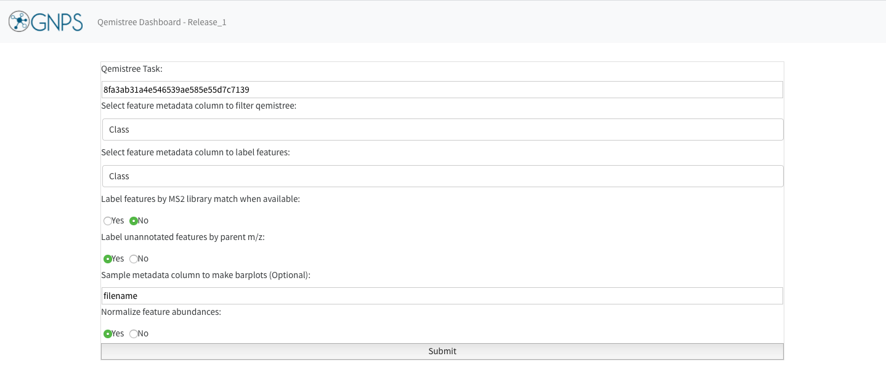

**QEMISTREE** – in silico tool to build a tree of molecules and annotate by chemical taxonomy
 
*Introduction*: Qemistree is a computation tool to build a tree of mass-spectrometry (LC-MS/MS) features to perform a chemically-informed comparison of untargeted metabolomic profiles. 

This documentation aims to provide a user-guide on the use and exploration of Qemistree visualizations.

****

 
**STEP 1: Collecting the right input files**

Users can perform QEMISTREE analysis in GNPS after processing LC-MS/MS data through [Feature-Based Molecular Networking or FBMN](https://ccms-ucsd.github.io/GNPSDocumentation/featurebasedmolecularnetworking/) using [MZmine](https://bmcbioinformatics.biomedcentral.com/articles/10.1186/1471-2105-11-395). The input files for Qemistree are:

**1. Required**: A SIRIUS file generated from the MZmine workflow

**2. Required**: A quant table called `qiime2_table` with all the identified features (an output of FBMN, and found  within the folder qiime2_output)

**3. Optional**: A metadata file called `qiime2_metadata` (an output of FBMN, and also found in folder qiime2_output)

**4. Optional**: A library identification file (tsv) (an output of FBMN, and found in folder `clusterinfo_summary`)

Follow the steps below to generate these files:

a. Follow the documentation for [Feature-Based Molecular Networking using MZmine2](https://ccms-ucsd.github.io/GNPSDocumentation/featurebasedmolecularnetworking-with-mzmine2/) to generate an aligned feature list for your LC-MS/MS data and export the necessary mgf and csv files for FBMN in GNPS.

b. While still in MZmine2, select your aligned feature list, then click on the tab for Feature list methods and select Export/Import, followed by Export for SIRIUS.

c. Choose the Mass list that you used to generate your feature list, and specify a path and Filename for your SIRIUS file. Click OK.

d. Go to GNPS server and run a [FBMN](https://gnps.ucsd.edu/ProteoSAFe/index.jsp?params=%7B%22workflow%22:%22FEATURE-BASED-MOLECULAR-NETWORKING%22,%22library_on_server%22:%22d.speclibs;%22%7D) job using the GNPS quant csv, GNPS mgf (both generated in step a, above) and [ReDU](https://mwang87.github.io/ReDU-MS2-Documentation/HowtoContribute/) metadata file.

e. The Qemistree tool ustilizes the output files from FBMN which you can access by clicking on `Download qiime2 Emperor qzv` (`qiime2_table.qza` and `qiime2_metadata.tsv` from folder `qiime2_output` and  `clusterinfo_summary` for the tsv file within).

 ****       	
 
**STEP 2: Running a Qemistree job**

**1.** Go to the status page of your FBMN job:

 

Click on `Visualize with Qemistree` under the `Advanced Views - Experimental Views` to analyze your data using Qemistree. This method auto-populates the input fields accordingly.

**2.** Make sure the correct files are included as described in the beginning:

1. SIRIUS file for Sirius MGF Spectrum files
2. `qiime2_table` for Quantification Table
3. `qiime2_metadata` for Metadata Table
4. `clusterinfo_summary` file for Library Identifications

**3.** Under the header: *Advanced options* select the following:
1. instrument type: Orbitrap or Q-TOF
2. Sample Metadata Column: Enter the column name of interest from the metadata file you used for FBMN or as seen in the `qiime2_metadata` file

If you are signed in to the server the email address will auto-populate. If not, add your email address and click on submit. The runtime depends on the number of features in your dataset -- a typical dataset (few thousand features) can take a few hours.

****

**STEP 3: Analysing the results from a Qemistree job from the status page**

Once the job is finished successfully, you will be able to see the status page as below.

**1. View Summary** gives a list of the features and their classification at different taxonomic levels. It tabulates the annotations for all features for which molecular fingerprints could be predicted using Sirius and CSI:FingerID ([Dührkop et. al]((https://www.pnas.org/content/112/41/12580))).

**2.** Under **Advanced Views**, click on `View qiime2 Emperor Plots` to visualize the PCoA plot of the samples as a result of using Qemistree-weighted [UniFrac distances](https://www.ncbi.nlm.nih.gov/pubmed/16332807). Click on `View Qemistree iTOL Tree` to take you to the following page for visualization:

**3.** Download the 4 required files by clicking on the boxes: **Qemistree, Labels, Colors, and Abundance**. These provide the tree file of the features that have smiles (`qemistree.tree`), the label for each tip of the tree (`labels.txt`), the color of each clade (`colors.txt`), and the relative abundance of the feature in the metadata category chosen for the job (`barplots.txt`). 

Qemistree classifies the features/molecules based on [ClassyFire](https://jcheminf.biomedcentral.com/articles/10.1186/s13321-016-0174-y) chemical taxonomy into chemical kingdom, superclass, class, subclass, and direct_parent which can be visualized as tip labels in the tree. For easy access, follow the `click here` button for Qemistree visualization in [iTOL](https://academic.oup.com/nar/article/47/W1/W256/5424068) where the resultant tree is auto-populated with the clade color, tip labels and sample group abundances. Shown below is an example.

Click on `Datasets` tab in iTOL to visualize the relative abundance of each feature in the sample metadata category you chose in the Qemistree GNPS job. You can modify the aethetics of this visualization (such as colors, fonts, sizes etc) interactively by using the control panel in iTOL. 

Please note that the auto-populated tree is only available for 30 days & therefore it is recommended that you download the associated files and upload it on iTOL using your login credential for permanent storage.

See the corresponding note here: https://github.com/biocore/q2-qemistree

**4.** For advanced analysis, you can download all the files generated from this analysis by clicking on `Download Qiime2 data` on the status page of the job. Among the folders downloaded, the `output folder` contains `qemistree.qza` and `qemistree-pruned-smiles.qza` which are two tree files that can be uploaded to [iTOL](https://itol.embl.de/upload.cgi) to visualize the features and how they are related to one another. The `qemistree.qza` file contains all the features for which molecular fingerprints could be predicted using Sirius+CSI:FingerID. Additionally, the workflow outputs `qemistree-pruned-smiles.qza` which contains the features that were annotated with molecular structures using spectral matching or CSI:FingerID. Moreover, `output_folder` also contains: 1. `merged-feature-table.qza` which has the abundances of features per sample and 2. `classified-feature-data.qza` which has feature metadata (parent mass, retention time, spectral library match, molecular structures and Classyfire chemical taxonomy for each feature). 
You can use these files to perform additional analyses in the QIIME2 which can be installed on your computer using the documentation [here](https://docs.qiime2.org/2019.10/install/). Advanced users may also refer to the Qemistree command-line documentation available [here](https://github.com/biocore/q2-qemistree). 

****

**STEP 4: Visualizing chemical trees using the Qemistree dashboard**

You can further explore and modify the Qemistree visualization interactively using the [Qemistree dashboard](https://qemistree.ucsd.edu/). This dashboard is available as a link on your Qemistree job status page for direct access.

The default Qemistree task on the dashboard provides an example for exploring the tool. The results are based on a subset of a global foodomics dataset. 

For your own data visualization, enter the following information on the dashboard:

1. Qemistree task: This is the unique ID of Qemistree job on GNPS. It can be found in your Jobs page in the `Description` column. Alternatively, click on `View Qemistree Dashboard` on the job status page, and this field will be auto-populated.
2. Column to filter qemistree features: Enter the feature metadata column to prune the tree. This can be a chemical taxonomy level or structural annotation type (all structures, MS2 structures, CSI:FingerID structures).
3. Column to label tree tips: Enter chemical taxonomic level that should be used to label each feature on the tree (tree tips).
4. You can include additional options for labelling features by MS2 library match or parent m/z values, when a feature cannot be assigned a chemical taxonomy by ClassyFire.
5. Choose metadata column by which to visualize the abundance of the features, and whether to normalize the abundance.
6. Click on Submit.

You can quickly generate many Qemistree-iTOL visualizations to explore your the chemical diverity in your metabolomics data.

**CITATIONS**:

[Dührkop, K., Shen, H., Meusel, M., Rousu, J. & Böcker, S. Searching molecular structure databases with tandem mass spectra using CSI:FingerID. Proc. Natl. Acad. Sci. U. S. A. 112, 12580–5 (2015)](https://www.pnas.org/content/112/41/12580)

[Djoumbou Feunang, Y. et al. ClassyFire: automated chemical classification with a comprehensive, computable taxonomy. J. Cheminform. 8, 61 (2016)](https://jcheminf.biomedcentral.com/articles/10.1186/s13321-016-0174-y)

[Letunic, I. & Bork, P. Interactive Tree Of Life (iTOL) v4: recent updates and new developments. Nucleic Acids Research vol. 47 W256–W259 (2019)](https://academic.oup.com/nar/article/47/W1/W256/5424068)
