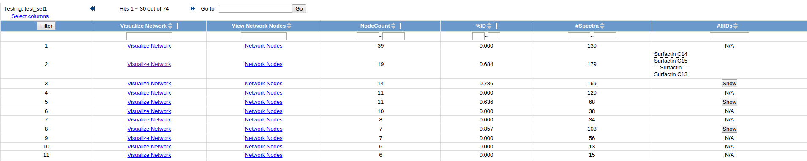

This is a quickstart guide that will enable you to prepare your data, create a GNPS account, upload to GNPS, and create your a molecular network on GNPS. While there are a wide variety of other tools at GNPS, molecular networking analysis is a great place to get your feet wet.

## Converting Data

Convert vendor formats to open formats using MSConvert locally. Checkout this [documentation](fileconversion.md).

## Create a GNPS Account

Account registration is a simple process, and completely private – GNPS will never use your contact information for any reason other than to email you the outcome of your dataset submissions and other workflows. To register an account, navigate to the [GNPS web site](https://gnps.ucsd.edu/). Here you will find a registration link in the upper right corner of the page, just below the login box.

Click on the registration link to bring up the account registration form.

## Upload data (Quick)

Open a ftp client such as [WinSCP](https://winscp.net/eng/download.php) (Not Filezilla as it includes malware) client with the following input parameters; Host: ccms-ftp01.ucsd.edu followed by entering your user name and password for GNPS followed by enter.

Choose the location of your files within the local site drop down menu. Highlight the files or folders to upload and select upload by right clicking. You will then see the files being queued and transferred to GNPS.

Once all the files are uploaded using this method they will be available for you to use for your molecular networking workflows within GNPS.

For a more detailed description of all the ways to upload data, please refer to our [Upload Documentation](fileupload.md)

## Molecular Networking Input

Navigate to the molecular networking [analysis page](https://gnps.ucsd.edu/ProteoSAFe/index.jsp?params=%7B%22workflow%22:%22METABOLOMICS-SNETS-V2%22,%22library_on_server%22:%22d.speclibs;%22%7D).

### Molecular Networking Parameter Presets

There are three presets that set the parameters to approximately appropriate values depending on the size of your dataset.

Please select the appropriate one given the follow criteria:

1. Small Dataset - up to 5 LC/MS files
2. Medium Dataset - 5 to 400 LC/MS files
3. Large Dataset - 400+ LC/MS files

### Naming your analysis

Provide a detailed title for your molecular network. This title will be helpful when you retrieve your data after the workflow is completed.

### Selecting Data Input Files

Within the Basic Options header; to input your spectrum files, select the input files tab next to the Spectrum files (required) field. A pop-up window with three tabs will appear; Select Input Files, Upload Files, Share Files. Proceed by selecting the files you want to analyze by clicking on the mass spectrometry file or an entire folder. Next click on the Spectrum Files G1 button to mark these files for analysis. You may select more files for analysis and put them in the separate groups (G1, G2, G3, G4, G5, G6) to reflect your experimental design. If you are performing an analysis with more than six groups, a metadata file may be used (see [Networking Documentation](networking.md)).

Once you are done selecting files to analyze, close the pop-up and hit submit.

## View Analysis Results

### Browsing Identifications

To quickly glance at all the molecules in your data matching to the GNPS community knowledge of reference MS/MS spectra, click on "View All Library Hits".

### Viewing Network (Quick)

To visualize the molecular networks in the browser, click the "View Spectral Families (In Browser Network Visualization)".

This brings you to a list of all the individual networks (connected components) that are in your data. Click on the "Visualize Network" link to explore each network individually. Your selection can be guided by the identifications within each network if there is a specific molecule of interest.

### Advanced Online Visualization

For a more detailed guide on how to explore the molecular networks online, please refer to our [documentation](networking.md)
