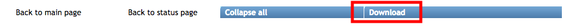
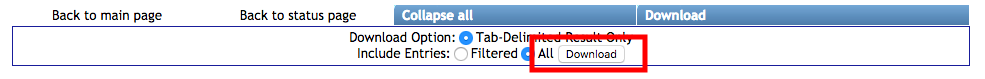

Here we highlight general properties of table result views in GNPS.

# Filtering Tables

## Filtering Rows for Substring

If you want to find rows that include a substring that you are interested in, simply enter the value in the box and hit enter. For example, to find all the identifications that include the substring "mycin": [link](https://gnps.ucsd.edu/ProteoSAFe/result.jsp?task=24b62946372c4044b49fceb662856e41&view=view_all_annotations_DB#%7B%22main.Compound_Name_input%22%3A%22mycin%22%7D).

## Filtering Rows with a single column AND operator

If you want to filter a table in GNPS on a single column and the value in a given column must contain ALL of the substrings you define, you can use the "&&" between substrings you want to search. For example, for a molecular network, if you want to find all the nodes that are from G1 AND G2, you can use the following syntax: G1&&G2. See this [link](https://gnps.ucsd.edu/ProteoSAFe/result.jsp?task=24b62946372c4044b49fceb662856e41&view=view_all_clusters_withID_beta#%7B%22main.DefaultGroups_input%22%3A%22G1%26%26G2%22%7D) for an example.

If you want to use negation, e.g. G1 AND not G2, you can use the carrot ^ like in this example G1&&^G2. 

## Filtering Rows with a single column OR operator

If you want to filter a table in GNPS on a single column and the value in a given column must contain at least one of the substrings you define, you can use the "||" between substrings you want to search. For example, for a molecular network, if you want to find all the nodes that are from G1 AND G2, you can use the following syntax: G1||G2. See this [link](https://gnps.ucsd.edu/ProteoSAFe/result.jsp?task=24b62946372c4044b49fceb662856e41&view=view_all_clusters_withID_beta#%7B%22main.DefaultGroups_input%22%3A%22G1%7C%7CG2%22%7D) for an example.

# Downloading Table Results

In order to download the data for a result table in GNPS that you are currently viewing, click the download button:

