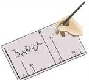
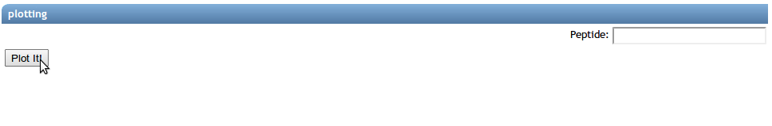
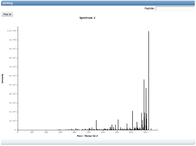

# Community Curated MS/MS Spectral Libraries

GNPS provides a platform for users to contribute their own annotated MS/MS spectra to the spectral libraries. There are several requirements for annotation: 1) the compound must be of known structure and 2) the MS/MS must be of sufficient quality to support the annotation of the compound. By contributing these spectra, users will expand the spectral libraries and allow dereplication of these compounds within other datasets.

## Library Quality Level

The spectral libraries are categorized based upon quality of the data. The level indicates both the quality of the MS/MS spectra as well as the trust worthiness of the annotations. These reflect both quality of the MS/MS spectra as well as the trust worthiness of the annotations.

|     Quality Level    | Description          | Quality Number |
| ------------- |-------------| -----|
| Gold | Synthetic, Complete structural characterization with NMR, crystallography or other standard methods as defined in the publication guidelines for Journal of Natural Products, Privileged users | 1 |
| Silver | Isolated or lysate/crude, Published data showing presence of molecule in the sample | 2 |
| Bronze | Any other putative, complete or partial annotation | 3 |
| Challenge | Unknown Identity, open to community to help annotate | 10 |

By default, users will have access to Bronze, but approval is required to contribute to silver and gold libraries. To obtain training and access please email [Mingxun Wang](mailto:miw023@ucsd.edu).

## Adding Single Spectra

### Input Formats

mzXML, mzML, and mgf file formats are accepted.

Additionally, spectra to be added to the library should be centroided. Profile data is not processed correctly by our algorithms.

### Adding Spectrum

From the [GNPS Splash Page](https://gnps.ucsd.edu/ProteoSAFe/static/gnps-splash.jsp), users can click on

to be brought to the Add Single Annotated Spectrum workflow. By default, users will contribute bronze quality reference spectra. Permission is required to contribute higher quality spectra to the gold and silver workflows.

Select an input spectrum file.

NOTE: do not change the spectral library that is selected.

### Annotation Fields

**Sample Parameters**

|     Field    | Description          | Default |  Required |
| ------------- |-------------| -----| ------- |
| Ion Source | Source of Ions | LC-ESI | Yes |
| Instrument | Mass Analyzer | qTof | Yes |
| Ion Mode | Ionization Mode | Positive | Yes |
| Compound Source | Sample source of compound | Commercial | Yes |
| Principle Investigator | PI overseeing compound acquisition and analysis | N/A | Yes |
| Data Collector | Individual Collecting Data | N/A | Yes |

**Annotation**

|     Field    | Description          | Default |  Required |
| ------------- |-------------| -----| ------- |
| Scan | Spectrum Scan of Spectrum | 0 | Yes |
| Adduct | Adduct of Ion fragmented in MS2 | M+H | Yes |
| Compound Name | Compound Common Name | N/A | Yes |
| Precursor MZ | Experimental Precursor MZ for Compound | 0 (will read from spectrum file if 0) | Yes |
| Charge | Charge of Precursor | 0 (will read from spectrum file if 0) | Yes |

**Advanced Annotation**

|     Field    | Description          | Default |  Required |
| ------------- |-------------| -----| ------- |
| CAS Number | Chemical Abstracts Service compound identification number | N/A | No |
| Pubmed ID | Pubmed ID where compound or data was published | N/A | No |
| Exact Mass | Compound Exact Mass | 0 | No |
| Smiles | Smiles Structure | N/A | No |
| Inchi | Inchi Structure | N/A | No |
| Inchi Aux | Inchi Auxiliary Structure | N/A | No |

### Validation Spectra Selection

To validate the input file and scan a user has selected, there is a plotting section that will attempt to plot the spectrum selected.

To plot the spectrum, click "Plot It!". Additionally, if users would like to see the annotation with a peptide fragment highlights, users can enter a peptide in the Peptide field, but this will not be stored in the annotation.

If the plotting succeeded and a spectrum appears, then the selection for the spectrum is done correctly.

If there was an error, check the original file was converted correctly and the scan number is not 0.
