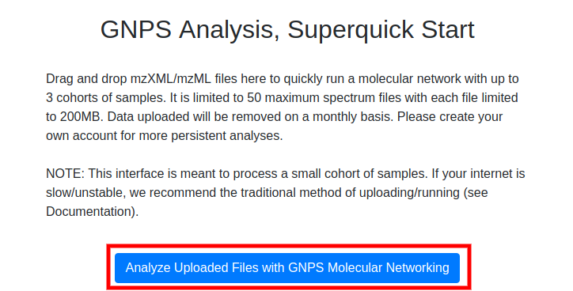

This is a superquick start guide that will enable you to analyze a few dozen samples with molecular networking without having to create an account or install any software besides your web browser and conversion software.

The limitations to this method is that the files uploaded will not reside in your own account (though no one else can see them) and will eventually disappear from GNPS.

## Converting Data

Convert vendor formats to open formats using MSConvert locally. [Documentation](fileconversion.md).

## Selecting Files

Please navigate to the [super quickstart page](http://mingwangbeta.ucsd.edu:5050/). Simply drag and drop your mass spectrometry files (mzML, mzXML, or mgf) into the appropriate cohorts you want to compare. Files are required to be uploaded to Cohort Group 1.

## Analyze Files

Once files have been uploaded into the appropriate cohort, enter your email and click the "Analyze Uploaded Files with GNPS Molecular Networking" button.

This will bring you to a GNPS workflow status page. If you entered an email, you will receive an email once the analysis job is complete. If you did not enter an email, save the URL of the analysis as this is the only way for you to find analysis again.

## Results

To understand the results, please refer to the analysis section of the standard [quickstart guide](quickstart.md#view-analysis-results).
