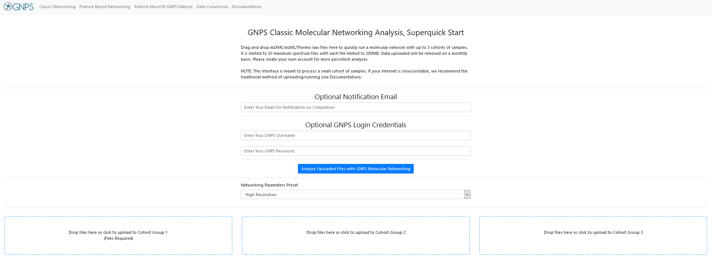

The Superquick start interface enables you to rapidly explore your data without having to create an account or install any software besides your web browser and data conversion programs.

**IMPORTANT!**: The limitations to this method is that the files uploaded will not reside in your own account (though no one else can see them) and will removed on a monthly basis. Please create your own account for more persistent and reproducible analyses.

You would be able to use the Super quickstart interface if you have the following requirements:

- [ ] The format of your files is mzXML/mzML/Thermo raw files.
- [ ] You have less than 3 cohorts of samples.
- [ ] Each file has a maximum of 50 spectrum files.
- [ ] Each file has less than 200MB. 

1. Classic Molecular Networking ([see the detailed documentation](networking.md)) - Analyze a few dozen samples in up to 3 cohorts
2. Feature Based Molecular Networking ([see the detailed documentation](featurebasedmolecularnetworking.md)) - Analyze molecular networks out of your favorite LC-MS feature detection/alignement software

## Classic Molecular Networking

Please navigate to the [super quickstart page](https://gnps-quickstart.ucsd.edu/) to begin with Classic Molecular Networking!

### Converting Data

Convert vendor formats to open formats using MSConvert locally. Checkout this [documentation](fileconversion.md).

### Selecting Files

Simply drag and drop your mass spectrometry files (mzML, mzXML, or MGF) into the appropriate cohorts you want to compare. It is required to upload files at least to Cohort Group 1.

### Analyze Files

Once files have been uploaded into appropriate cohorts, enter your email and click "Analyze Uploaded Files with GNPS Molecular Networking".

This will bring you to a GNPS workflow status page. If you entered your email, you will receive a notification once the analysis job is complete. If you did not enter an email, save the URL of the analysis as this will be the only way for you to find the analysis again.

### Results

To understand the results, please refer to the analysis section of the standard [quickstart guide](quickstart.md#view-analysis-results).

## Feature Based Molecular Networking

Please navigate to the [super quickstart page](https://gnps-quickstart.ucsd.edu/featurebasednetworking) to begin with Feature Based Molecular Networking!

### Selecting Files

Simply drag and drop the files out of your feature detection and alignement tool:

1. the **feature quantification table** (.CSV file, or mzTab-M).
2. the **MS/MS spectral summary** (MGF file or MSP file (Progenesis QI), or mzML (for mzTab-M).
3. (Optional) Sample metadata file - The format can be found [here](metadata.md)
4. (Optional) Additional features edge generated externally - [See the documentation](https://ccms-ucsd.github.io/GNPSDocumentation/featurebasedmolecularnetworking/#advanced-extras).

### Analyze your Files

Once files have been uploaded, enter your email and click "Analyze Uploaded Files with GNPS Molecular Networking".

This will bring you to a GNPS workflow status page. If you entered your email, you will receive a notification once the analysis job is complete. If you did not enter an email, save the URL of the analysis as this will be the only way for you to find the analysis again.

### Results

To understand the results, please refer to the [feature based molecular networking page](featurebasedmolecularnetworking.md).
