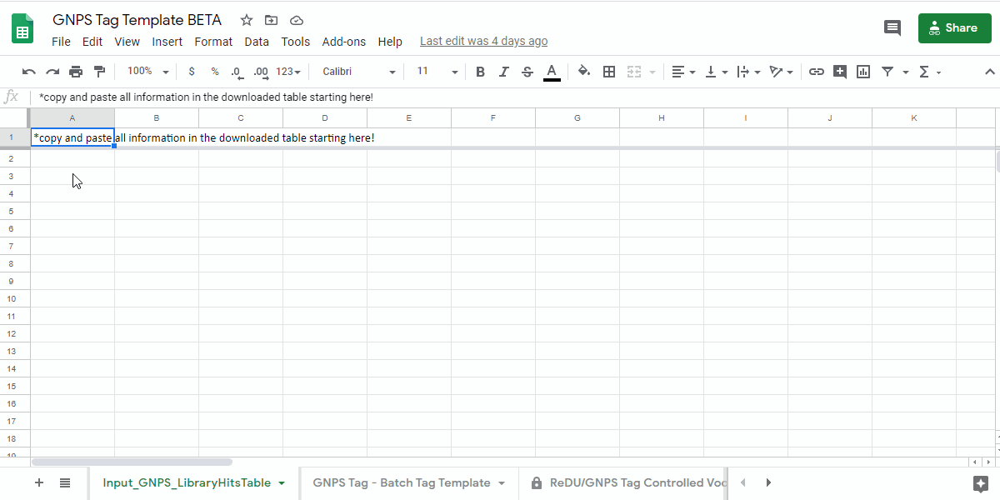
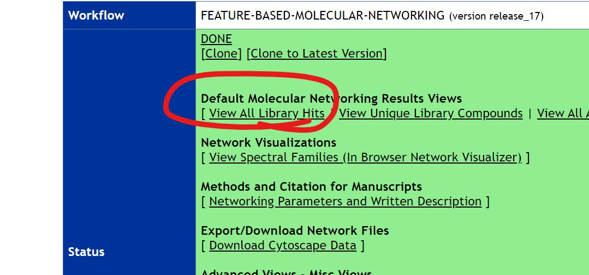
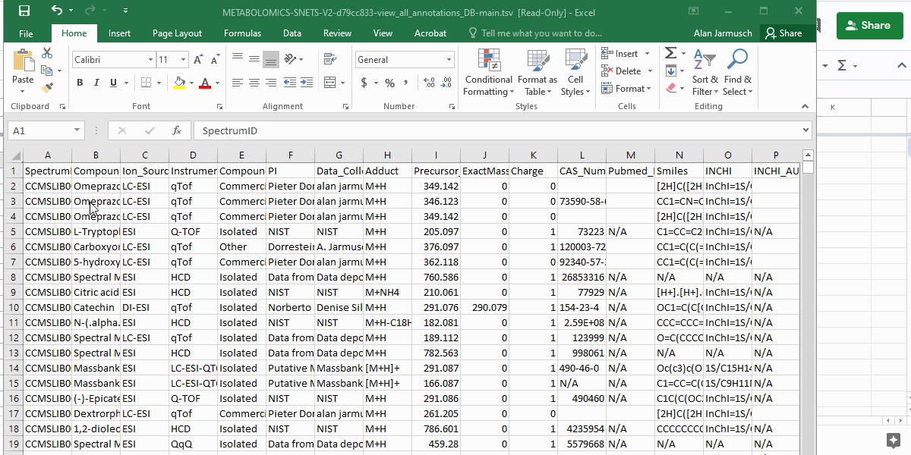
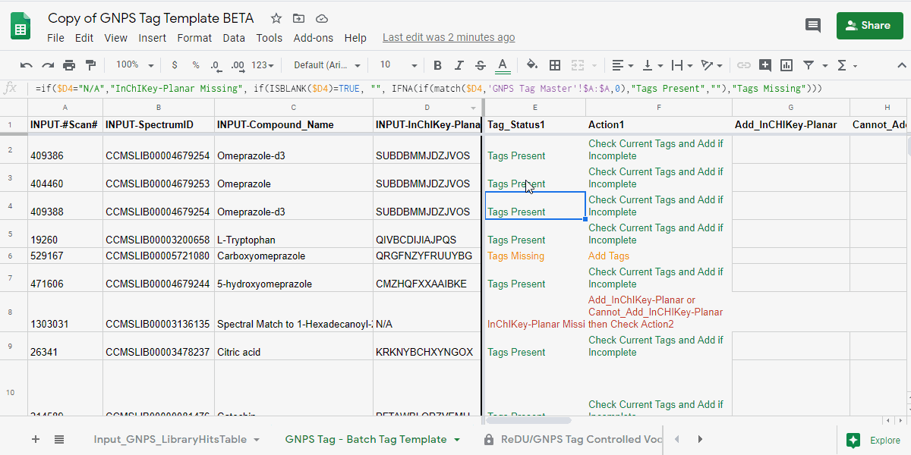
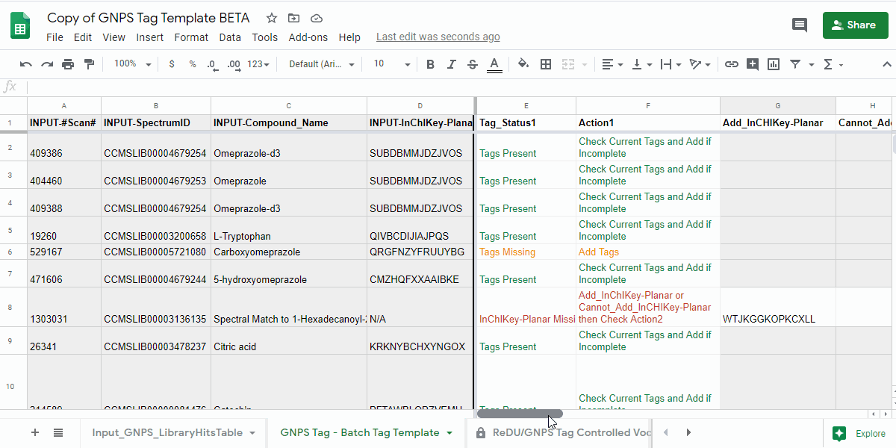
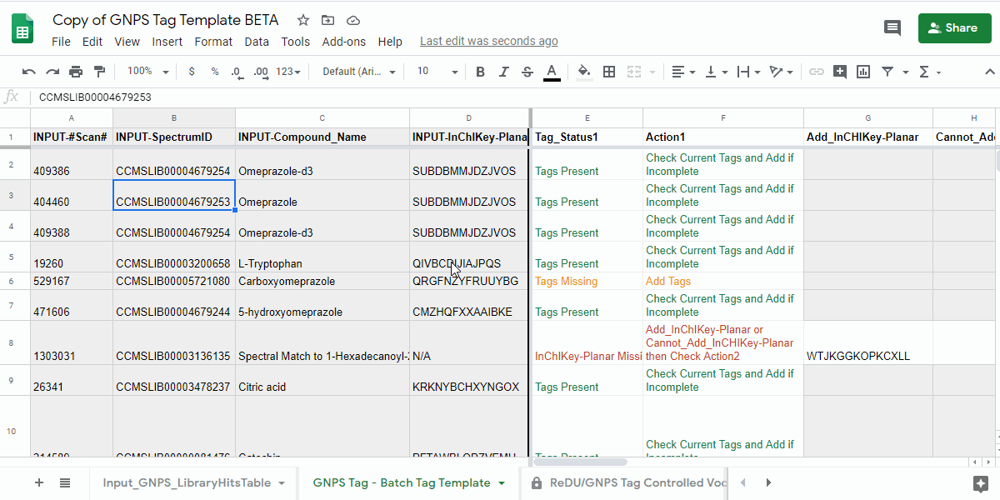

# GNPS Tag Contribution and Supported Analyses

!!! warning 
		Pardon our dust as this is documentation is a work in progress! We also welcome your contributions. 

## "What are tags?"
**Tags reflect high-level information about your data!** The tagging system in GNPS aims to generate a high-level summary of the chemical annotations provided by spectral library matching (*i.e.* matching of acquired MS/MS product ion scans with reference MS/MS spectra). Our goal is to reduce the amount of expert knowledge and the amount of trivial research needed to provide initial context to chemicals annotated from data run through the GNPS platform.

!!! info "Supported Workflows in GNPS"
	1. Molecular Networking (classic)
	2. Library Search
	3. **pending** Feature-based Molecular Networking

---

# How to Contribute to GNPS Tags

!!! info "Required Items"
		1. **Completed Task From a Supported GNPS Workflow**.
			- Please sign-up at the MassIVE homepage - [link here](https://massive.ucsd.edu/ProteoSAFe/static/massive.jsp)
			- Please sign-up at the GNPS homepage - [link here](https://gnps.ucsd.edu/ProteoSAFe/static/gnps-splash.jsp)
		2. **Completed GNPS Tag Template**
			- GNPS Tag Template - [link here](https://docs.google.com/spreadsheets/d/1oRsE9Z8lhIx-sKiADPgh6ivBX0jrCS2N_4X97fN_oKA/edit?usp=sharing).
			- GNPS Tag Template for Large-scale Projects (>2000 chemicals annotated) - [link here](https://docs.google.com/spreadsheets/d/1_0Efw0uLXMmyvsCma8e0Pn4ag9IUMx_vv2nRgTjJdK0/edit?usp=sharing).
		3. **Email of Completed GNPS Tag Template to GNPS Admin**

# Detailed Step-by-step Instructions for Completion of the GNPS Tag Template

## 1. Navigate to the GNPS Tag Template and Make a Personal Copy
- GNPS Tag Template - [link here](https://docs.google.com/spreadsheets/d/1oRsE9Z8lhIx-sKiADPgh6ivBX0jrCS2N_4X97fN_oKA/edit?usp=sharing).
- Save a copy of the sample information template by going to **"File - Make a copy"** into a personal google drive

???+ example "how to make a copy of the GNPS Tag Template - .gif"
	

!!! info
		For projects with >2000 annotations, please use the large-scale project version of the GNPS tag template - [link here](https://docs.google.com/spreadsheets/d/1_0Efw0uLXMmyvsCma8e0Pn4ag9IUMx_vv2nRgTjJdK0/edit?usp=sharing) and complete it as described above.

## 2. Obtain the Annotation Information From the Supported GNPS Workflows
- Download the annotation information from GNPS and open it in a spreadsheet program.

!!! info
	- Molecular Networking (Classic)
		- **Download** the **"View all library hits"** table from the GNPS results page.
	- Library Search
		- **Download** the **"View all spectra hits"** table from the GNPS results page.

???+ example "where you can find the information to download"
	
	
## 3. Setting up the **GNPS Tag Template** with Your Annotation Information 
- Copy and paste the entire table contents (including the header) into the **"Input_GNPS_LibraryHitsTable"** tab in the GNPS Tag Template.
- If done correctly, information relevant to tagging should appear in the **"GNPS Tag - Batch Tag Template"** tab in columns A-D.

!!! info
	- All columns in light grey are for reference only and should **not** be modified.

???+ example "how to copy and paste into the template"
	

## 4. Manual completion of the **GNPS Tag Template** 
### 4.1. Open the **"GNPS Tag - Batch Tag Template"** tab and check the "Tag_Status1" and "Action1" columns.
- review the information in the **"Tag_Status1"** column and follow the next action indicated in **"Action1"** column.

| Tag_Status1 | Action1 | Description of what to do |
| ---- | ---- | ---- |
| Tags Present | Check Current Tags and Add if Incomplete | Check the Tags in the "Current_Tags", "Current_NCBITaxonomy", "Current_UBERON", and "Current_Lifestyle" columns. If you believe that the information is incomplete, then please add the tags you believe are missing to the "Add_Tag 1-3", "Contribute-NCBITaxonomy 1-3", "Contribute-UBERONTag 1-3", and "Contribute-LifestyleTag 1-3".
| Tags Missing | Add Tags | Please add the tags you believe are missing to the "Add_Tag 1-3", "Contribute-NCBITaxonomy 1-3", "Contribute-UBERONTag 1-3", and "Contribute-LifestyleTag 1-3". |
| InChIKey-Planar Missing |	Add_InChIKey-Planar or Cannot_Add_InCHIKey-Planar then Check Action2 | Please add the planar InChIKey to the "Add_InCHIKey-Planar" column - [details on planar InChIKeys]( add here) - **or** if an InChIKey cannot be created, then add "No InChIKey-Planar" using the dropdown in the "Cannot_Add_InChIKey-Planar" column. **Check Tag_Status2 and Action2**|

!!! info 
	- columns that should be ignored are colored grey.
	- a maximum of 3 tags per category can be added.
	- if additional terms are required, please submit an issue on GitHub - [link here](https://github.com/CCMS-UCSD/GNPS_Workflows).

???+ example "evalute action1"
	

### 4.2. **IF** instructed to review **Check Tag_Status2 and Action2** in the previous step.
- review the information and the following actions.

| Tag_Status2 | Action2 | Description of what to do |
| ---- | ---- | ---- |
| Tags Present | Check Current Tags and Add if Incomplete | Check the Tags in the "Current_Tags", "Current_NCBITaxonomy", "Current_UBERON", and "Current_Lifestyle" columns. If you believe that the information is incomplete, then please add the tags you believe are missing to the "Add_Tag 1-3", "Contribute-NCBITaxonomy 1-3", "Contribute-UBERONTag 1-3", and "Contribute-LifestyleTag 1-3".
| Tags Missing | Add Tags | Please add the tags you believe are missing to the "Add_Tag 1-3", "Contribute-NCBITaxonomy 1-3", "Contribute-UBERONTag 1-3", and "Contribute-LifestyleTag 1-3". |

!!! warning
	- make sure to include either a value in the **"Add_InCHIKey-Planar"** column or indicate that an InChIKey cannot be created in the **"No InChIKey-Planar"**. 

???+ example "evalute action2"
	

### 4.3 Download the "GNPS Tag - Batch Tag Template"
- Download the "GNPS Tag - Batch Tag Template" as a .tsv
- Email file to admins ... (add contact info here).

???+ example "how to download"
	
	
!!! Success
	Congrats and thank you for contributing tags to GNPS! This is a community effort and every contribution helps! :thumbsup:

---

# Current Supported Analyses

- under construction

---

!!! info "Data and Code Availability"
	- under construction

!!! cite "Recommended Citation"
	- under construction

!!! help "Issues and Suggestions"
	- New Terms, Corrections, Suggestions = GitHub - [link here](https://github.com/CCMS-UCSD/GNPS_Workflows)
	- The use of the [GNPS forum](https://groups.google.com/forum/#!forum/molecular_networking_bug_reports) is encouraged.

## Page Contributions

{{ git_page_authors }}
