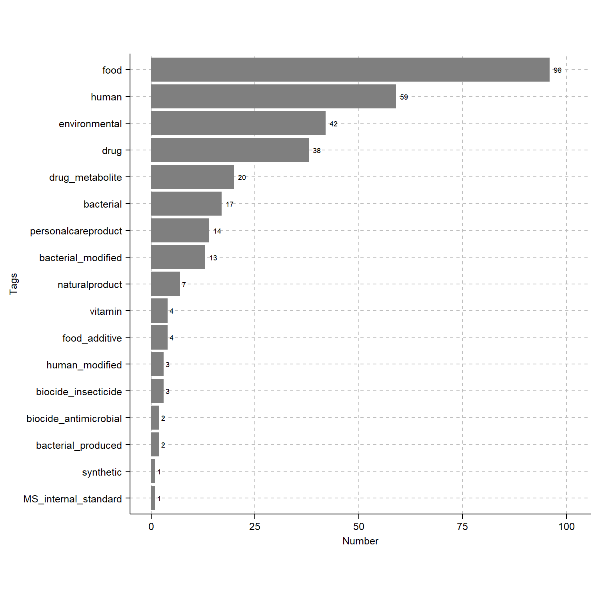
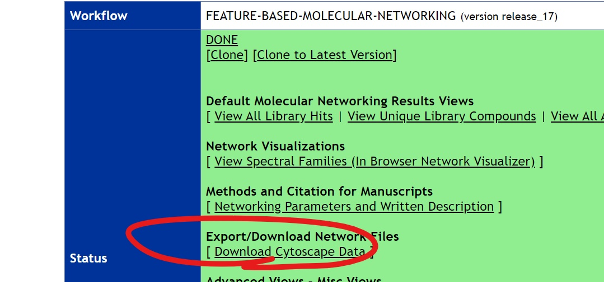
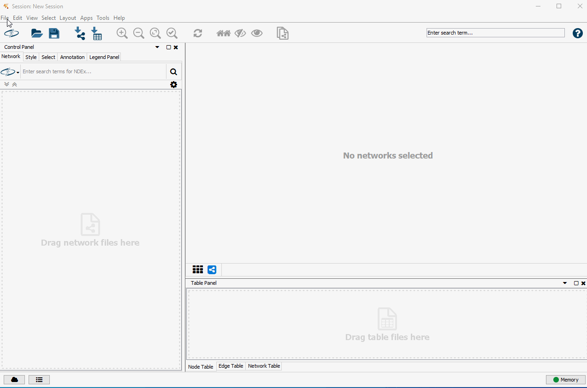

# How to Contribute Tags to GNPS and Analyses Currently Supported

Pardon our dust as this is documentation is a work in progress! We also welcome your contributions. 

---

## Required Items and Summary of Steps for Contribution
1. **GNPS Tag Template**   
    1.1 Manual completion of the **GNPS Tag Template** ([link here](https://docs.google.com/spreadsheets/d/10mev2FYcZd42eaeHr2xYy24oAmoLw89C3Xr6iZ3bhdw/edit?usp=sharing))  
    1.2.a Annotation without InChi without Tags  
    1.2.b Annotation without InChi with Tags  
    1.2.c Annotation with InChi without Tags  
    1.2.d Annotation with InChi with Tags  
    1.3 Submission of the **GNPS Tag Template** to admin  

## Detailed Step-by-step Instructions for Contribution

### 1. **GNPS Tag Template**   

#### 1.1 Manual completion of the **GNPS Tag Template**
- **Download** the **"View all library hits"** table from GNPS

    > Notes:  
      - the link is located on the results page

- Open the **"View all library hits"** table in a spreadsheet program.
- Copy and paste the tables contents (skip the headers) into the **"INPUT GNPS Table"** tab. 
    
    > Notes:  
      - All columns in light grey are for reference only and should **not** be modified.  
      - If done correctly, information relevant to tagging should appear in the **"GNPS Tag - Batch Tag Template"** tab in columns A-D.  

- **IF** matches **are not** found to the InCHI in the "GNPS Tag Master" tab, then **"Check_Master"** column = "No" (column E) and no tags will appear in the "Update_" columns.

- **IF** matches **are** found to the InCHI in the "GNPS Tag Master" tab, then **"Check_Master"** column = "Yes" (column E) and tags will appear in the "Update_" columns.

- Users should check that the tags present in columns F-J are accurate and appropriate for each annotation.
    
    > Notes:  
      - The InChi associated with each annotation is queried against the "GNPS Tag Master" tab which is updated by the admins and the results are displayed in the **"GNPS Tag - Batch Tag Template"** tab.  

- Users should then complete the **"GNPS Tag - Batch Tag Template"** tab in a rowwise manner to the extent possible. The following scenarios in 1.2.a - 1.2.d provide guidance.

#### 1.2.a Complete the "GNPS Tag - Batch Tag Template" following these scenarios: Annotation without InChi without Tags
##### **"Check_Master"** column = "No" (column E) and no tags will appear in the "Update_" columns.
- Add the InChi to the **"Add_INCHI"** column (column K). 
    > Notes:  
      - *optional: add the common name ("Add_Name", Column L) - we suggest the use of PubChem*
- **IF** matches **are not** found to the InCHI in the "GNPS Tag Master" tab, then **"Check_Added_INCHI"** column = "No" (column M) and no tags will appear in the "Check_" columns (columns N-R).
- Complete the tags using the controlled vocabulary (up to three tags can be added for each tag category)
    > Notes:  
      - The same tag can only be applied to an InCHI once, please avoid repeated tagging.
      - If additional terms are desired, please submit an issue on GitHub - [link here](https://github.com/CCMS-UCSD/GNPS_Workflows)

#### 1.2.b Complete the "GNPS Tag - Batch Tag Template" following these scenarios: Annotation without InChi with Tags
##### **"Check_Master"** column = "No" (column E) and no tags will appear in the "Update_" columns.
- Add the InChi to the **"Add_INCHI"** column (column K). 
    > Notes:  
      - *optional: add the common name ("Add_Name", Column L) - we suggest the use of PubChem*
- **IF** matches **are** found to the InCHI in the "GNPS Tag Master" tab, then **"Check_Added_INCHI"** column = "Yes" (column M) and  tags will appear in the "Check_" columns (columns N-R).
- Check that the tags present in columns F-J are accurate and appropriate for each annotation.
- Complete the tags (if necessary) using the controlled vocabulary (up to three tags can be added for each tag category)
    > Notes:  
      - The same tag can only be applied to an InCHI once, please avoid repeated tagging.
      - If additional terms are desired, please submit an issue on GitHub - [link here](https://github.com/CCMS-UCSD/GNPS_Workflows)

#### 1.2.c Complete the "GNPS Tag - Batch Tag Template" following these scenarios: Annotation with InChi without Tags
##### **"Check_Master"** column = "Yes" (column E) and no tags will appear in the "Update_" columns.
- Complete the tags using the controlled vocabulary (up to three tags can be added for each tag category)
    > Notes:  
      - The same tag can only be applied to an InCHI once, please avoid repeated tagging.
      - If additional terms are desired, please submit an issue on GitHub - [link here](https://github.com/CCMS-UCSD/GNPS_Workflows)

#### 1.2.d Complete the "GNPS Tag - Batch Tag Template" following these scenarios: Annotation with InChi with Tags
##### **"Check_Master"** column = "Yes" (column E) and no tags will appear in the "Update_" columns.
- Check that the tags present in columns F-J are accurate and appropriate for each annotation.
- Complete the tags using the controlled vocabulary (up to three tags can be added for each tag category)
    > Notes:  
      - The same tag can only be applied to an InCHI once, please avoid repeated tagging.  
      - If additional terms are desired, please submit an issue on GitHub - [link here](https://github.com/CCMS-UCSD/GNPS_Workflows)

#### 1.3 Download the "GNPS Tag - Batch Tag Template"
- Download the "GNPS Tag - Batch Tag Template" as a .tsv
- Email file to admins:
    - Alan Jarmusch (ajarmusch@ucsd.edu)
    
---

## Thank you for contributing tags to GNPS! This is a community effort and every contribution helps!

## Help and Advice
- General Questions or Advice = GNPS Forum - [link here](https://groups.google.com/forum/#!forum/molecular_networking_bug_reports)  
- New Terms, Corrections, Suggestions = GitHub - [link here](https://github.com/CCMS-UCSD/GNPS_Workflows)  

---
---

# Current Analyses
1. **Summary the tags information** in a GNPS molecular networking job
2. Color an existing **GNPS molecular networking using GNPS tags**
3. *Coming Soon:* Utilize **"TagTracker"** to simplify and focus the analysis of a GNPS molecular network
4. *Coming Soon:* Analyze Tags using Metdata

---
---

# 1. **Summary the tags information** in a GNPS molecular networking job   
- Make a copy and download Master Tag Sheet (.tsv) from Google Sheets - [link here](https://docs.google.com/spreadsheets/d/1zgSpcgsSxRIgWdHH9khiEMmt2rvNL15raRFP8CxNnFE/edit?usp=sharing)
- Download the "View all library hits" table from GNPS

- Run the Jupyter Notebook or Code (R) = "Tags_Summary"
    - Update the paths in the #COMMON STEPS section
    - Run the code (generates .pdf of figures, example below)
- Modify graphs as desired  

# 2. Color an existing **GNPS molecular networking using GNPS tags**  
- Make a copy and download Master Tag Sheet (.tsv) from Google Sheets - [link here](https://docs.google.com/spreadsheets/d/1zgSpcgsSxRIgWdHH9khiEMmt2rvNL15raRFP8CxNnFE/edit?usp=sharing)
- Download the Cytoscape .graphML files via the "Download Cytoscape Data" or "Direct Cytoscape Preview/Download"

- Download the Node Table
    - Open the molecular network in Cytoscape
    - File -> Export -> Table to File -> Select the option ending in "default node" in the dropdown -> Update Path and Save

- Run the Jupyter Notebook or Code (R) = "Tags_Cytoscape"
    - Update the paths in the #COMMON STEPS section
    - Run the code (generates and updated node table)
- Import the Updated Node Table into Cytoscape

- **Example Shown Above = Using node color to indicate chemicals tagged as "bacterial"**
    - Open node fill color in cytoscape
    - Select "TAG_bacterial" and use discrete mapping
        - Value of 0.1 = no InChi and no tag information present
        - Value of 0.0 = InChi present but not tagged based on selection
        - Value of 1.0 = InChi present and tagged based on selection
    - Open node label in cytoscape
    - Select "Compound_Name" and use passthrough mapping
    - *Interpretation* - Molecular netowrk linked glycocholic acid, a primary bile acid conjugated to glycine, and glycodeoxycholic acid, a secondary bile acid. Glycodeoxycholic acid is known to be produced by bacteria in the human gut (and other animals) and **was** tagged as bacterial (green). Glycocholic acid is known to be produced by human (and other animals) and **was not** tagged as bacterial (red). The nodes in grey do not have tags at the time of analysis.
    
#### 3. Utilize **"TagTracker"** to simplify and focus the analysis of a GNPS molecular network   
TBD

---
