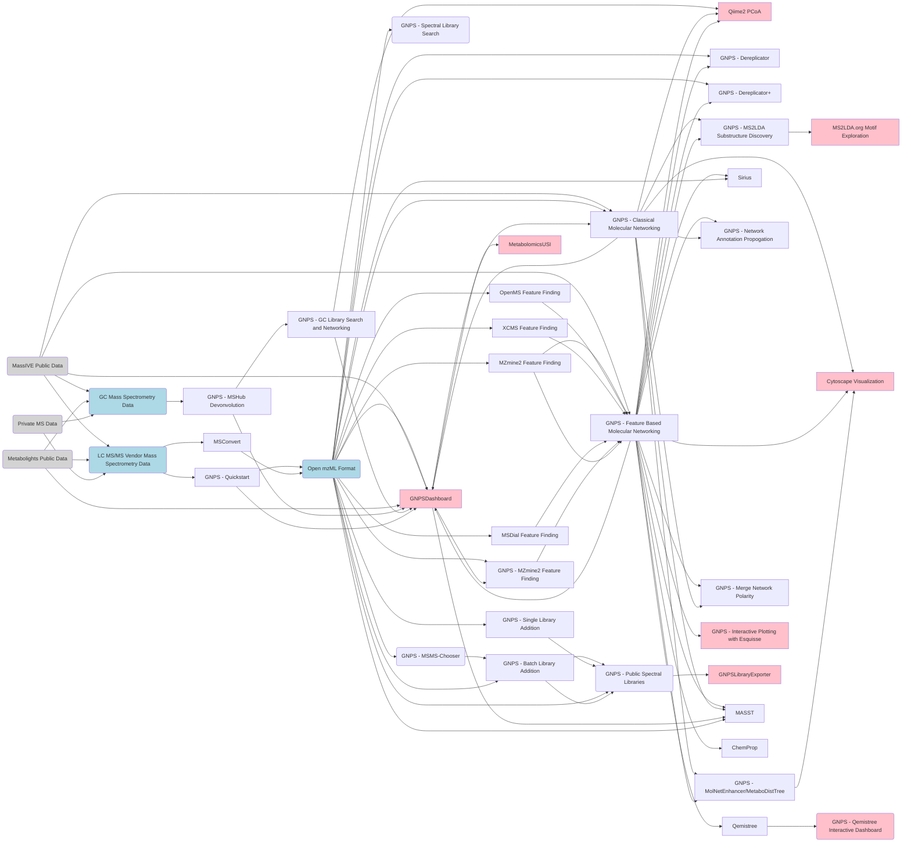

# GNPS Tool Index

This is a global tool index for GNPS. Throughout this documentation we have very detailed information for how to use way more tools than we though we'd have, but its a good problem to have!

However, we recognize it might be difficult for people to simply see what all is availble in GNPS as tool and web services. This table is always evolving and hope to make it easier for people to navigate. 

Please help us fill in more completely!

## GNPS Workflows

| Category  | Workflow  | GNPS Link  | Beta Link  | Documentation | Source Code | Citation | 
|---|---|---|---|---|---|---|
| Networking | Molecular Networking  | [Workflow](https://gnps.ucsd.edu/ProteoSAFe/index.jsp?params=%7B%22workflow%22:%22METABOLOMICS-SNETS-V2%22,%22library_on_server%22:%22d.speclibs;%22%7D)  | [Workflow](https://proteomics2.ucsd.edu/ProteoSAFe/index.jsp?params=%7B%22workflow%22:%22METABOLOMICS-SNETS-V2%22,%22library_on_server%22:%22d.speclibs;%22%7D) | [Documentation](networking.md) | [Github](https://github.com/CCMS-UCSD/GNPS_Workflows/tree/master/metabolomics-snets-v2) | [Citation](https://www.nature.com/articles/nbt.3597) |
| Networking | Feature-Based Molecular Networking  | [Workflow](https://gnps.ucsd.edu/ProteoSAFe/index.jsp?params=%7B%22workflow%22:%22FEATURE-BASED-MOLECULAR-NETWORKING%22,%22library_on_server%22:%22d.speclibs;%22%7D)   | [Workflow](https://proteomics2.ucsd.edu/ProteoSAFe/index.jsp?params=%7B%22workflow%22:%22FEATURE-BASED-MOLECULAR-NETWORKING%22,%22library_on_server%22:%22d.speclibs;%22%7D) | [Documentation](featurebasedmolecularnetworking.md) 
| Networking | Merge Polarity Networks  | [Workflow](https://gnps.ucsd.edu/ProteoSAFe/index.jsp?params=%7B%22workflow%22:%22MERGE_NETWORKS_POLARITY%22%7D)   | [Workflow](https://proteomics2.ucsd.edu/ProteoSAFe/index.jsp?params=%7B%22workflow%22:%22MERGE_NETWORKS_POLARITY%22%7D) | [Documentation](mergepolarity.md) |
| Networking | MS2LDA Motif DB  | [Workflow](https://gnps.ucsd.edu/ProteoSAFe/index.jsp?params=%7B%22workflow%22:%22MS2LDA_MOTIFDB%22%7D)   | [Workflow](https://proteomics2.ucsd.edu/ProteoSAFe/index.jsp?params=%7B%22workflow%22:%22MS2LDA_MOTIFDB%22%7D) | [Documentation](ms2lda.md) |  [Github-ms2lda](https://github.com/sdrogers/lda), [Github-ms2ldaviz](https://github.com/sdrogers/ms2ldaviz)  | [Citation-ms2lda](https://www.pnas.org/content/113/48/13738), [Citation-ms2ldaviz](https://academic.oup.com/bioinformatics/article/34/2/317/4158166) |
| Networking | MolNetEnhancer / MetaboDistTree  | [Workflow](https://gnps.ucsd.edu/ProteoSAFe/index.jsp?params=%7B%22workflow%22:%22MOLNETENHANCER%22%7D)   | [Workflow](https://proteomics2.ucsd.edu/ProteoSAFe/index.jsp?params=%7B%22workflow%22:%22MOLNETENHANCER%22%7D) | [Documentation](molnetenhancer.md)|  [Github-MolNetEnhancer](https://github.com/madeleineernst/pyMolNetEnhancer), [Github-MetaboDistTrees](https://github.com/madeleineernst/MetaboDistTrees) | [Citation](https://www.mdpi.com/2218-1989/9/7/144) |
| Data Analysis | MASST  | [Workflow](https://gnps.ucsd.edu/ProteoSAFe/index.jsp?params=%7B%22workflow%22:%22SEARCH_SINGLE_SPECTRUM%22,%22library_on_server%22:%22d.speclibs;%22%7D)   | [Workflow](https://proteomics2.ucsd.edu/ProteoSAFe/index.jsp?params=%7B%22workflow%22:%22SEARCH_SINGLE_SPECTRUM%22,%22library_on_server%22:%22d.speclibs;%22%7D) |[Documentation](https://ccms-ucsd.github.io/GNPSDocumentation/masst/)|---|[Citation](https://www.nature.com/articles/s41587-019-0375-9)|
| Data Analysis | MASST by USI  | [Workflow](https://gnps.ucsd.edu/ProteoSAFe/index.jsp?params=%7B%22workflow%22:%22SEARCH_SINGLE_SPECTRUM_USI%22,%22library_on_server%22:%22d.speclibs;%22%7D)   | [Workflow](https://proteomics2.ucsd.edu/ProteoSAFe/index.jsp?params=%7B%22workflow%22:%22SEARCH_SINGLE_SPECTRUM_USI%22,%22library_on_server%22:%22d.speclibs;%22%7D) |[Documentation](https://ccms-ucsd.github.io/GNPSDocumentation/masst/)|---|[Citation](https://www.nature.com/articles/s41587-019-0375-9)|
| Data Analysis | Microbiome-Metabolomics Association - mmvec  | [Workflow - Inactive](https://gnps.ucsd.edu/ProteoSAFe/index.jsp?params=%7B%22workflow%22:%22MMVEC%22%7D)   | [Workflow](https://proteomics2.ucsd.edu/ProteoSAFe/index.jsp?params=%7B%22workflow%22:%22MMVEC%22%7D) |---|
| Annotation | Large Scale Library Search  | [Workflow](https://gnps.ucsd.edu/ProteoSAFe/index.jsp?params=%7B%22workflow%22:%22MOLECULAR-LIBRARYSEARCH-V2%22,%22library_on_server%22:%22d.speclibs;%22%7D)   | [Workflow](https://proteomics2.ucsd.edu/ProteoSAFe/index.jsp?params=%7B%22workflow%22:%22MOLECULAR-LIBRARYSEARCH-V2%22,%22library_on_server%22:%22d.speclibs;%22%7D) |---| 
| Annotation | Library Search/Molecular Networking GC  | [Workflow](https://gnps.ucsd.edu/ProteoSAFe/index.jsp?params=%7B%22workflow%22:%22MOLECULAR-LIBRARYSEARCH-GC%22%7D)   | [Workflow](https://proteomics2.ucsd.edu/ProteoSAFe/index.jsp?params=%7B%22workflow%22:%22MOLECULAR-LIBRARYSEARCH-GC%22%7D) |
| Annotation | Network Annotation Propogation (NAP) | [Workflow](https://proteomics2.ucsd.edu/ProteoSAFe/?params=%7B%22workflow%22:%22NAP_CCMS2%22%7D) | --- | [Documentation](nap.md) | [GitHub](https://github.com/DorresteinLaboratory/NAP_ProteoSAFe/) | [Citation](https://journals.plos.org/ploscompbiol/article?id=10.1371/journal.pcbi.1006089) |
| Annotation | Qemistree | [Workflow](https://gnps.ucsd.edu/ProteoSAFe/index.jsp?params=%7B%22workflow%22:%22QEMISTREE%22%7D)   | [Workflow](https://proteomics2.ucsd.edu/ProteoSAFe/index.jsp?params=%7B%22workflow%22:%22QEMISTREE%22%7D) |
| Annotation | Dereplicator | [Workflow](https://gnps.ucsd.edu/ProteoSAFe/index.jsp?params=%7B%22workflow%22:%22DEREPLICATOR%22%7D) | --- | [Documentation](dereplicator.md) | [GitHub](https://github.com/ablab/npdtools) | [Citation](https://pubmed.ncbi.nlm.nih.gov/27820803/)|
| Annotation | Dereplicator+ | [Workflow](https://gnps.ucsd.edu/ProteoSAFe/index.jsp?params=%7B%22workflow%22:%22DEREPLICATOR_PLUS%22%7D) | --- | [Documentation](dereplicator+.md) | [GitHub](https://github.com/ablab/npdtools) | [Citation](https://pubmed.ncbi.nlm.nih.gov/30279420/) |
| Annotation | MetaMiner | [Workflow](https://gnps.ucsd.edu/ProteoSAFe/index.jsp?params=%7B%22workflow%22:%22RIPPQUEST%22%7D) | --- | [Documentation](metaminer.md) | [GitHub](https://github.com/mohimanilab/MetaMiner) | [Citation](https://pubmed.ncbi.nlm.nih.gov/31629686/) |
| Annotation | MolDiscovery | [Workflow](https://gnps.ucsd.edu/ProteoSAFe/index.jsp?params=%7B%22workflow%22:%22MOLDISCOVERY%22%7D) | --- | [Documentation](molDiscovery.md) | [GitHub](https://github.com/mohimanilab/molDiscovery) | [Citation](https://www.biorxiv.org/content/10.1101/2020.11.28.401943v1) |
| Annotation | Sirius | --- | [Workflow](https://proteomics2.ucsd.edu/ProteoSAFe/index.jsp?params=%7B%22workflow%22:%22SIRIUS%22%7D) |
| Data Processing | MSHub-GC Deconvolution  | [Workflow](https://gnps.ucsd.edu/ProteoSAFe/index.jsp?params=%7B"workflow":"MSHUB-GC"%7D)   | [Workflow](https://proteomics2.ucsd.edu/ProteoSAFe/index.jsp?params=%7B"workflow":"MSHUB-GC"%7D) | 
| Data Processing | OpenMS Feature Detector for FBMN - Future Feature  | [Workflow]()   | [Workflow]() |---|
| Data Processing | LC - MZMine2 | [Workflow](https://gnps.ucsd.edu/ProteoSAFe/index.jsp?params=%7B%22workflow%22:%22LC_MZMINE2%22%7D) | [Workflow](https://proteomics2.ucsd.edu/ProteoSAFe/index.jsp?params=%7B%22workflow%22:%22LC_MZMINE2%22%7D) |
| Data Processing | MSMS-Chooser  | [Workflow](https://gnps.ucsd.edu/ProteoSAFe/index.jsp?params=%7B%22workflow%22:%22MSMS-CHOOSER%22%7D)   | [Workflow](https://proteomics2.ucsd.edu/ProteoSAFe/index.jsp?params=%7B%22workflow%22:%22MSMS-CHOOSER%22%7D) |[Documentation](msmschooser.md)| [Github](https://github.com/CCMS-UCSD/GNPS_Workflows/tree/master/msms-chooser) |[Citation](https://onlinelibrary.wiley.com/doi/abs/10.1002/rcm.8725)| 
| Data Processing | ChemProp  | ---  | [Workflow](https://proteomics2.ucsd.edu/ProteoSAFe/index.jsp?params=%7B%22workflow%22%3A%20%22CHEMPROP%22%7D)  |[Documentation](chemdir.md)|---|---|
| Data Processing | Spec2vec | [Workflow](https://gnps.ucsd.edu/ProteoSAFe/index.jsp?params=%7B%22workflow%22:%22SPEC2VEC%22%7D) | [Workflow](https://proteomics2.ucsd.edu/ProteoSAFe/index.jsp?params=%7B%22workflow%22:%22SPEC2VEC%22%7D)| --- | --- | --- | 
| Data Processing | MAGI 2 | --- | [Workflow](https://proteomics2.ucsd.edu/ProteoSAFe/index.jsp?params=%7B%22workflow%22:%22MAGI2%22%7D)| --- | --- | --- | 
| Data Processing | Falcon Clustering | [Workflow](https://gnps.ucsd.edu/ProteoSAFe/index.jsp?params=%7B%22workflow%22:%22FALCON-CLUSTER%22%7D) | [Workflow](https://proteomics2.ucsd.edu/ProteoSAFe/index.jsp?params=%7B%22workflow%22:%22FALCON-CLUSTER%22%7D)| --- | --- | --- | 
| Data Processing | NP Classifier Batch | [Workflow](https://gnps.ucsd.edu/ProteoSAFe/index.jsp?params=%7B%22workflow%22:%22NPCLASSIFIER%22%7D) | [Workflow](https://proteomics2.ucsd.edu/ProteoSAFe/index.jsp?params=%7B%22workflow%22:%22NPCLASSIFIER%22%7D)| --- | --- | --- | 
| Data Processing | USI to MGF Conversion | [Workflow](https://gnps.ucsd.edu/ProteoSAFe/index.jsp?params=%7B%22workflow%22:%22USI_TO_MGF%22%7D) | [Workflow](https://proteomics2.ucsd.edu/ProteoSAFe/index.jsp?params=%7B%22workflow%22:%22USI_TO_MGF%22%7D)| --- | --- | --- | 
| Data Processing | Spectral Library Conversion | --- | [Workflow](https://proteomics2.ucsd.edu/ProteoSAFe/index.jsp?params=%7B%22workflow%22:%22LIBRARY_CONVERSION%22%7D)| --- | --- | --- | 
| Data Processing | Retention Time Modeling | --- | [Workflow](https://proteomics2.ucsd.edu/ProteoSAFe/index.jsp?params=%7B%22workflow%22:%22rt_model_workflow%22%7D)| --- | --- | --- | 

## GNPS Web Tools

These are web tools that is run by the GNPS team and provides complementary funcationality to GNPS. 

| Tool  | Documentation | Source Code | Citation |
|---|---|---|---|
| [ReDU](https://redu.ucsd.edu/) | [Documentation](https://mwang87.github.io/ReDU-MS2-Documentation/) | [GitHub](https://github.com/mwang87/ReDU-MS2-GNPS) | [Citation](https://www.nature.com/articles/s41592-020-0916-7) |
| [GNPS Structure Server](https://gnps-structure.ucsd.edu/) | --- | --- |
| [GNPS Quickstart/Batch Validator](https://gnps-quickstart.ucsd.edu) | [Documentation](superquickstart.md) | --- |
| [GNPS Cytoscape](https://gnps-cytoscape.ucsd.edu) | [Documentation](cytoscape.md) | --- |
| [GNPS MASST](https://masst.ucsd.edu) | [Documentation](masst.md) | TODO | [Citation](https://www.nature.com/articles/s41587-019-0375-9)|
| [Metabolomics Spectrum Resolver](https://metabolomics-usi.ucsd.edu) | [Documentation](usi.md) | [GitHub](https://github.com/mwang87/MetabolomicsSpectrumResolver) | [Citation](https://www.biorxiv.org/content/10.1101/2020.05.09.086066v1) |
| [GNPS Networking URL Formatter](https://gnps-urlworkflow.herokuapp.com/) | --- | --- |
| [GNPS Mass Spec Calculator](https://gnps-structure.ucsd.edu/dashinterface/) | --- | --- |
| [GNPS Usage Stats Dashboard](https://gnps-usage-stats.herokuapp.com/) | --- | [GitHub](https://github.com/mwang87/GNPS_StatsSummaryDashboard) | --- |
| [GNPS Classical Networking Upset Plot Dashboard](https://gnps-classical-comparison.herokuapp.com/) | --- | [GitHub](https://github.com/mwang87/GNPS_ClassicalNetworkGroupsComparisonDashboard) | --- |
| [GNPS FBMN Upset Plot Dashboard](https://gnps-fbmn-upset.herokuapp.com/) | --- | --- |
| [NP Classifier](https://npclassifier.ucsd.edu/) | --- | [GitHub](https://github.com/mwang87/NP-Classifier) | --- |
| [GNPS LCMS Explorer](https://gnps-lcms.ucsd.edu/) | [Documentation](lcms-dashboard.md) | --- |
| [GNPS Mass Defect Dashboard (Beta)](https://gnps-massdefectdashboard.herokuapp.com/) | --- | --- |
| [GNPS Plotter Dashboard (Beta)](https://gnps-plotter.ucsd.edu/) | --- | --- |
| [GNPS Dataset File Explorer (Beta)](https://gnps-explorer.ucsd.edu/) | --- | --- |
| [GNPS Public Libraries Download List](https://gnps-external.ucsd.edu/gnpslibrary) | --- | --- | 
| [GNPS Public Data Index](https://gnps-datasetcache.ucsd.edu/datasette/database/filename) | --- | --- | 
| [GNPS Spectral Similarity Hub](https://gnps-similarity.ucsd.edu/) | --- | --- | 
| [Nature Journals Author Quick Entry](https://natureauthors.wanglab.science/) | --- | --- | 

## GNPS Deprecated Web Tools

| Tool  | Documentation | Source Code | Citation |
|---|---|---|---|
| [GNPS Library Dash Explorer](http://dorresteinappshub.ucsd.edu:6546/) | --- | --- |
| [GNPS Task Esquisse Server (Beta)](http://dorresteintesthub.ucsd.edu:8347/) | --- | --- |
| [GNPS Result View Esquisse Server (Super Beta)](http://dorresteintesthub.ucsd.edu:8359/) | --- | --- |
| [GNPS Text Esquisse Server (Super Beta)](https://gnps.shinyapps.io/text_entry/) | --- | --- |
| [Qemistree Dashboard](https://qemistree.ucsd.edu) | [Documentation](qemistree.md) | --- | --- |

## GNPS Jupyter Notebooks

These are Jupyter Notebooks that interact with GNPS web resources and do further processing. They serve as a prototype for future built-in infrastructure, check it out!

| Tool | Documentation | Source Code | Binder Launch |
| ---- | ------------- | ----------- | ------------- |
| GNPS MASST Post Processing | --- | [GitHub](https://github.com/mwang87/GNPS_MASST_Notebooks) |  |
| GNPS Bioactive Molecular Networks | --- | [GitHub](https://github.com/DorresteinLaboratory/Bioactive_Molecular_Networks) |  |

## Community Tools GNPS Interfaces with

| Tool  | Publication |
|---|---|
| [MS2LDA.org](http://ms2lda.org/) | [Citation](https://academic.oup.com/bioinformatics/article/34/2/317/4158166) |
| [NPAtlas](https://www.npatlas.org/joomla/) | [Citation](https://pubs.acs.org/doi/10.1021/acscentsci.9b00806) |
| [MIBiG](https://mibig.secondarymetabolites.org/) | [Citation](https://academic.oup.com/nar/article/48/D1/D454/5587631) |
| [ClassyFire](http://classyfire.wishartlab.com/) | [Citation](https://jcheminf.biomedcentral.com/articles/10.1186/s13321-016-0174-y) |
| [SMART NMR](http://smart.ucsd.edu) | [Citation](https://pubs.acs.org/doi/abs/10.1021/jacs.9b13786) |
| MassBank | [Citation](https://onlinelibrary.wiley.com/doi/full/10.1002/jms.1777?casa_token=Wr51kpu9hCgAAAAA%3AERBV24GFextLVnW0J4SDcdJAskSYG2eqf2tgh8AUBeowVLnKBErbLqJxEzOQJUz2MqrI5dKr47zSVXw) |
| Cytoscape | [Citation](https://www.ncbi.nlm.nih.gov/pmc/articles/PMC403769/) |
| ProteoWizard | [Citation](https://www.ncbi.nlm.nih.gov/pmc/articles/PMC2732273/) |

## GNPS Tools Interoperability Graph

## Page Contributors

{{ git_page_authors }}
