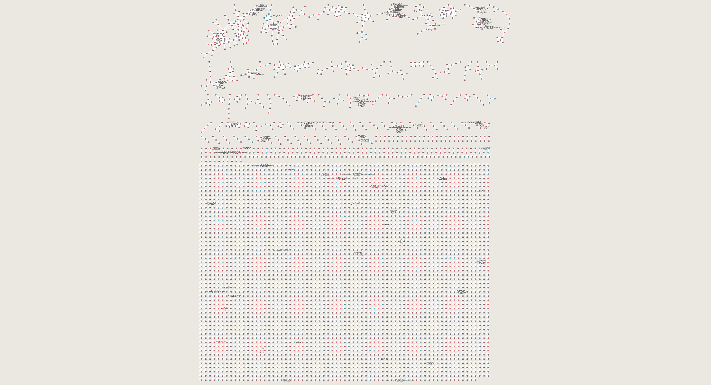

In this tutorial, we highlight how GNPS and molecular networking can help users uncover unique molecules being produced a new strain of bacteria.

## Experimental Setup

Microbial extracts from Streptomyces roseosporus and Streptomyces sp. DSM5940 were analyzed on an LTQ FT mass spectrometer. The mass spectrometer was operated in data dependent positive ion mode; automatically switching between full scan high resolution FT MS and low resolution LTQ MS/MS acquisitions. Full scan MS spectra were acquired in the FT and the top six most intense ions in a particular scan were fragmented using collision induced dissociation (CID) at a constant collision energy of 35eV, an activation Q of 0.25, and an activation time of 50 to 80 ms.

## Data Availability

MS/MS data can be found in the [MassIVE dataset MSV000079204](https://massive.ucsd.edu/ProteoSAFe/dataset.jsp?task=d74ca92d9dec4e2883f28506c670e3ca).

There are a total of four mzXML mass spectrometry files that have already been converted for analysis.

| filename  | Description          |
| ------------- |-------------|
| ccms_peak/0518_s_BuOH.mzXML | S. roseosporus extract |
| ccms_peak/15998_nBuOH_FT_test01.mzXML | S. roseosporus extract |
| ccms_peak/DSM4950_BuOH_ziptip_data_dependent.mzXML | Streptomyces sp. DSM5940 extract |
| ccms_peak/DSM4950_MeOH_ziptip_data_dependent.mzXML | Streptomyces sp. DSM5940 extract |

## Running Molecular Networking

Select [molecular networking analysis](https://gnps.ucsd.edu/ProteoSAFe/index.jsp?params=%7B%22workflow%22:%22METABOLOMICS-SNETS-V2%22,%22library_on_server%22:%22d.speclibs;%22%7D).

### Selecting Files

1. Click "Select Input Files" - [Help](../networking.md#selecting-files-to-analyze)
2. Import MSV000079204 to analyze - [Help](../networking.md#selecting-files-to-analyze)
3. Select S. roseosporus files into Group G1 and Streptomyces sp. DSM5940 into Group G2

### Updating parameters

These parameters were selected to be appropriate for a small dataset and a little on the loose side. The following are the updates that deviate from the default.

1. Advanced Network Options - Min Pairs Cos: 0.65
2. Advanced Network Options - Minimum Cluster Size: 1
3. Advanced Filtering Options - Filter Precursor Window: Don't Filter
4. Advanced Filtering Options - Filter peaks in 50Da Window: Don't Filter
5. Advanced Filtering Options - Filter Library: Don't Filter

### Pre-filled example

If you want to see a pre-filled example, see [here](https://gnps.ucsd.edu/ProteoSAFe/index.jsp?task=24b62946372c4044b49fceb662856e41).

## Analyzing Results in Browser

This is an example [completed molecular networking analysis](https://gnps.ucsd.edu/ProteoSAFe/status.jsp?task=24b62946372c4044b49fceb662856e41).

### Exploring Identified Compounds in Data

Click the "View All Library Hits".

This will list all library compounds that were matched. Here we can see many different antibiotics, e.g. Stenothricin, Arylomycin, Daptomycin, and Mureidomycin.

### Exploring Molecular Networks including Stenothricin

Click the "View All Clusters With IDs". This brings you to a list of all MS/MS detected in your samples. We can filter on "Stenothricin" in the LibraryID column. Click on "View Network" for any of the Stenothricin compounds:

Here we can see the molecular network of related compounds to Stenothricin

To color the nodes by which species they came from, click the draw pies

We can now see all the compounds from S. roseosporus in red and Streptomyces sp. DSM5940 in blue.

Further, we can highlight the compounds where are identified (blue border of nodes) and show the actual names

This network indicates to us that there are some unique compounds being produced by Streptomyces sp. DSM5940 that are related to Stenothricin.

To highlight what might be different about these molecules, we can highlight the mass differences between connected (structurally related) molecules in the network.

We can see the Stenothricin-GNPS 2 is a molecule which we discovered using molecular networking. We can further interrogate the similarity at the fragmentation level by clicking the edge between the two nodes to visualize the MS/MS spectra and align the peaks

## Analyzing Global Network with Cytoscape

Click the "Direct Cytoscape Preview/Download" to get a preformatted cytoscape file

In this preview you can even see from a high level the red and blue molecules that represent the G1 (roseosporus) and G2 (DSM5940) respectively. Download the Cytoscape file and view in cytoscape to dig further!

Open network in Cytoscape ([Help](../cytoscape.md)) to look at the entire network. Each molecule (node) has the pie charts already drawn with red (G1 - Rosesporus) and blue (G2 - DSM5940).

Good Luck!

## Homework

Look for putative analogs of other antibiotics such as Arylomycin and Daptomycin.
