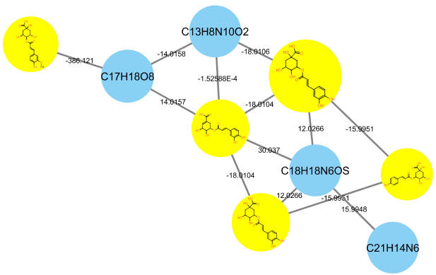

## Tutorial Using MetaboScape and GNPS

In this tutorial you will be guided into running MetaboScape for the [Feature Based Molecular Network (FBMN) workflow](../featurebasedmolecularnetworking.md) on GNPS to reproduce some findings of the [MetaboScape](../featurebasedmolecularnetworking-with-metaboscape.md) Coffee tutorial.

## Learning Objectives

1. Run MetaboScape feature detection on non-targeted LC-MS/MS data, and receive a feature quantification table and a MS2 spectral file as an output.
2. Run GNPS and visualize MetaboScape annotation in Cytoscape.

## Experimental Setup

We will use a subset of the LC-MS/MS analysis from the Coffee project. 

[MetaboScape](../featurebasedmolecularnetworking-with-metaboscape.md) will be used to perform feature detection and alignment and output a feature quantification table (.CSV file) and a MS/MS spectral file (.MGF format). The feature quantification table contains the intensity values for every aligned peak accross the samples, while the MS/MS spectral file contains a single MS/MS representing each aligned peak.

## Data and Files Needed for the Tutorial

LC-MS/MS data and files are part of the MetaboScape tutorial project.

## MetaboScape Representative Output Files
These files are not needed for the tutorial but are provided here as reference files, or if you want to bypass the MetaboScape processing.

|     File Type    | Download Link          |
| ------------- |------------- |
| Feature quantification table (.csv format) | [Download](https://github.com/lfnothias/GNPSDocumentation/blob/master/docs/tutorials/AG_tutorial_files/MetaboScape-GNPS-Coffee_Tutorial_msmsonly_featuretable.csv) |
| MS2 spectral file (.mgf format) | [Download](https://github.com/lfnothias/GNPSDocumentation/blob/master/docs/tutorials/AG_tutorial_files/MetaboScape-GNPS-Coffee_Tutorial.mgf) |

## Required Software Installations

1. MetaboScape, commercially available from Bruker. 
2. [Cytoscape](http://www.cytoscape.org/download.php) for advanced network visualization.

## Process the data with MetaboScape
Refer to the detailed step-by-step procedure to run Metaboscape [here](../featurebasedmolecularnetworking-with-metaboscape.md).

## Run FBMN on GNPS

See the FBMN documentation [here](../featurebasedmolecularnetworking.md).

## Run Cytoscape

See the documentation to perform visualization of the molecular networking on the data of the Coffee Project [here](../featurebasedmolecularnetworking-cytoscape.md).

## Visualization of Molecular Networks with Cytoscape 
1. Open Cytoscape 3.4 (or more recent version).
2. Install the Cytoscape App *ChemViz2* - http://apps.cytoscape.org/apps/chemviz2.
3. Import the molecular networking files downloaded from GNPS into Cytoscape.
    * Import the network topology. Go to *File/Import/Network/File* - select the .pairsinfo file in *networkedges_selfloop* folder. 
    * Import the node information table. Go to *File/Import/Table/File* - select the .tsv file in *clusterinfosummarygroup_attributes_withIDs_withcomponentID* folder.
    * Import the MS/MS spectral library annotation table. Go to *File/Import/Table/File* - select the .tsv file in *result_specnets_DB* folder.
    * Import the bucket table (MS/MS only) exported from MetaboScape. Go to *File/Import/Table/File* - select the .csv file.

Figure 1. Import the molecular network topology.

Figure 2. Node table import interface.

4. Configure the Cytoscape style.
    * For the *Label* properties. Select the column *MOLECULAR_FORMULA* and click *Passthrough Mapping* for the mapping type.
    * For the *Size* properties. Select the column *SAMPLE* and click *Continuous Mapping* for the mapping type.

Figure 3. Configure the molecular network style.

5. Visualizing the bucket table as a pie chart diagram. For the *Image/Chart* properties. Click on the *Def.* box. 
    * Click on the *Charts* spreadsheet, and select the group for visualization.
    * Click on the option *Charts/option* spreadsheet, and select the color-code for each group.

Figure 4. Pie charts configuration. Data in *Image/Chart* properties.

Figure 5. Pie charts configuration. Options in *Image/Chart* properties.

6. Visualize the MS/MS spectral library annotations (make sure *ChemViz2* is installed).
    * Select the nodes with MS/MS spectral library annotation (column LibraryID in the Cytoscape node table).
    * Right click on the nodes and select */Apps/Cheminformatics/Show compounds table*, or alternatively */Apps/Cheminformatics/Show structures for selected nodes* or */Apps/Cheminformatics/Paint structures for selected nodes*.

Figure 6. Molecular networks visualization with molecular formula annotation (node name).

Figure 7. View of compounds structures for spectral library MS/MS annotation in the molecular networks.

Figure 8. Molecular networks with MS/MS spectral annotation.

## Page contributors
Louis Felix Nothias (UCSD), Tam Dang (Tech. Univ. Berlin), Kevin Ngoc (UCSD).
