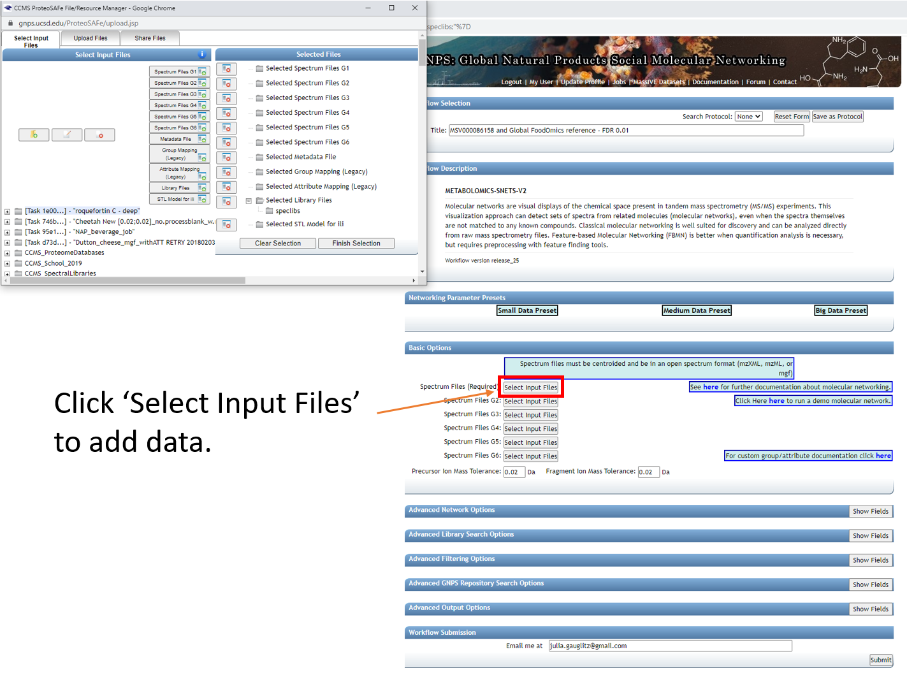

# Reference Data-Driven Analysis of Untargeted Metabolomics Data

The key difference between a traditional untargeted metabolomics analysis and a reference data-driven analysis (RDD) is the inclusion of data from reference samples, composed of a complex mixture of MS/MS scans corresponding to hundreds or thousands of unique compounds of both **known and unknown structure**. A key attribute of reference samples is metadata describing characteristics such as **source or environmental origin**. This is in contrast to reference spectra (contained in compound libraries or reference databases), which are of known structure and have been previously annotated.

Here we present a step by step tutorial for running a RDD analysis through the GNPS web infrastructure. This document will link out to code on Github that can be used to replicate the analysis highlighted in Figure 2 of [Gauglitz et al., 2020](https://doi.org/10.1101/2020.07.08.194159). All input files and outputs can also be found at the GNPS/Massive Repository, along with the data files at [https://massive.ucsd.edu/ProteoSAFe/dataset.jsp?task=99830767e1524e489b1a0f62569b8ed9](https://massive.ucsd.edu/ProteoSAFe/dataset.jsp?task=99830767e1524e489b1a0f62569b8ed9)

**Tutorial folder:** [ftp://massive.ucsd.edu/MSV000086158/updates/2020-10-01_jgauglitz_6c7824e2/other/](ftp://massive.ucsd.edu/MSV000086158/updates/2020-10-01_jgauglitz_6c7824e2/other/)

**Outline of Steps:**

1. Passatuto workflow to determine min cosine score to use in the molecular networking analysis.
2. Launch molecular networking analysis job, containing reference dataset.
3. Download and visualization of GNPS molecular analysis results.
4. Explore overlap information. 
5. Generate custom information based on the type of reference data used (Global FoodOmics specific).


## Step 1. Determine input parameters to run workflow at a 1% False Discovery Rate (FDR).

**Citations:**
- Scheubert, Kerstin, Franziska Hufsky, Daniel Petras, Mingxun Wang, Louis-Félix Nothias, Kai Dührkop, Nuno Bandeira, Pieter C. Dorrestein, and Sebastian Böcker. 2017. "Significance Estimation for Large Scale Metabolomics Annotations by Spectral Matching." Nature Communications 8 (1): 1494.
- Wang, Mingxun, Jeremy J. Carver, Vanessa V. Phelan, Laura M. Sanchez, Neha Garg, Yao Peng, Don Duy Nguyen, et al. 2016. "Sharing and Community Curation of Mass Spectrometry Data with Global Natural Products Social Molecular Networking." Nature Biotechnology 34 (8): 828–37.

### Step 1.1 Navigate to the GNPS webpage and sign in. 


### Step 1.2 Scroll down to locate additional workflows.


### Step 1.3 Scroll down to locate additional workflows.


### Step 1.4 Select workflow, which will generate a job launch page. Expand full menu. 


### Step 1.5 Fill out the launch page information. 


### Step 1.6 Select datasets in your workspace and add to selected files. 


### Step 1.7 Add datasets to your workspace using the MassIVE identifier. 


### Step 1.8 Select files from newly added dataset and add to the job. 


### Step 1.9 Note that the notification that the job is complete will be sent to the email address provided.

You can also check the "Jobs" tab to check on the status of the analysis. 


### Step 1.10 The status page will look like this and will update when the job has completed. 


### Step 1.11 Navigating the completed Passatutto Workflow.

1. Job will be saved, and can be accessed by clicking on DONE.
2. Selecting "View All Spectra DB with FDR" will bring up the view in 3.
3. Where one clicks on "Download".
4. This opens up an additional set of options. Select "Download" again and a .zip folder will be downloaded, as shown on the left below. This folder can be extracted and the .tsv can either be opened in Excel or the cosine score for an appropriate FDR value can be extracted programmatically, such as with R, as in Step 1.12. 


### Step 1.12 Extracting the MQScore (modified cosine score) needed for molecular networking to achieve a 1% FDR with the min number of matched peaks set in the FDR estimation workflow (5 in this case).

The result here is that 0.64 is the cutoff for Step 2 of the tutorial. 

Code for use in RStudio: 

```
tab <- read.delim("ProteoSAFe-MOLECULAR-LIBRARYSEARCH-FDR-af0eb459-view_all_annotations_DB_fdr/MOLECULAR-LIBRARYSEARCH-FDR-af0eb459-view_all_annotations_DB_fdr-main.tsv")
fdr_5min <- tab[,c("MQScore","fdr")]
head(fdr_5min)
fdr_5min_cos0.01 <- fdr_5min[fdr_5min$fdr <= 0.01,]
head(fdr_5min_cos0.01)
```

## Step 2. Launch molecular networking analysis job, containing reference dataset

**Citations:**

- Wang, Mingxun, Jeremy J. Carver, Vanessa V. Phelan, Laura M. Sanchez, Neha Garg, Yao Peng, Don Duy Nguyen, et al. 2016. "Sharing and Community Curation of Mass Spectrometry Data with Global Natural Products Social Molecular Networking." Nature Biotechnology 34 (8): 828–37.
- Watrous, Jeramie, Patrick Roach, Theodore Alexandrov, Brandi S. Heath, Jane Y. Yang, Roland D. Kersten, Menno van der Voort, et al. 2012. "Mass Spectral Molecular Networking of Living Microbial Colonies." Proceedings of the National Academy of Sciences of the United States of America 109 (26): E1743–52.

### Step 2.1 Navigate to the GNPS main page. Scroll down and click on ‘Create Molecular Network’.


### Step 2.2 Molecular Networking Start Page


Edit presets: Fill in the Title and under "Basic Options" --- select precursor ion mass tolerance and fragment ion mass tolerance based on the resolution of the data and reference data chosen. For high resolution QTOF data we chose 0.02.


### Step 2.3 Dataset selection from GNPS molecular networking analysis homepage

Data of interest can be added to "Spectrum Files (Required)" (G1) and reference data can be added to "Spectrum Files G4". 

In this tutorial, fecal data are added to G1, plasma data to G2, study specific foods (which are a part of Global FoodOmics) are added to G3, and the remainder of the Global FoodOmics dataset is added to G4.

If using this reference dataset for your own analyses, the entire folder can be selected and added to G4. Begin by clicking on any of the "Select Input Files" tabs.



Here select the Stool-Food match to select the stool data. Click on ‘Spectrum Files G1’ and it will appear under Selected Files as shown. Repeat for plasma below.


Select reference data to include in the molecular networking job.


Below you can see how SSF have been placed in G3 and the remainder of the files in G4. If you make an error and add more folders than desired, you can click them one at a time and click on the small folder icon with the red x over it (seen towards the middle of the screen).


After clicking "Finish selection" you will return to the workflow launch page below and will observe the number of files or folders placed into each group.


**Note:** It is arbitrary which group is selected for each data type, however the groupings used above will require the least modification of the code found on GitHub.

"Spectrum Files G2" is reserved for a second paired dataset, such as plasma if fecal data are in G1 (Required). "Spectrum Files G3" is reserved for study specific reference data, in contrast to public reference datasets (G4).

### Step 2.4 Selecting Molecular Networking parameters 

Default view:


GNPS molecular networking analysis homepage: "Advanced Library Search Options": Set "Library Search Min Matched Peaks" to the value used in the Passatuto FDR estimation workflow and set "Score Threshold" to the value determined for a 1% FDR (the lower panel).


"Advanced Network Options": Set "Min Pairs Cos" to the value determined in the FDR estimation workflow and set "Minimum Matched Fragment Ions" to the corresponding value (the upper panel).

Here we select 5, which is what we chose for the FDR estimation. The value determined at 1% FDR is 0.64.

Lastly, if the datasets are large, it may be necessary to Select "Don't Create" for "Create Cluster Buckets and qiime2/Biom/PCoA Plots output". This will decrease the run time and may be necessary if the job times out / fails due to requiring too much compute time.


**Note:** If a job fails, you can select "Clone" and adjust needed parameters, rename if desired, and resubmit. It is not necessary to load all files and information from scratch.


## Step 3 Downloading results

**Citations:**

- Wang, Mingxun, Jeremy J. Carver, Vanessa V. Phelan, Laura M. Sanchez, Neha Garg, Yao Peng, Don Duy Nguyen, et al. 2016. "Sharing and Community Curation of Mass Spectrometry Data with Global Natural Products Social Molecular Networking." Nature Biotechnology 34 (8): 828–37.
- Shannon, Paul, Andrew Markiel, Owen Ozier, Nitin S. Baliga, Jonathan T. Wang, Daniel Ramage, Nada Amin, Benno Schwikowski, and Trey Ideker. 2003. "Cytoscape: A Software Environment for Integrated Models of Biomolecular Interaction Networks." Genome Research 13 (11): 2498–2504.

### Step 3.1 Click on "Direct Cytoscape Preview/Download" or "Download GraphML for Cytoscape" to visualize the molecular network with the open source software Cytoscape.


###Step 3.2 Downloading results, part 2

Click on "View All Clusters With IDs", next click on "Download" which opens another menu, click on "Download". The .tsv file contained in the main directory contains information pertinent to further evaluations and together with sample and reference metadata can be used to further interpret the untargeted metabolomic data.


### Step 3.3 The download button will prompt a menu to save a .zip folder. Click save and then extract. 


Save the extracted folder on a location on your computer that you can reach it using your analysis software --- RStudio, Jupyter Notebooks, Terminal, etc.


## Step 4 Explore overlap information.

Extract percent increase in interpretation using the .tsv file downloaded in tutorial step 2. Code is located on Github. 

- Sign into Github. Navigate to [https://github.com/DorresteinLaboratory/GlobalFoodomics](https://github.com/DorresteinLaboratory/GlobalFoodomics)
- Click on notebooks -> click on fig2_spectral_interpretation_rate.Rmd
- Click on Raw -> right click and save as (on Windows, delete the .txt extension that is automatically added when downloading).

The .Rmd file can be opened in RStudio.


Read in the datafile downloaded from the molecular networking analysis.
Copy and paste an example dataset and alter the file path accordingly.


The remainder of the files to be read in from all datasets in the study can be deleted when working with the tutorial data or your own dataset.

Run the code block by clicking on the green arrow pointing right -- in the red box. 


Run the cells of code until you have generated the first output values. These will appear in line in the markdown.


The first value **1.** is the annotation rate of the human dataset loaded into G1 during the molecular networking analysis. **2.** is the percent overlap between the dataset loaded into G1 and the study specific foods (SSF) in G3 (if no data is entered here, then the value will be the same as 1.). **3.** is the overlap taking into account only the Global FoodOmics foods (excluding the SSF) and **4.** Is the overlap when taking into account both SSF and the reference dataset in G4.

Running the next block of code will generate the analogous overlap values for the dataset in G2 (plasma). 


Running the additional code up until this cell will generate the percent of nodes for which information is gained due to shared molecular family. This value is termed "Q_added" in the code. So in the case of the tutorial data, the overlap between stool and food reference data is 59.24%, with a further increase of 8.12%, resulting in a TOTAL value of 67.36%. 


## Step 5 Generate custom information based on the type of reference data used. 

For analysis with the Global FoodOmics reference data you can investigate several different types of outputs and visualizations based on the analyses produced above. Below are two examples. 

### Example 1: Flow diagram to visualize ontology

Dependencies:
- Follow the instructions for installation of floweaver [here](https://floweaver.readthedocs.io/en/latest/installation.html).

Required files:

- Global FoodOmics metadata
- Sample_type_hierarchy.csv (color coded key for the foodomics ontology)
- Molecular networking analysis .tsv output from Step 2 of the tutorial 

Load packages required:

```
import math

import floweaver
import numpy as np
import pandas as pd
```

Download Global FoodOmics metadata and ensure that the data path is correct. 

```
def get_sample_types(gfop_metadata, simple_complex=None):
    if simple_complex is not None:
        gfop_metadata = gfop_metadata[
            gfop_metadata['simple_complex'] == simple_complex]
    col_sample_types = [f'sample_type_group{i}' for i in range(1, 7)]
    return (gfop_metadata[['filename', *col_sample_types]]
            .set_index('filename'))


gfop_metadata = pd.read_csv(
    '../data/11442_foodomics_multiproject_metadata.txt', sep='\t')
# First row is empty.
gfop_metadata = gfop_metadata.drop(index=0)
# Remove trailing whitespace.
gfop_metadata = gfop_metadata.apply(lambda col: col.str.strip()
                                    if col.dtype == 'object' else col)
```

It will not be necessary to modify the next cells, however they must be run in order. 

```
def _get_flows(gnps_network, sample_types, groups_included,
               max_hierarchy_level):
    # Select GNPS job groups.
    groups = {f'G{i}' for i in range(1, 7)}
    groups_excluded = groups - set(groups_included)
    df_selected = gnps_network[
        (gnps_network[groups_included] > 0).all(axis=1) &
        (gnps_network[groups_excluded] == 0).all(axis=1)].copy()
    filenames = (df_selected['UniqueFileSources'].str.split('|')
                 .explode())#.unique())
    # Select food hierarchy levels.
    sample_types = sample_types[[
        f'sample_type_group{i}' for i in range(1, max_hierarchy_level + 1)]]
    # Match the GNPS job results to the food sample types.
    sample_types_selected = sample_types.reindex(filenames)
    sample_types_selected = sample_types_selected.dropna()
    # Discard samples that occur less frequent than water (blank).
    water_count = ((sample_types_selected['sample_type_group1'] == 'water')
                   .sum())
    sample_counts = sample_types_selected[
        f'sample_type_group{max_hierarchy_level}'].value_counts()
    sample_counts_valid = sample_counts.index[sample_counts > water_count]
    sample_types_selected = sample_types_selected[sample_types_selected[
        f'sample_type_group{max_hierarchy_level}'].isin(sample_counts_valid)]
    # Get the flows between consecutive food hierarchy levels.
    flows, processes = [], []
    for i in range(1, max_hierarchy_level):
        g1, g2 = f'sample_type_group{i}', f'sample_type_group{i + 1}'
        flow = (sample_types_selected.groupby([g1, g2]).size()
                .reset_index().rename(columns={g1: 'source', g2: 'target',
                                               0: 'value'}))
        flow['source'] = flow['source'] + f'_{i}'
        flow['target'] = flow['target'] + f'_{i + 1}'
        flow['type'] = flow['target']
        flows.append(flow)
        process = pd.concat([flow['source'], flow['target']],
                            ignore_index=True).to_frame()
        process['level'] = [*np.repeat(i, len(flow['source'])),
                            *np.repeat(i + 1, len(flow['target']))]
        processes.append(process)
    return (pd.concat(flows, ignore_index=True),
            pd.concat(processes, ignore_index=True).drop_duplicates()
            .rename(columns={0: 'id'}).set_index('id'))
```

```
def plot_flows(gnps_network, sample_types, groups_included,
               sample_type_hierarchy, max_hierarchy_level=4, filename=None):
    flows, processes = _get_flows(
        gnps_network, sample_types, groups_included, max_hierarchy_level)
    dataset = floweaver.Dataset(flows, dim_process=processes)

    labels = (sample_type_hierarchy
              .reindex(set(flows['source']) | set(flows['target']))
              .sort_values('order_num').index)
    nodes, ordering, bundles = {}, [], []
    for level in processes['level'].unique():
        nodes[f'level {level}'] = floweaver.ProcessGroup(f'level == {level}')
        nodes[f'level {level}'].partition = floweaver.Partition.Simple(
            'process', labels[labels.str.endswith(f'_{level}')][::-1])

        ordering.append([f'level {level}'])

        if level + 1 in processes['level'].unique():
            bundles.append(floweaver.Bundle(f'level {level}',
                                            f'level {level + 1}'))

    sdd = floweaver.SankeyDefinition(
        nodes, bundles, ordering, flow_partition=dataset.partition('type'))
    palette = sample_type_hierarchy['color_code'].dropna().to_dict()
    return floweaver.weave(sdd, dataset, palette=palette)
```

```
sample_types_simple = get_sample_types(gfop_metadata, 'simple')
sample_types_complex = get_sample_types(gfop_metadata, 'complex')
```

In the next steps you will load the sample type hierarchy specific to the Global FoodOmics metadata and the dataset generated in step 2 (.tsv). Ensure that the file paths are correct.

```
sample_type_hierarchy = (
    pd.read_csv('../data/sample_type_hierarchy.csv')
    .set_index('descriptor').sort_values('order_num'))

gnps_network = pd.read_csv(
    '../data/METABOLOMICS-SNETS-V2-9a90bd12-view_all_clusters_withID_beta-main.tsv',
    sep='\t')
```

The next step will generate the flow diagram and automatically save it based on the selections made. In this case matches are only against "simple" foods, and matches are only between plasma data and the reference dataset in G4. The hierarchy is displayed out to level 5 of the sample type hierarchy. 

```
dataset = 'onr'
simple_complex = 'simple'
groups = '2', '4'
max_level = 5

if simple_complex == 'simple':
    sample_types = sample_types_simple
elif simple_complex == 'complex':
    sample_types = sample_types_complex
else:
    raise ValueError('Unknown sample type')
sankey_data = plot_flows(
    gnps_network, sample_types, [f'G{g}' for g in groups],
    sample_type_hierarchy, max_level)
width = max_level * 150 + 300
height = math.ceil(
    sum([1 for node in sankey_data.nodes
         if node.title.endswith(str(max_level))]) * 50 / 100) * 100
(sankey_data.to_widget(width=width, height=height, margins={
    'left': 150, 'right': 150, 'top': -50, 'bottom': -50})
 .auto_save_png(f'flow_{dataset}_g{"".join(groups)}_level{max_level}_'
                f'{simple_complex}.png'))
```

Output visualization shows the types of food categories from which molecules were observed in human plasma samples for a sleep deprivation cohort.


### Example 2: Food count generation

- Github code:
- Download the notebook "file_food_count.ipynb".
- Load in your environment and open with Jupyter notebooks.

When using the Global FoodOmics data as reference data, you will need to load the metadata, as well as the metadata from your study of interest and the .tsv file generated in Step 2 of this tutorial. 

**Required files:**

- Global FoodOmics metadata
- Study metadata
- Molecular networking analysis .tsv output from Step 2 of the tutorial 

**Dependencies:** Python 3.6 or newer.

Load packages required:

```
import numpy as np
import pandas as pd
```

Download Global FoodOmics metadata and ensure that the data path is correct. 

```
def get_sample_types(gfop_metadata, simple_complex=None):
    if simple_complex is not None:
        gfop_metadata = gfop_metadata[
            gfop_metadata['simple_complex'] == simple_complex]
    col_sample_types = [f'sample_type_group{i}' for i in range(1, 7)]
    return (gfop_metadata[['filename', *col_sample_types]]
            .set_index('filename'))


gfop_metadata = pd.read_csv(
    '../data/11442_foodomics_multiproject_metadata.txt', sep='\t')
# First row is empty.
gfop_metadata = gfop_metadata.drop(index=0)
# Remove trailing whitespace.
gfop_metadata = gfop_metadata.apply(lambda col: col.str.strip()
                                    if col.dtype == 'object' else col)
```

It will not be necessary to modify the next cells, however they must be run in order. 

```
def get_file_food_counts(gnps_network, sample_types, groups_included,
                         filenames_included, level):
    # Select GNPS job groups.
    groups = {f'G{i}' for i in range(1, 7)}
    groups_excluded = groups - set(groups_included)
    df_selected = gnps_network[
        (gnps_network[groups_included] > 0).all(axis=1) &
        (gnps_network[groups_excluded] == 0).all(axis=1)].copy()
    df_selected = df_selected[
        df_selected['UniqueFileSources'].apply(lambda cluster_fn:
            any(fn in cluster_fn for fn in filenames_included))]
    filenames = (df_selected['UniqueFileSources'].str.split('|')
                 .explode())
    # Select food hierarchy levels.
    sample_types = sample_types[f'sample_type_group{level}']
    # Match the GNPS job results to the food sample types.
    sample_types_selected = sample_types.reindex(filenames)
    sample_types_selected = sample_types_selected.dropna()
    # Discard samples that occur less frequent than water (blank).
    water_count = (sample_types_selected == 'water').sum()
    sample_counts = sample_types_selected.value_counts()
    sample_counts_valid = sample_counts.index[sample_counts > water_count]
    sample_types_selected = sample_types_selected[
        sample_types_selected.isin(sample_counts_valid)]
    # Get sample counts at the specified level.
    return sample_types_selected.value_counts()
```

```
sample_types_simple = get_sample_types(gfop_metadata, 'simple')
sample_types_complex = get_sample_types(gfop_metadata, 'complex')
```

In the next step you will load the metadata and data generated in step 2. Ensure that the file paths are correct.

```
metadata = pd.read_csv(
    'data/ONR_Primary_Global_metadata_Plasma.txt', sep='\t')

gnps_network = pd.read_csv(
    'METABOLOMICS-SNETS-V2-57c1416f-view_all_clusters_withID_beta-main.tsv',
    sep='\t')
```

The next steps will generate the food count output.

Note: You can edit the output generated by changing the groups listed. Currently G2, G3, and G4 are selected. So this is including those compounds that were observed in the plasma data, as well as the study specific foods, and the FoodOmics reference data.

```
level = 4
food_counts, filenames = [], []
groups = ['G2', 'G3', 'G4']
for filename in metadata['filename']:
    file_food_counts = get_file_food_counts(
        gnps_network, sample_types_simple, groups, [filename], level)
    if len(file_food_counts) > 0:
        food_counts.append(file_food_counts)
        filenames.append(filename)

food_counts = (pd.concat(food_counts, axis=1, sort=True)
               .fillna(0).astype(int).T)
food_counts.index = pd.Index(filenames, name='filename')
```

The matrix generated has this format:


The last step is to export the matrix as a .csv file.

```
food_counts.to_csv('Tutorial_plasma_file_food_count.csv')
```
