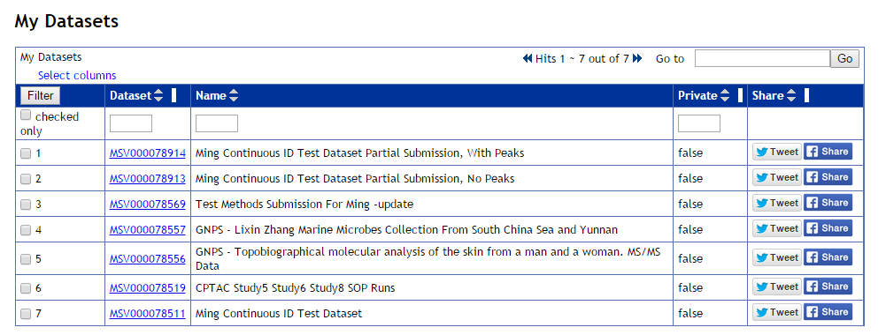
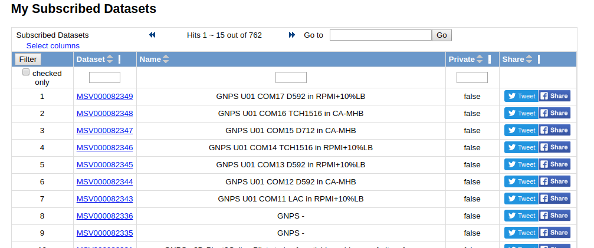
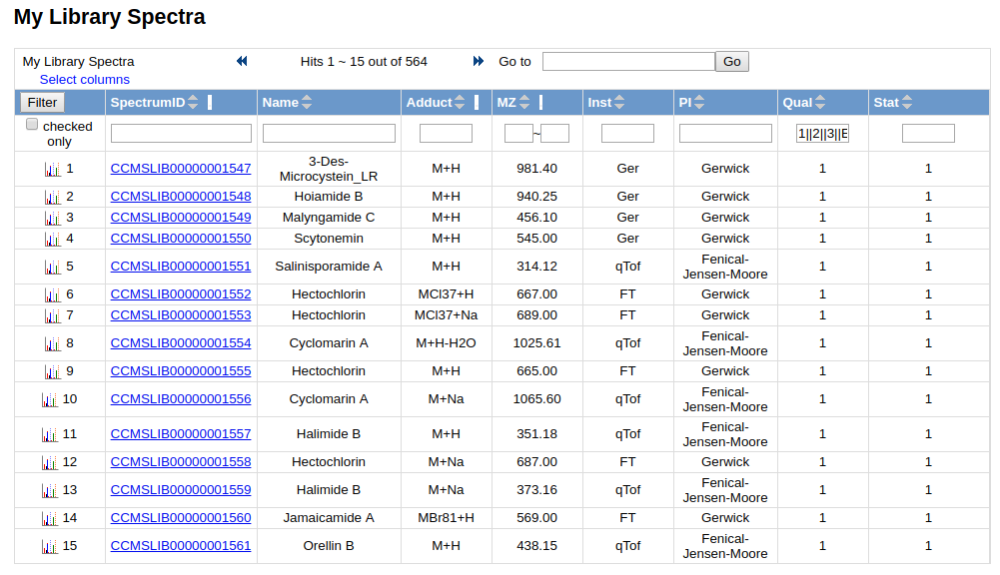

# User Page

At GNPS, since there is so much power given to the user to affect the system, it is necessary for users to keep track of their own account. Specifically, in the user summary page, users can view the datasets that they have uploaded, browse the datasets they have subscribed to, spectra they have contributed to the GNPS spectral libraries, and the spectra that have been contributed to GNPS challenge spectra.

## My Datasets

Users are able to see all their own datasets, either public or private in a view like this:

From here users can view their private datasets and make them public if they wish or simply browse their own datasets. Additionally, users can share their datasets with the world via Twitter and Facebook.

## My Subscriptions

Users can see all datasets they are subscribed to

## My Library Spectra

These are all the annotated MS/MS spectra you have contributed to the community GNPS library.

## Page Contributors

{{ git_page_authors }}